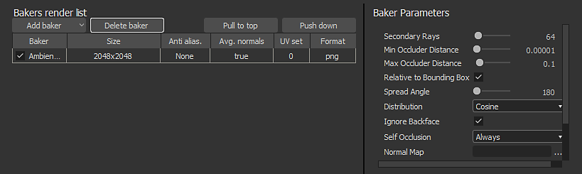

# Baker

La esegue i baking fa riferimento all&#39;azione di **trasferimento delle informazioni basate sulla trama nelle texture**. Queste informazioni vengono quindi lette dagli shader e/o dai filtri Substance per generare effetti o texture più avanzati.

>[!NOTE]
>
> Per ulteriori informazioni sulla esegue i baking, consulta la [Documentazione di Esegue i baking](https://experienceleague.adobe.com/it/docs/substance-3d/bakers/home).

<table>
<tr style="border: 0;">
<td width="100.00%" style="border: 0;" valign="top">

È possibile accedere alla finestra di cottura tramite il file mesh nella finestra [Esplora risorse](../interface/the-explorer-window/the-explorer-window.md). Fate clic con il pulsante destro del mouse sul nome della trama e scegliete &quot;**Informazioni sul modello di forno**&quot; per aprire la finestra di cottura al forno.

</td>
<td width="33.33%" style="border: 0;" valign="top">

Opzione &quot;Esegue i baking informazioni modalità&quot; di 

</td>
</tr>
</table>

## Panoramica

La finestra di cottura di è divisa in diversi pannelli che sono descritti di seguito.

<table>
<tr style="border: 0;">
<td style="border: 0;" valign="top">

### Elementi da eseguire i baking

Questo pannello controlla quale parte della trama a basso poli verrà utilizzata per la cottura al forno.

Elenca la geometria trovata all&#39;interno del file mesh low-poly. Per impostazione predefinita, l’elenco si basa sui singoli materiali presenti nel file, ma può essere sostituito da sottoreti, se necessario. Potete deselezionare gli elementi che devono essere ignorati durante il processo di cottura al forno.

</td>
<td style="border: 0;" valign="top">

</td>
</tr>
</table>

<table>
<tr style="border: 0;">
<td style="border: 0;" valign="top">

### Output

Questo pannello controlla la posizione della texture cotta.

</td>
<td style="border: 0;" valign="top">

</td>
</tr>
</table>

| *Parametro* | *Descrizione* |
| --- | --- |
| **Metodo** | Controlla come verranno memorizzate le texture cotte con la confezione di Substance.Valori possibili:<ul data-preserve-html="true"><li data-preserve-html="true"><strong>Embedded</strong>: la texture baked è memorizzata in una sottocartella accanto al pacchetto Substance con un nome specifico.</li><li data-preserve-html="true"><strong>Collegata</strong> (impostazione predefinita): la texture in baked viene memorizzata nella cartella definita e quindi referenziata nella Substance collocata.</li></ul> |
| **Cartella** | Posizione delle texture al forno quando vengono salvate. Fai clic sul pulsante con tre punti per aprire una finestra di dialogo e scegli la cartella di esportazione. A destra sarà visibile un segno di spunta che indica se la cartella esiste effettivamente o meno. |
| **Nome** | Convenzione di denominazione delle texture cotte. Fate clic sul pulsante con tre punti per aprire un menu a discesa e inserire altri segnaposto (nome di backup, personalizzato, materiale, trama). |
| **Esempio** | Simulare un nome di file per verificare la convenzione di denominazione. |
| **Inserire la risorsa in una cartella specifica della trama** | Se questa opzione è attivata, le texture al forno vengono salvate all’interno di una cartella denominata file mesh. |

### Trame ad alta definizione

Questo pannello controlla l’elenco delle trame a poli alti e le relative impostazioni. Per ulteriori informazioni, vedere [parametri comuni](https://experienceleague.adobe.com/it/docs/substance-3d/bakers/bakers-settings/common-parameters).

### Valori predefiniti

Per ulteriori informazioni, vedere [parametri comuni](https://experienceleague.adobe.com/it/docs/substance-3d/bakers/bakers-settings/common-parameters).

### Elenco e impostazioni di rendering dei forni

L&#39;**elenco dei forni** è il punto in cui puoi scegliere quale texture infornata generare. Per impostazione predefinita, l’elenco è vuoto.

* **Aggiunta di un nuovo fornaio:** Fare clic sul pulsante &quot;Aggiungi fornaio&quot;.
* **Rimozione di un fornaio:** Selezionare il fornaio nell&#39;elenco, quindi fare clic sul pulsante &quot;Elimina fornaio&quot;.
* **Spostamento di un fornaio in alto:** Selezionare il fornaio nell&#39;elenco, quindi fare clic sul pulsante &quot;Tirare in alto&quot;.
* **Spostamento in basso di un fornaio:** Selezionare il fornaio nell&#39;elenco, quindi fare clic sul pulsante &quot;Spingi in basso&quot;.

Per impostazione predefinita, ogni baker eredita i Valori predefiniti (vedere sopra). È possibile, ad esempio, ignorare le dimensioni (risoluzione) facendo clic sulla cella sulla riga del baker. Questo vale per le altre impostazioni della riga.

Quando si fa clic su un baker nell&#39;elenco, la vista Parametri Baker viene aggiornata con i relativi parametri specifici.

Per ulteriori informazioni sui parametri specifici, vedere: [Impostazioni Baker](https://experienceleague.adobe.com/it/docs/substance-3d/bakers/bakers-settings/bakers-settings).

