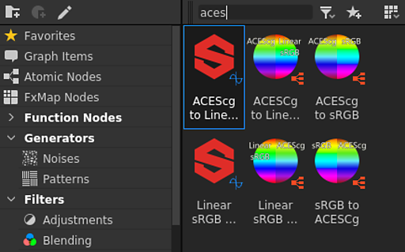

# Gestione colore

Questa pagina spiega le funzioni e le impostazioni di Gestione colore di Substance 3D Designer.

Substance 3D Designer può essere configurato per l&#39;utilizzo di [OpenColorIO](https://opencolorio.org/) (OCIO) o dell&#39;Adobe Color Engine (ACE) per la gestione del colore. Ciò consente di avere *trasformazioni di colore* coerenti e la visualizzazione dell&#39;immagine in più applicazioni.

In questa modalità, Designer funzionerà internamente con **colori RGB lineari**. Poiché 8 profondità di bit non sono in genere sufficienti per rappresentare i colori lineari, si consiglia di utilizzare *almeno* profondità a **16 bit** per le texture di colore nel [grafico](../compositing-graphs/substance-compositing-graphs.md).

>[!WARNING]
>
> Un flusso di lavoro efficace per la gestione del colore si basa sul lavoro con uno schermo *calibrato* corretto. Esistono soluzioni di terze parti per calibrare correttamente il monitor per l’ambiente di lavoro utilizzando hardware specializzato.
> 
> Gli utenti di OpenColorIO devono utilizzare gli spazi colore OpenColorIO corrispondenti per i monitor.\
> Gli utenti di Adobe devono assicurarsi che i profili ICC selezionati *nel sistema operativo* corrispondano ai *monitor*.

## Configurazione

Le impostazioni di Gestione colore possono essere configurate nella scheda [Progetti](../interface/preferences-window/project-settings/project-settings.md) della finestra di dialogo [Preferenze](../interface/preferences-window/preferences-window.md). È possibile impostare le seguenti impostazioni:

### Modalità di gestione colore

|  |  |
| --- | --- |
| <b>Gestione colore</b> | Questa impostazione consente di selezionare le modalità [Legacy](../color-management/color-management.md), [OpenColorIO](#opencolorio) o [Adobe](#adobe-ace) per la gestione colore in Substance 3D Designer. *Predefinito: Legacy* |

## OpenColorIO

### Configurazione OpenColorIO

Quando si utilizza la modalità OpenColorIO per la gestione del colore, Designer utilizzerà le informazioni memorizzate in un <b>file di configurazione</b> (*\*.config*) per eseguire trasformazioni di colore, identificare gli spazi colore e impostare le impostazioni predefinite.

Substance 3D Designer viene fornito con le seguenti configurazioni:

* Substance: una configurazione semplice che include spazi di colore comuni
* [ACES 1.0.3](https://github.com/hpd/OpenColorIO-Configs/tree/master/aces_1.0.3): la configurazione completa di [Academy Color Encoding System](https://www.oscars.org/science-technology/sci-tech-projects/aces) (ACES), uno standard di settore per i flussi di lavoro di gestione colore

Questi file di configurazione sono disponibili nella cartella <b>risorse > ocio</b> dei file di installazione di Designer.

|  |  |
| --- | --- |
| <b>Configurazione OpenColorIO</b> | Questa impostazione consente di selezionare il file di configurazione OpenColorIO da utilizzare in Designer. In alternativa, potete impostare il file di configurazione OpenColorIO utilizzando la variabile di ambiente OCIO.  Quando esiste, il file di configurazione sarà *bloccato* in Designer. È comunque possibile modificare gli spazi colore predefiniti e visualizzare le trasformazioni (vedere le impostazioni di seguito).  **Avviso:** dopo aver aggiunto la variabile di ambiente, si consiglia di chiudere Designer, *uscire* dalla sessione utente nel sistema operativo, quindi di accedere nuovamente. In questo modo, la variabile di ambiente è attiva all&#39;avvio di Designer. È inoltre possibile utilizzare la riga di comando per creare una variabile di ambiente temporanea e avviare Designer dall&#39;ambiente della riga di comando *stesso*.  *Impostazione predefinita: Substance* |
| **File di configurazione personalizzato** | Se l&#39;opzione **Personalizzato** è impostata in **Configurazione OpenColorIO**, è possibile selezionare il *file \*.config specifico *da utilizzare come file di configurazione in questo campo.* Impostazione predefinita: impostata dal file di configurazione OpenColorIO o dalla variabile di ambiente OCIO* |

### Impostazioni predefinite spazio colore bitmap

|  |  |
| --- | --- |
| <b>immagini a 8 bit</b> | Imposta lo spazio colore predefinito per le bitmap a 8 bit. *Impostazione predefinita: impostata dal file di configurazione OpenColorIO* |
| <b>immagini a 16 bit</b> | Imposta lo spazio colore predefinito per le bitmap a 16 bit. *Impostazione predefinita: impostata dal file di configurazione OpenColorIO* |
| <b>Immagini a virgola mobile</b> | Imposta lo spazio colore predefinito per le bitmap di precisione a virgola mobile, ad esempio le immagini *HDR* nei formati *\*.exr *o*\*.hdr*. *Impostazione predefinita: impostata dal file di configurazione OpenColorIO* |
| <b>Usa nome file per rilevare lo spazio colore</b> | Consente a Designer di assegnare automaticamente uno spazio colore se il *suffisso* di un nome file bitmap *corrisponde esattamente* al nome minuscolo di uno spazio colore incluso nella *configurazione* di OpenColorIO corrente. Esempio: una risorsa bitmap *mybitmap\_aces\_acescg.png* verrebbe impostata automaticamente sullo spazio colore *ACES - ACEScg* e la trasformazione appropriata verrà applicata allo spazio colore di lavoro. *Impostazione predefinita: selezionata* |

### Visualizzazione predefinita delle viste 2D e 3D

|  |  |
| --- | --- |
| <b>Visualizzazione predefinita delle viste 2D e 3D</b> | Imposta lo spazio colore predefinito *visualizzazione* per le finestre delle viste [2D](../interface/2d-view/2d-view.md) e [3D](../interface/3d-view/3d-view.md). *Impostazione predefinita: impostata dal file di configurazione IO OpenColor* |
| <b>Miniature per la gestione dei colori</b> | Consente a Designer di trasformare automaticamente il nodo *miniature* nello spazio cromatico *attivo* del grafico. *Impostazione predefinita: selezionata* |

## Adobe ACE

### Impostazioni del colore

Quando si utilizza la modalità Adobe ACE per la gestione del colore, Substance 3D Designer utilizzerà le informazioni memorizzate in <b>profili ICC</b> (*\*.icc / \*.icm*) per eseguire le trasformazioni di colore e identificare gli spazi cromatici.

Designer viene fornito con diversi profili ICC. I file per questi profili sono disponibili nella cartella `resources > icc` dei file di installazione di Designer.\
Puoi aggiungere *i tuoi* profili ICC inserendo questi file nella posizione `Adobe/Adobe Substance 3D Designer/icc` nella cartella *Documenti* per l&#39;utente corrente del sistema.

|  |  |
| --- | --- |
| <b>Spazio di lavoro</b> | Questa impostazione consente di selezionare lo spazio cromatico di lavoro per *eseguire operazioni a colori* in Substance 3D Designer. *Impostazione predefinita: sRGB IEC61966-2.1* |
| <b>Intento di rendering</b> | Questa opzione consente di controllare il modo in cui i colori devono essere trasformati quando si trovano *al di fuori della gamma* dello spazio cromatico *di lavoro*. *Impostazione predefinita: colorimetrico relativo* |

### Impostazioni predefinite spazio colore bitmap

|  |  |
| --- | --- |
| <b>immagini a 8 bit</b> | Imposta il profilo ICC predefinito da utilizzare per le bitmap a 8 bit. *Predefinito:* sRGB IEC61966-2.1 ** |
| <b>immagini a 16 bit</b> | Imposta il profilo ICC predefinito per l’utilizzo di bitmap a 16 bit. **Predefinito: *sRGB IEC61966-2.1*** |
| <b>Immagini a virgola mobile</b> | Imposta il profilo ICC predefinito da utilizzare per le bitmap di precisione a virgola mobile, ad esempio le immagini *HDR* nei formati *\*.exr *o*\*.hdr*. *Impostazione predefinita: non elaborato (ovvero nessun profilo applicato)* |
| <b>Usa profili ICC incorporati se disponibili</b> | Consente a Designer di utilizzare il profilo ICC incorporato in una bitmap anziché le impostazioni predefinite sopra elencate. *Impostazione predefinita: selezionata* |

### Spazio predefinito visualizzazione vista 2D e 3D

|  |  |
| --- | --- |
| <b>Visualizzazione predefinita delle viste 2D e 3D</b> | Imposta lo spazio colore predefinito *visualizzazione* per le finestre delle viste [2D](../interface/2d-view/2d-view.md) e [3D](../interface/3d-view/3d-view.md). *Impostazione predefinita:*** Profilo ICC per la schermata principale, recuperato dal sistema operativo **** |

### Visualizzazione grafico

|  |  |
| --- | --- |
| <b>Miniature per la gestione dei colori</b> | Quando *selezionato*, Designer trasformerà le miniature dei *nodi* nello *spazio cromatico di lavoro* corrente. *Impostazione predefinita:*** Deselezionata **** |

## Modalità legacy

Quando si utilizza la modalità <b>Legacy</b>, la gestione colore è *disabilitata* in Designer-

In questa modalità, i grafici e le immagini si comportano esattamente nello stesso modo delle versioni precedenti. Ciò significa che il flusso di lavoro delle versioni precedenti *non sarà interessato* se questa impostazione viene lasciata *inalterata*. Sono tuttavia disponibili alcune utili aggiunte:

Puoi scegliere di utilizzare <b>ACES sRGB</b> *mappatura della tonalità* nella <b>vista 3D</b> in modo che corrisponda all&#39;output di altri software, ad esempio *[Unreal Engine](https://docs.unrealengine.com/en-US/Engine/Rendering/PostProcessEffects/ColorGrading/index.html)*.

Potete impostare uno spazio colore per *bitmap esportate* come descritto nella sezione [Esportazione degli output](#exporting-outputs) di questa pagina. Gli spazi colore disponibili sono i seguenti:

* sRGB
* Lineare
* Raw

In modalità Legacy, Designer utilizza lo spazio colore di lavoro <b>sRGB</b>, che può essere riprodotto dalla maggior parte degli schermi.

Considerando che l&#39;opzione &#39;Raw&#39; scrive i dati immagine *così come sono* dal grafico, ovvero utilizzando lo spazio cromatico di lavoro del grafico, ciò significa che le opzioni <b>Raw</b> e <b>sRGB</b> producono lo *stesso output colore*.

Per impostazione predefinita, l&#39;opzione &#39;sRGB&#39; verrà impostata per gli output che contengono *informazioni sul colore* (ad esempio, Colore di base, Emissivo) e l&#39;opzione &#39;Raw&#39; verrà impostata per gli output che contengono *dati puri* (ad esempio, Rugosità, Metallico, Height, Normale). Come spiegato in precedenza, queste impostazioni predefinite producono gli stessi colori e sono impostate solo per *differenziare l&#39;utilizzo finale* dei loro output.

L&#39;opzione <b>Lineare</b> è *solo* e determina l&#39;applicazione di una *trasformazione del colore* all&#39;immagine. Può essere utilizzata solo per le immagini <b>High dynamic range</b> (HDR), che in genere utilizzano *precisione a virgola mobile* (ovvero profondità di bit 16F o 32F) nello spazio cromatico lineare. Queste immagini possono essere utilizzate in una vasta gamma di spazi colore e ambienti di produzione.

>[!NOTE]
>
> Per ulteriori informazioni sulle esportazioni di immagini, consultate la pagina [Esportazione di bitmap](../compositing-graphs/exporting-bitmaps/exporting-bitmaps.md) della documentazione.

## Importazione di bitmap

Potete assegnare un <b>spazio colore</b> (OCIO) o un <b>profilo ICC</b> (Adobe ACE) alle bitmap importate e collegate.

Quando si importano o si collegano bitmap, per impostazione predefinita *1} verrà impostato uno spazio colore o un profilo ICC per la risorsa bitmap, utilizzando le opzioni impostate nella sezione <b>Impostazioni predefinite spazio colore bitmap</b> della scheda <b>Gestione colore</b> nelle [impostazioni progetto](../interface/preferences-window/project-settings/project-settings.md).*

È possibile modificare lo spazio cromatico di una bitmap in qualsiasi momento. L&#39;opzione si trova nelle <b>Proprietà</b> della risorsa bitmap.

>[!NOTE]
>
> **Solo OpenColorIO**
> 
> In particolare, è possibile utilizzare il **nome file** per impostare lo spazio colore appropriato *automaticamente*. Il nome dello spazio colore nel nome del file deve *corrispondere al nome* nel file di configurazione OpenColorIO (ad esempio *myImage\_utility - linear -srgb.png* verrà impostato sullo spazio colore *Utility - Linear - sRGB*).

## Esportazione degli output

Quando si utilizza la finestra di dialogo <b>Output dell&#39;esportazione</b>, è possibile assegnare un <b>spazio colore</b> (OCIO) o allegare un <b>profilo ICC</b> (Adobe ACE) per l&#39;output *ogni*.\
Designer *converte* le immagini negli spazi colore specificati prima di salvare i file immagine.

{width="512px"}

Potete anche assegnare uno spazio colore (OCIO) o associare un profilo ICC (Adobe ACE) alle immagini *salvate* dalla [vista 2D](../interface/2d-view/2d-view.md).

## Viste 2D e 3D

### Visualizza barra degli strumenti

Puoi *attivare/disattivare* Gestione colore e modificare in qualsiasi momento la *trasformazione visualizzazione* per la visualizzazione utilizzando il menu a discesa nella barra degli strumenti di visualizzazione.

{width="512px"}

### Ambienti HDRI della libreria

Gli ambienti HDRI forniti con Designer si trovano nello spazio cromatico <b>Lineare sRGB</b>.\
Quando si utilizza una configurazione OpenColorIO in cui lo spazio colore lineare della scena è *non* sRGB lineare, ad esempio la configurazione [ACES](https://acescentral.com/t/getting-started-with-aces/1372), nell&#39;ambiente verranno visualizzati *colori non corretti*.

In tal caso, lo spazio colore per gli ambienti HDRI della libreria deve essere impostato *manualmente* nelle proprietà dell&#39;ambiente, disponibili nel menu <b>Ambiente</b> del pannello Vista 3D.

{width="512px"}

## Nodi di conversione colore

La [libreria](../interface/the-library/the-library.md) include i nodi seguenti per l&#39;esecuzione di <b>conversioni</b> da e verso lo spazio cromatico ACEScg:

<table>
<tr style="border: 0;">
<td style="border: 0;" valign="top">

[Grafico Substance](../compositing-graphs/substance-compositing-graphs.md)

* Da ACEScg a Lineare sRGB
* Da sRGB lineare a ACEScg
* Da ACEScg a sRGB
* da sRGB a ACEScg

</td>
<td style="border: 0;" valign="top">

[Grafico funzione Substance](../function-graphs/function-graphs.md)

* Da ACEScg a Lineare sRGB
* Da sRGB lineare a ACEScg

</td>
</tr>
</table>

Sono utili quando si utilizzano grafici creati *senza* Gestione colore o materiali dalla libreria [Risorse Substance 3D](https://substance3d.adobe.com/assets).

{width="512px"}

## Limitazioni note

L’implementazione corrente della gestione del colore in Substance 3D Designer presenta le seguenti limitazioni:

* La gestione del colore è attualmente *non* esposta nell&#39;[API Python](../scripting/scripting.md);
* [OpenColorIO](https://opencolorio.org/) *look* sono *non* supportati.
