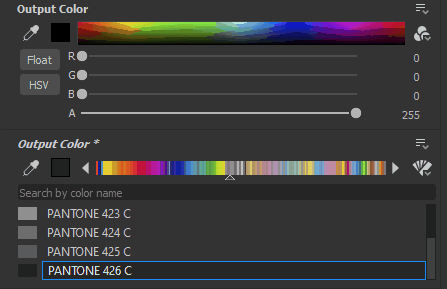

# Tinte piatte (Pantone)

Le tinte piatte rappresentano una modalità alternativa per la scelta dei colori. Al posto del selettore di colore standard RGB o HSV, Substance 3D Designer consente di scegliere i colori dalla guida colori in linea con i sistemi di gestione e riproduzione dei colori esistenti. Ciò consente di garantire che i colori digitali utilizzati in Designer siano molto simili a quelli dei prodotti fabbricati.

Attualmente Spot Colors offre diciassette libri Pantone.

## Gestione del colore

Poiché le tinte piatte consentono una riproduzione e una corrispondenza accurate dei colori, è fondamentale configurare[Gestione colore](../../color-management/color-management.md) per Designer prima di iniziare a lavorare. Le tinte piatte funzionano meglio con la gestione colore <b>Adobe Color Engine (ACE)</b>, non con l&#39;OCIO. Funzioneranno con la modalità precedente, ma non potete essere sicuri che vengano visualizzati correttamente se il monitor non è calibrato per sRGB.

In breve, la configurazione della Gestione colore per le tinte piatte comporta le seguenti operazioni:

* Calibrate il monitor generando o ottenendo il profilo ICC corretto.
* Attivate la gestione colore con Adobe Color Engine (ACE) nelle Preferenze di Designer.
* Impostate 2D e vista 3D per utilizzare il profilo appropriato dal monitor.
* Riavvia per rendere effettive le modifiche.
* Verificate la corrispondenza di colore tra Designer e un’altra applicazione Adobe come Adobe Illustrator o Photoshop. Il colore &quot;<b>Pantone Rhodamine Red C</b>&quot; del primo libro di Pantone, Solid Coated, è un buon test case in quanto può variare in modo significativo se la gestione del colore non è corretta.

>[!WARNING]
>
> **Colori miniature**
> 
> Le miniature dei nodi *non sono gestite dal colore per impostazione predefinita*, pertanto la visualizzazione del colore nella vista 2D con il profilo corretto è considerata attendibile solo. La gestione del colore delle miniature può essere attivata nelle preferenze di Gestione colore del progetto, ma ha un leggero costo in termini di prestazioni.

## Utilizzo delle tinte piatte

### Passare da RGB a Tinta piatta

Anche se configuri la gestione del colore, per impostazione predefinita i selettori colore RGB o HSV usano comunque i selettori colore. Devi impostarli manualmente su Tinte piatte. Questa impostazione viene memorizzata per parametro e viene mantenuta anche quando si espone un parametro.

1. Fai clic sul pulsante  <b>Tipo selettore colore</b> accanto al campione di colore RGB.
1. Invece di <b>colori RGB</b>, scegliete un <b>libro dei colori</b> dall&#39;elenco a discesa.
1. L&#39;icona del  <b>tipo di selettore colore</b> cambia e l&#39;interfaccia cambia in modalità <b>Colore tinta piatta</b>.

{width="512px"}

### Scegliere e trovare le tinte piatte

Ci sono alcuni modi per trovare e scegliere le tinte piatte in una guida colori.

* Potete usare le   <b>frecce sinistra e destra</b> su entrambi i lati delle pagine del libro per passare da una pagina all&#39;altra. È inoltre possibile fare clic e trascinare il puntatore del mouse sulla visualizzazione della pagina per scorrere tra le pagine.
* È possibile fare clic su qualsiasi colore nella pagina corrente per selezionarlo. Spesso sono disponibili più colori e occorre scorrere leggermente verso il basso.
* Potete usare la barra di ricerca per cercare il colore in base al nome o al numero. Questa ricerca corrisponde solo ai nomi dei colori del libro, non è in corso alcuna logica complessa; la ricerca &quot;grigio&quot; produrrà risultati solo con la parola &quot;grigio&quot; nel nome, non vedrete alcun colore grigio che ha solo numeri nel nome.
* Per ottenere un&#39;interfaccia più grande e facile da usare per la guida colori, fai clic sulla casella di anteprima del colore tra l&#39;icona  <b>Contagocce</b> e la  <b>freccia sinistra</b>.

{width="512px"}

### Prelievo e conversione delle tinte piatte

Le tinte piatte possono essere selezionate con lo strumento  <b>Contagocce</b>. In modalità Colore tinta piatta, il colore RGB campionato viene convertito nel colore tinta piatta più simile tra quelli presenti nel libro attualmente selezionato.

Lo strumento <b>Contagocce</b> di Designer può essere utilizzato in qualsiasi punto dello schermo senza limitazioni. Ciò significa che potete utilizzare Designer come strumento di conversione di tinte piatte.

Se cambiate libro o se tornate a RGB da una guida in linea per i colori tinta piatta, il colore corrente viene convertito nella corrispondenza più simile. Ciò significa che potete convertire i colori da un libro all’altro e viceversa in RGB.

>[!WARNING]
>
> La conversione delle tinte piatte tra libri diversi è un’operazione con perdita di dati. Effettuare una conversione round-trip spesso non porterà allo stesso colore come quello che hai iniziato con!

{width="512px"}
