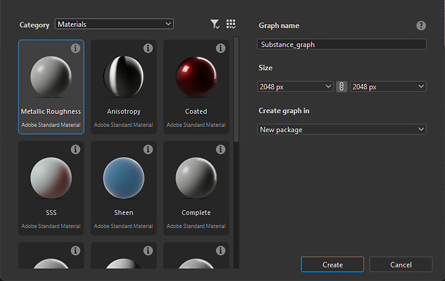
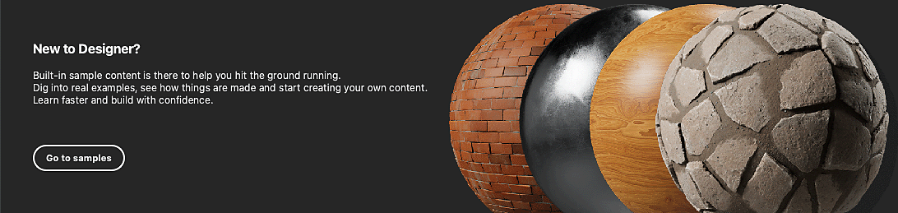

# Creazione di un grafico Substance

La creazione di texture in Designer inizia con la creazione di un grafico a Substance, da un modello predefinito o da un grafico vuoto.

## Creazione di un grafico

Per avviare la creazione di un nuovo [grafico Substance](../../compositing-graphs/substance-compositing-graphs.md), è possibile utilizzare uno dei seguenti metodi:

* &#x200B;
  <table>
  <tr style="border: 0;">
  <td style="border: 0;" valign="top">

  Nella schermata Home, fai clic sul pulsante <b>Nuovo grafico</b>.

  </td>
  <td style="border: 0;" valign="top">

  {zoomable="yes"}

  </td>
  </tr>
  </table>

* &#x200B;
  <table>
  <tr style="border: 0;">
  <td style="border: 0;" valign="top">

  In qualsiasi elemento del pacchetto *esistente* in [Esplora risorse](../../interface/the-explorer-window/the-explorer-window.md), fai clic su <b>MB</b> e seleziona <b>Nuovo > Substance grafico</b> nel menu di scelta rapida.

  </td>
  <td style="border: 0;" valign="top">

  {zoomable="yes"}

  </td>
  </tr>
  </table>

* &#x200B;
  <table>
  <tr style="border: 0;">
  <td style="border: 0;" valign="top">

  Nella barra degli strumenti principale fare clic sul pulsante  <b>Nuovo grafico Substance</b>.

  </td>
  <td style="border: 0;" valign="top">

  {zoomable="yes"}

  </td>
  </tr>
  </table>

* &#x200B;
  <table>
  <tr style="border: 0;">
  <td style="border: 0;" valign="top">

  Nel menu principale, vai a <b>File > Nuovo > Substance grafico...</b>

  </td>
  <td style="border: 0;" valign="top">

  

  </td>
  </tr>
  </table>

* Premi il tasto <b>Ctrl+N</b> (Windows) / <b>Cmd+N</b> (macOS).

Indipendentemente dal metodo scelto, verrà visualizzata la finestra di dialogo <b>Nuovo grafico Substance</b>.

## Modelli di grafici

Indipendentemente dal metodo utilizzato per creare un nuovo grafico Substance, verrà sempre visualizzata la finestra di dialogo <b>Nuovo grafico Substance</b> che consente di configurare il nuovo grafico.

{zoomable="yes"}

### Modelli

Designer include modelli di grafici con nodi preconfigurati per iniziare più rapidamente. Possono includere [nodi di output](../../compositing-graphs/nodes-reference-for-com/atomic-nodes/output/output.md), nodi semplici per passare valori a questi output, ad esempio [Colore uniforme](../../compositing-graphs/nodes-reference-for-com/atomic-nodes/uniform-color/uniform-color.md), nonché nodi [di input](../../compositing-graphs/nodes-reference-for-com/atomic-nodes/input/input.md).

Fai doppio clic su un modello nell&#39;elenco oppure selezionalo e fai clic sul pulsante <b>Crea</b> per creare un nuovo grafico a Substance utilizzando tale modello. Per impostazione predefinita, il nuovo grafico viene inserito in un nuovo pacchetto non salvato.

>[!TIP]
>
> Iniziare da zero
> 
> Per iniziare da un grafico completamente vuoto, seleziona il modello <b>Vuoto</b> nella categoria &quot;Vuoto&quot;.

>[!NOTE]
>
> Passaggio da un modello all’altro
> 
> Se selezioni il modello errato, non puoi *passare a un modello diverso* dopo aver creato il grafico.
> 
> Per trasferire il grafico esistente a un altro modello, potete creare un nuovo grafico utilizzando il modello appropriato e copiare e incollare il grafico in quello nuovo. Riconnettere i nodi come appropriato, in particolare i nodi di output.

<table>
<tr style="border: 0;">
<td width="100.00%" style="border: 0;" valign="top">

Ogni modello è elencato in base all’etichetta e al sottotitolo.

Il sottotitolo fornisce più contesto sul *caso d&#39;uso* per il modello: il modello di materiale su cui è basato, il software con cui è destinato a integrarsi e così via.

In modalità <b>Miniature</b>, il sottotitolo viene inserito sotto l&#39;etichetta in un testo più scuro e più piccolo.

Nelle modalità di visualizzazione <b>Elenco</b>, <b>Pacchetti</b> e <b>Directory</b>, il sottotitolo viene aggiunto all&#39;etichetta in modo uniforme: *Etichetta - Sottotitolo*.

</td>
<td width="25.00%" style="border: 0;" valign="top">

</td>
</tr>
</table>

### Campioni di materiale

La categoria <b>Campioni di materiale</b> include una [selezione accurata di grafici](../../compositing-graphs/creating-compositing-gra/material-samples/material-samples.md) da cui imparare e con cui sperimentare.

Puoi anche accedere agli esempi direttamente dalla schermata Home, utilizzando il pulsante <b>Vai agli esempi</b>.

Tutti i campioni sono basati sull&#39;[modello di materiale](../../interface/3d-view/material-properties/material-properties.md#openpbr).

{zoomable="yes"}

<table>
<tr style="border: 0;">
<td style="border: 0;" valign="top">

### Descrizione comando delle informazioni

Passando il cursore del mouse sull’icona delle informazioni per ogni elemento del modello, viene visualizzata una descrizione con informazioni aggiuntive sul modello:

<b>Tipo:</b> Il tipo di risorsa che il modello deve produrre. È modificabile nelle [proprietà del grafico](../../compositing-graphs/graph-parameters/graph-parameters.md).

<b>Descrizione:</b> dettagli sul modello, ad esempio il flusso di lavoro in cui viene integrato, il caso d&#39;uso previsto e consigli per il suo utilizzo.

<b>Output:</b> Gli eventuali nodi [Output](../../compositing-graphs/nodes-reference-for-com/atomic-nodes/output/output.md) del modello.

</td>
<td style="border: 0;" valign="top">

{zoomable="yes"}

</td>
</tr>
</table>

<table>
<tr style="border: 0;">
<td width="100.00%" style="border: 0;" valign="top">

### Modalità di visualizzazione

L&#39;elenco dei modelli può essere visualizzato in modalità diverse utilizzando il pulsante <b>Modalità di visualizzazione</b>.

I filtri applicati dalla categoria e dal file di progetto selezionati vengono applicati a tutte le visualizzazioni.

</td>
<td width="33.33%" style="border: 0;" valign="top">

{zoomable="yes"}

</td>
</tr>
</table>

+++Modalità di visualizzazione
{zoomable="yes"}

<b>Miniature</b>

Schede con miniature che forniscono un’anteprima o un’icona del tipo di modello.

{zoomable="yes"}

<b>Elenco</b>

I modelli sono elencati solo in base alla relativa etichetta.

{zoomable="yes"}

<b>Pacchetti</b>

I modelli sono elencati in base alla loro etichetta come elementi secondari del file di pacchetto a cui appartengono.

Passate il mouse su un elemento del file del pacchetto per visualizzare una descrizione con il percorso completo.

{zoomable="yes"}

<b>Directory</b>

I modelli sono elencati in base alla loro etichetta come secondari della directory che ospita il file del pacchetto a cui appartengono.

Passate il mouse su un elemento della directory per visualizzare una descrizione con il percorso completo.

+++

### Proprietà

Dopo aver selezionato il modello, potete impostare le informazioni di base relative al nuovo grafico. Può essere modificato in qualsiasi momento dopo aver creato il grafico.

<b>Nome grafico</b>: identificatore del grafico. Deve essere univoco per un determinato pacchetto e non può includere spazi e alcuni caratteri speciali.

<b>Dimensioni</b>: la risoluzione principale del grafico che controllerà la risoluzione dell&#39;output della maggior parte dei nodi. Per ulteriori informazioni, vedere la pagina [Dimensioni output](../../compositing-graphs/output-size/output-size.md). Per impostazione predefinita, la larghezza e il height sono collegati tra loro e puoi scollegarli facendo clic sul pulsante di collegamento tra le caselle combinate larghezza e height.

<b>Crea grafico in</b>: è possibile utilizzare questa casella combinata per creare un pacchetto *nuovo* per il nuovo grafico oppure aggiungere il nuovo grafico a qualsiasi pacchetto *esistente* già caricato nel pannello [Esplora risorse](../../interface/the-explorer-window/the-explorer-window.md).

### Descrizione della Guida

Passa il puntatore del mouse sull’icona del punto interrogativo per visualizzare una descrizione con un pulsante che si collega direttamente a questa pagina, in modo da poter fare riferimento a questa documentazione in base alle esigenze.

{zoomable="yes"}

## Gestione dei modelli

<table>
<tr style="border: 0;">
<td width="100.00%" style="border: 0;" valign="top">

### Filtrare per categoria

Le categorie vengono utilizzate per raggruppare i modelli correlati in base al caso di utilizzo o al tipo di risorsa.

Utilizzare la casella combinata <b>Categoria</b> per selezionare la categoria in base alla quale si desidera filtrare i modelli.

</td>
<td width="41.67%" style="border: 0;" valign="top">

{zoomable="yes"}

</td>
</tr>
</table>

<table>
<tr style="border: 0;">
<td width="100.00%" style="border: 0;" valign="top">

Nei <b>Dati modello</b> dei modelli è possibile impostare una categoria [attributo graph](../../compositing-graphs/graph-parameters/graph-parameters.md), utilizzato come filtro per restringere l&#39;elenco dei modelli:

&lt;category>;&lt;subtitle>

Le categorie personalizzate possono essere impostate nei modelli forniti dai file di progetto (vedi di seguito). Queste categorie verranno quindi aggiunte all&#39;elenco nella casella combinata.

</td>
<td width="50.00%" style="border: 0;" valign="top">

{zoomable="yes"}

</td>
</tr>
</table>

<table>
<tr style="border: 0;">
<td width="100.00%" style="border: 0;" valign="top">

### Filtraggio per file di progetto

Se uno dei [file di progetto](../../interface/preferences-window/project-settings/project-settings.md) attivi fornisce uno o più percorsi di modello, i grafici nei file di pacchetto trovati in questi percorsi verranno aggiunti all&#39;elenco dei modelli.

Utilizzare quindi il pulsante <b>Filtra per file di progetto</b> per restringere l&#39;elenco dei modelli a quelli forniti da un file di progetto specifico.

</td>
<td width="33.33%" style="border: 0;" valign="top">

{zoomable="yes"}

</td>
</tr>
</table>
