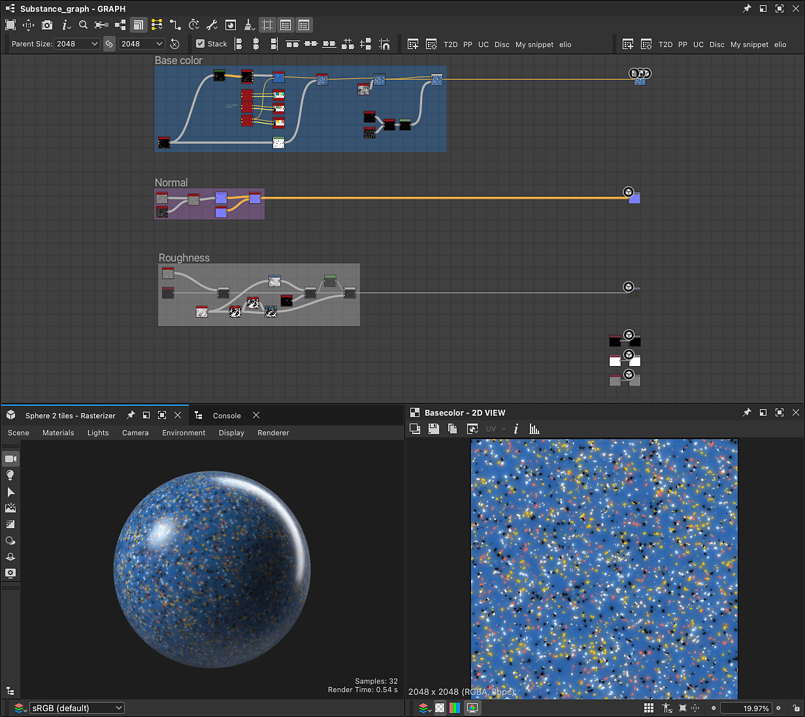

# Campioni di materiale

Designer offre una selezione accurata di grafici campione su vari tipi di materiali da imparare e con cui sperimentare.

Gli esempi devono essere utilizzati come modello di grafico, il che significa che è possibile accedervi <b>creando un nuovo grafico Substance</b>.
Il nuovo grafico è una <b>copia completamente modificabile</b> dell&#39;esempio, che puoi modificare, separare ed espandere a piacere.
È possibile creare dai campioni tutti i nuovi grafici che desideri.

Tutti i campioni sono basati sul modello di materiale **OpenPBR**, un nuovo standard del settore con supporto crescente.

Durante la creazione di un nuovo grafico a Substance, i campioni sono disponibili nella [finestra di dialogo Nuovo grafico a Substance](../../../compositing-graphs/creating-compositing-gra/creating-a-substance-compositing-graph.md):

<table>
<tr style="border: 0;">
<td style="border: 0;" valign="top">

{zoomable="yes"}

Aprite la casella combinata <b>Categoria</b> e selezionate <b>Campioni di materiale</b> per elencare i modelli disponibili.

</td>
<td style="border: 0;" valign="top">

{zoomable="yes"}

Puoi accedere direttamente all&#39;elenco dei campioni nella finestra di dialogo, utilizzando il pulsante <b>Vai a campioni</b> comodamente posizionato
nella <b>schermata iniziale</b>.

</td>
</tr>
</table>

<table>
<tr style="border: 0;">
<td width="33.33%" style="border: 0;" valign="top">

Nella finestra di dialogo, passate il mouse sull’icona delle informazioni di un elemento di esempio per ottenere ulteriori informazioni sui concetti e le tecniche
esplorato nel campione.

</td>
<td width="100.00%" style="border: 0;" valign="top">

{zoomable="yes"}

</td>
</tr>
</table>

Fate doppio clic su un elemento qualsiasi per creare un nuovo grafico a partire dall’esempio. È inoltre possibile selezionare il campione e fare clic su
il pulsante <b>Crea</b>.

Fate doppio clic su un elemento qualsiasi per creare un nuovo grafico a partire dall’esempio. È inoltre possibile selezionare il campione e fare clic su
il pulsante <b>Crea</b>. Una volta selezionato un campione di materiale e convalidata la creazione del grafico, la finestra di dialogo si chiude
e una copia del campione viene caricata come nuovo grafico nella vista Grafico.

Per impostazione predefinita, il primo output del campione viene caricato nella vista 2D e le texture vengono applicate alla vista 3D.
L&#39;area di lavoro viene configurata automaticamente e sei pronto per iniziare. (Può essere modificato nelle [preferenze](../../../interface/preferences-window/preferences-window.md) di Designer)

>[!NOTE]
> 
> I campioni di materiale utilizzano <code>OpenPBR 1.1</code> modello di materiale e visualizzazione nella vista 3D significa
> il materiale nella vista 3D passerà automaticamente alla superficie OpenPBR <code></code> shader per
> visualizzare il campione con precisione.

{zoomable="yes"}
