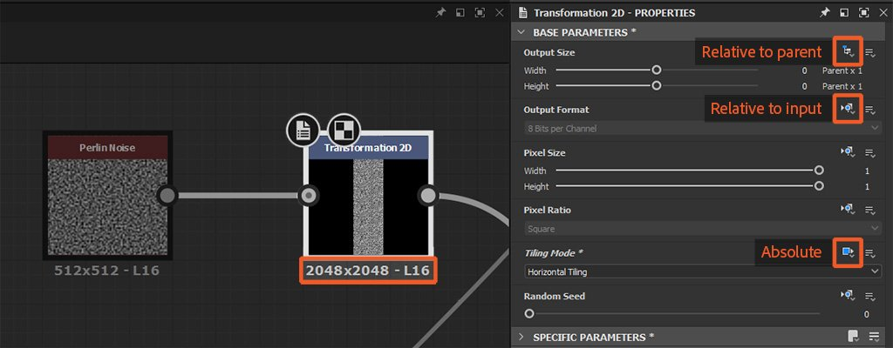

# Ereditarietà nei grafici Substance

Questa pagina descrive come l&#39;ereditarietà viene applicata nei [grafici Substance](../../compositing-graphs/substance-compositing-graphs.md) in [Substance 3D Designer](https://www.adobe.com/products/substance3d-designer.html) e l&#39;impatto che ha sull&#39;output del grafico.

{width="1400px"}

## Panoramica

Tutti i nodi in un grafico a Substance possono *ereditare* il valore di alcuni parametri da un&#39;origine. L&#39;ereditarietà indica che la modifica del valore nell&#39;origine *eseguirà la modifica* in tutti i nodi che ereditano da essa. Questo è uno dei concetti fondamentali alla base della potenza di Substance 3D Designer nella generazione di risorse parametriche.

>[!NOTE]
>
> Nella sezione [Grafici di Substance di esempio](../../compositing-graphs/sample-compositing-graphs/sample-substance-compositing-graphs.md) di questa documentazione è disponibile un file di progetto annotato che dimostra l&#39;ereditarietà.

### Metodi di ereditarietà

<table>
<tr style="border: 0;">
<td style="border: 0;" valign="top">

{width="128px"}

<b>Assoluto</b>

Nessuna ereditarietà. Il valore è definito *arbitrariamente e localmente* per il parametro

</td>
<td style="border: 0;" valign="top">

{width="128px"}

<b>Rispetto all&#39;input</b>

Il valore viene ereditato dai dati connessi all&#39;*input primario* del nodo

</td>
<td style="border: 0;" valign="top">

{width="128px"}

<b>Rispetto all&#39;elemento padre</b>

Il valore viene ereditato dall&#39;*elemento padre* del nodo o del grafico

</td>
</tr>
</table>

I metodi di ereditarietà vengono applicati per i [parametri di base](../../compositing-graphs/graph-parameters/graph-parameters.md) di un nodo, ovvero l&#39;insieme di parametri comuni di tutti i nodi che controllano *aspetti fondamentali* del loro comportamento. Tali parametri includono:

* **Dimensioni output**
* **Formato di output** (ovvero, profondità di bit)
* **Dimensione pixel**
* **Proporzioni pixel**
* **Modalità Porzione**
* **Numero casuale**

Ciò dovrebbe consentirti di comprendere come le modifiche in *un* nodo possano influire sulla risoluzione, la precisione e il comportamento di suddivisione in porzioni di *tutti i nodi a valle* da esso.

>[!WARNING]
>
> Un promemoria importante per comprendere i concetti discussi in questa pagina: un *nodo istanza* è un [nodo che rappresenta un grafico in un altro grafico](../../compositing-graphs/creating-compositing-gra/graph-instances-sub-gra/graph-instances-sub-graphs.md), con i suoi *valori di parametro discreti*, da cui il termine *istanza*.\
> Ad esempio, due nodi [Perlin noise](../../compositing-graphs/nodes-reference-for-com/node-library/texture-generators/noises/perlin-noise/perlin-noise.md) in uno stesso grafico sono entrambi rappresentazioni di un *same* grafico di origine (`perlin_noise` in `noise_perlin_noise.sbs`) con i relativi *insiemi propri* di valori di parametro.

>[!NOTE]
>
> **Dimensioni output:** Utilizzare il pulsante di blocco  per fare in modo che il valore Height *corrisponda* al valore della larghezza\
> **Numero casuale:** Utilizzare il pulsante  per assegnare un nuovo valore casuale al numero casuale.

## Apportare modifiche

### Modifica dei metodi di ereditarietà

Nel pannello Proprietà, tutti i parametri elencati nella sezione [Parametri di base](../../compositing-graphs/graph-parameters/graph-parameters.md) delle proprietà di un nodo dispongono di un pulsante a discesa (icona) <b>Imposta metodo di ereditarietà</b> di fronte all&#39;etichetta.\
Questo pulsante consente di selezionare il metodo di ereditarietà da utilizzare per un parametro.

{width="512px"}

Nella maggior parte dei casi, i parametri di base di un *nodo* sono impostati su *Rispetto all&#39;input*, per sfruttare il comportamento procedurale del concatenamento dei nodi, mentre i parametri di base di un *grafico* sono impostati su *Rispetto all&#39;elemento padre*, in modo che i parametri globali possano adattarsi al contesto in cui viene utilizzato il grafico.

### MODIFICA DEI VALORI EREDITATI

Alcuni parametri di base, ad esempio [Dimensioni output](../../compositing-graphs/output-size/output-size.md), Dimensioni pixel o Numero casuale, possono essere modificati *relativamente al valore ereditato*.

Ad esempio, quando il parametro Dimensione output utilizza un metodo di ereditarietà *Relativo a...*, un valore o `(1, -1)` indica una potenza di due risoluzioni *superiore* il valore ereditato per X e una potenza di due risoluzioni *inferiore* il valore ereditato per Y, ad esempio:

* Valore ereditato: `(9, 9)` che è `2^9, 2^9 = 512, 512`
* Valore relativo: `(1, -1)` che è `2^(9+1), 2^(9-1) = 256, 1024`

>[!NOTE]
>
> La pagina [Dimensioni output](../../compositing-graphs/output-size/output-size.md) approfondisce questo parametro Base critico e si consiglia di leggere per comprendere come viene calcolata la risoluzione finale di un nodo.

Se una funzione viene applicata a un parametro Base, anche il risultato della funzione verrà interpretato utilizzando il metodo di ereditarietà del parametro.\
Tenendo presente l&#39;esempio della dimensione di output, una funzione che mira ad aumentare di due volte la risoluzione ereditata in X e Y dovrebbe generare il valore `(2, 2)` Integer2.

## Proprietà di parentela per nodi e grafici

Quando si utilizza il metodo di ereditarietà Relativo all&#39;elemento padre, è necessario comprendere esattamente cosa si trova esattamente in un contesto specifico.

L&#39;elemento padre di un nodo è il *grafico* in cui esiste.

L&#39;elemento padre di un grafico è il *contesto* in cui esiste:

* Se il grafico è un sottografo istanziato in un altro grafico host come *nodo di istanza*, il padre del sottografo è il *nodo di istanza*. L&#39;elemento padre di tale nodo di istanza è il *grafico host*.
* Se il grafico è un grafico radice, l&#39;elemento padre è l&#39;*applicazione stessa* e qualsiasi valore impostato dall&#39;applicazione per un determinato parametro. Ad esempio, i grafici erediteranno dal parametro <b>Dimensione principale</b> impostato nella barra degli strumenti della [visualizzazione Grafico](../../interface/the-graph-view/the-graph-view.md).

>[!WARNING]
>
> La parentela è *applicata così com&#39;è* quando si pubblica un pacchetto in file di risorse Substance 3D (SBSAR). Ciò significa che l&#39;impostazione di qualsiasi parametro sul metodo di ereditarietà *Assoluto* determinerà il *blocco* di tale parametro sul valore corrente nella risorsa pubblicata.\
> Anche se ciò è auspicabile per [nodi Bitmap](../../compositing-graphs/nodes-reference-for-com/atomic-nodes/bitmap/bitmap.md) o [scopi di ottimizzazione](../../best-practices/performance-optimization/performance-optimization-guidelines.md), ad esempio, si consiglia *vivamente* di utilizzare i metodi di ereditarietà *Relativi a...* quando si utilizzano grafici Substance, a meno che non vi sia uno *scopo chiaro* nel fare diversamente.

### MODIFICA IN CONTESTO

Quando si utilizza [Modifica in contesto](../../compositing-graphs/creating-compositing-gra/graph-instances-sub-gra/graph-instances-sub-graphs.md) su un nodo di istanza del grafico, il padre del grafico è il *nodo di istanza*. In tal caso, l&#39;impostazione <b>Dimensione principale</b> nella barra degli strumenti della [visualizzazione Grafico](../../interface/the-graph-view/the-graph-view.md) è *disabilitata*, poiché il grafico eredita i parametri di base dal nodo dell&#39;istanza.

Questa caratteristica è il *punto* della modifica in contesto e dovrebbe essere *valutata in base al fattore* durante l&#39;impostazione del metodo di ereditarietà e la valutazione dei valori correnti dei parametri Base di qualsiasi nodo.

## Ereditarietà con input multipli

Quando un grafico ha più input, ogni input può ereditare dai suoi dati di input discreti o dal grafico, a seconda del suo metodo di ereditarietà:

<table>
<tr style="border: 0;">
<td style="border: 0;" valign="top">

{width="128px"}

<b>Rispetto all&#39;input</b>

L’input eredita dai suoi dati di input discreti, indipendentemente dai parametri di base del grafico. Questo è molto utile per controllare i dati per input.

</td>
<td style="border: 0;" valign="top">

{width="128px"}

<b>Rispetto all&#39;elemento padre</b>

L’input eredita dal grafico e i dati che riceve vengono adattati di conseguenza.

</td>
<td style="border: 0;" valign="top">

</td>
</tr>
</table>

### Ingresso principale

<table>
<tr style="border: 0;">
<td style="border: 0;" valign="top">

<table>
<tr style="border: 0;">
<td style="border: 0;" valign="top">

{width="48px"}

</td>
<td style="border: 0;" valign="top">

{width="48px"}

</td>
<td style="border: 0;" valign="top">

{width="48px"}

</td>
</tr>
</table>

È possibile impostare uno degli input come **input principale** del grafico facendo clic su **RMB** nel nodo [Input](../../compositing-graphs/nodes-reference-for-com/atomic-nodes/input/input.md) e selezionando l&#39;opzione **Imposta come input principale** nel menu di scelta rapida.

</td>
<td style="border: 0;" valign="top">

</td>
</tr>
</table>

Quando l&#39;istanza del grafico viene inserita in un altro grafico come nodo dell&#39;istanza, tutti i parametri Base del nodo dell&#39;istanza impostati su *Rispetto all&#39;input* erediteranno i dati connessi a *tale input*. L&#39;input principale di un nodo di istanza può essere identificato dal piccolo punto scuro nel suo connettore.

Gli altri input impostati su *Rispetto all&#39;elemento padre* erediteranno gli stessi valori dei parametri di base, in quanto ereditano dal *grafico* che eredita dal *nodo di istanza\**, che eredita dall&#39;input principale.

\*: questo è vero se il grafico utilizza il metodo di ereditarietà* Relativo al padre*.

## Esempi

Di seguito sono riportati alcuni esempi relativi a diversi casi di ereditarietà e all’interazione dei metodi di ereditarietà impostati nei seguenti attori, dall’alto verso il basso:

1. Applicazione
1. Grafico host
1. Nodo dell&#39;istanza nel grafico host
1. Sottografo: il grafico a cui fa riferimento il nodo dell&#39;istanza
1. Nodi nel sottografo

Il *metodo di ereditarietà* impostato per un attore viene visualizzato in arancione appena sopra di esso. Il *flusso di ereditarietà* alla relativa origine viene visualizzato con linee arancioni.

Le lettere rappresentano *set separati* di parametri di base e dovrebbero aiutare a seguire i dati ereditati da ciascun attore.

<table>
<tr style="border: 0;">
<td style="border: 0;" valign="top">

**Esempio A**

{zoomable="yes"}

</td>
<td style="border: 0;" valign="top">

**Esempio B**

{zoomable="yes"}

</td>
</tr>
</table>

<table>
<tr style="border: 0;">
<td style="border: 0;" valign="top">

**Esempio C**

{zoomable="yes"}

</td>
<td style="border: 0;" valign="top">

**Esempio D**

{zoomable="yes"}

</td>
</tr>
</table>

## Risoluzione dei problemi di ereditarietà

Man mano che create il grafico e ne aumentate la complessità, potreste riscontrare risultati imprevisti dovuti all’ereditarietà. Se l&#39;output di un nodo ha una risoluzione o una precisione errata (ad esempio, la profondità di bit), è necessario passare *alla catena di ereditarietà* per individuare la provenienza di tali valori.

Un buon punto di partenza è il controllo dei dati visualizzati appena sotto un nodo: si tratta della risoluzione, del formato del colore e della precisione dell&#39;output dell&#39;immagine da parte del *primo output* del nodo. Anche se la comprensione della risoluzione è semplice, vale la pena di approfondire la seconda parte dei dati:

* Il *prefisso di lettere* fa riferimento al formato colore dell&#39;immagine:
  * <b>L</b>: Luminanza (ovvero, scala di grigi)
  * <b>C</b>: colore
* Il *numero* fa riferimento alla profondità di bit dell&#39;immagine, dalla precisione più bassa a quella più alta:
  * <b>8</b>: numero intero a 8 bit (256 passaggi in 0-1)
  * <b>16</b>: numero intero a 16 bit (65.536 passaggi in 0-1)
  * <b>16F</b>: virgola mobile a 16 bit (valori di bassa precisione superiori a 0-1, inclusi negativi)
  * <b>32F</b>: virgola mobile a 32 bit (valori di alta precisione superiori a 0-1, inclusi negativi)

Se il nodo dispone di più output, è possibile verificarne la risoluzione e la precisione in due semplici modi:

* Fate doppio clic su <b>LMB</b> nel *connettore di output* per visualizzare l&#39;immagine nella [vista 2D](../../interface/2d-view/2d-view.md) e verificate le informazioni sull&#39;immagine visualizzate nell&#39;*angolo inferiore sinistro* della vista 2D
* Creare un nodo [Livelli](../../compositing-graphs/nodes-reference-for-com/atomic-nodes/levels/levels.md) o [Trasformazione 2D](../../compositing-graphs/nodes-reference-for-com/atomic-nodes/transformation-2d/transformation-2d.md) e collegarne l&#39;input all&#39;output che si desidera controllare. Per impostazione predefinita, il nodo *eredita dall&#39;output* ed è quindi possibile controllare i valori al di sotto del nodo.

È ora possibile spostarsi in alto nella catena di nodi nel grafico e cercare di trovare il *primo nodo* in cui vengono visualizzati i valori imprevisti. Controllare il metodo di ereditarietà dei relativi parametri Base.

Se non vi sono errori e il nodo è un nodo di istanza, è necessario andare più in profondità e aprire il grafico a cui fa riferimento tale nodo di istanza. Ripetete il processo partendo dai nodi di output del grafico e andando a monte.

### UN ESEMPIO COMUNE

In particolare, il concetto di *input primario* è facilmente *ignorato* e può causare problemi di ereditarietà.

Il nodo [Fusione](../../compositing-graphs/nodes-reference-for-com/atomic-nodes/blend/blend.md) è molto sensibile a questo, in quanto viene utilizzato molto frequentemente. L&#39;input <b>Background</b> è l&#39;input principale.

{width="512px"}

È necessario prestare attenzione all&#39;ordine in cui si fondono i due input: l&#39;input che la risoluzione e la precisione che si desidera mantenere in basso il grafico dovrebbe essere collegato all&#39;input Sfondo, se il metodo di fusione necessario lo rende possibile. In caso contrario, potrebbe essere necessario modificare i parametri di base del nodo di blend e il relativo metodo di ereditarietà per compensare.
