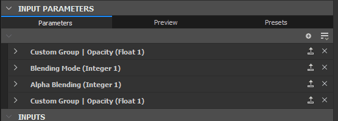

# Esposizione di un parametro

L’esposizione dei parametri è uno degli strumenti più potenti ed è fondamentale per aprire i tuoi grafici ad altre applicazioni quali Substance 3D Painter, Substance 3D Sampler e Substance Integrazioni for Maya e 3DS Max.

Questa pagina spiega tutti i concetti necessari per iniziare a esporre. Prima di continuare su questa pagina, ti consigliamo di [sapere cos&#39;è un&#39;istanza di Graph](../../../compositing-graphs/creating-compositing-gra/graph-instances-sub-gra/graph-instances-sub-graphs.md). È inoltre utile conoscere[la differenza tra Publish ed Exporting, nonché i tipi di file interessati.](../../../getting-started/overview/overview.md)

*\*Le linee tratteggiate, trasparenti sopra riportate sono una rappresentazione astratta della connessione\
dai parametri esposti ai parametri del grafico.*

## Comprendere i parametri ed esporre

+++Che cos&#39;è un parametro?
*Un parametro è un valore semplice, con un elemento dell&#39;interfaccia utente, che controlla il comportamento di un grafico.* Li usi costantemente in tutti i software di Substance: per cambiare un colore, per impostare il metodo di fusione, per scegliere un valore di opacità, ecc... Senza parametri, il software Substance non consente alcuna personalizzazione.

I parametri possono assumere diverse forme: cursori, quadranti, caselle di testo, menu a discesa e così via. I valori che rappresentano possono essere di diversi tipi: valori decimali, valori interi (integer), valori booleani (true/false) e frammenti di testo.

+++

+++Che cos&#39;è &#39;esporre&#39;?
***L&#39;esposizione è il processo che consente di rendere disponibile un parametro per l&#39;utilizzo al di fuori dell&#39;attuale visualizzazione grafico.***  Durante la creazione di un grafico, in genere si seleziona un nodo per modificare i parametri nelle relative proprietà; se esposto, si *abilita l&#39;accesso a questo parametro da un pannello di controllo esterno*. Questo &quot;pannello di controllo esterno&quot; può indicare cose diverse in base al contesto: quando viene utilizzato come istanza di Graph all&#39;interno di Designer, funge semplicemente da un altro nodo. Quando vengono utilizzati in Substance 3D Painter, Substance 3D Sampler o in un&#39;integrazione, questi parametri esposti saranno *l&#39;unico controllo* di cui disponi sul grafico.

+++

+++Perché l&#39;esposizione è utile?
***L&#39;esposizione dei parametri porta Substance 3D Designer oltre un semplice editor di texture, consentendoti di creare strumenti personalizzabili e dinamici per la generazione delle texture*** **.** Senza esporre, i Materiali Substance non sarebbero molto diversi dalle texture statiche: non avresti modo di modificarne gli output.

+++

+++Perché non esporre sempre ogni parametro in modo automatico?
<b> [Substance grafici](../../../compositing-graphs/substance-compositing-graphs.md) può diventare complicato e può contenere centinaia di parametri contemporaneamente. Non ha senso mostrare sempre tutti i parametri a un utente, soprattutto se si creano grafici con un obiettivo semplice, che non richiedono molti parametri.</b> Quando esponi i parametri, lavori come progettista UI o UX: pensi che i controlli abbiano senso, quali valori siano richiesti e come renderne facile l&#39;utilizzo per te stesso, per gli altri utenti online o per i tuoi colleghi.

+++

+++Devo sapere la matematica per esporre? È necessario comprendere i grafici delle funzioni di Substance?
***Non è richiesta la conoscenza matematica per utilizzare correttamente i parametri di esposizione, né l&#39;uso delle funzioni.***  Come utente iniziale, potete evitare quasi completamente di dover eseguire operazioni matematiche in [Grafici delle funzioni](../../../function-graphs/function-graphs.md). L&#39;unica cosa fortemente consigliata è una [conoscenza di base decente dei diversi tipi di dati, ad esempio Integer, Float e Boolean.](../../../function-graphs/nodes-reference-for-fun/function-nodes-overview/function-nodes-overview.md)

+++

## Come esporre

Attualmente esistono due metodi principali per esporre i parametri. Un metodo è più adatto per esporre rapidamente un singolo parametro, mentre il secondo è più adatto per esporre più parametri in una singola sweep.

{width="512px"}

### METODO DI ESPOSIZIONE SINGOLA

1. Individua il parametro da esporre nel pannello [Proprietà](../../../interface/properties/properties.md), nella scheda Parametri specifici.
1. Fai clic sul pulsante Opzioni del menu a discesa .
1. Scegli  <b>Esporta come nuovo input grafico</b> dall&#39;elenco a discesa, la prima opzione.
1. Viene visualizzata la finestra di dialogo <b>Esponi parametro</b>. Impostare le proprietà desiderate.

   È consigliabile modificare almeno l&#39;<b>identificatore</b> e l&#39;<b>etichetta</b>
1. Premi <b>OK</b> per confermare
1. Il nome del parametro diventa *blu* e \
   <b> Il pulsante Modifica funzione parametro</b> viene visualizzato accanto alle opzioni del menu a discesa per confermare che il parametro è esposto

>[!NOTE]
>
> La maggior parte dei campi numerici supporta *formule matematiche di base* come input, ad esempio `17+3.5`, `7/3`, `(4+2)*3`. Premere *Invio* per convalidare la formula e il risultato verrà inserito nel campo. Se la formula non è valida, il campo torna al valore precedente.\
> Questa funzione è supportata anche da alcuni campi numerici in altre parti dell&#39;applicazione, ad esempio nel dock [Proprietà](../../../interface/properties/properties.md).

{width="512px"}

### Metodo di esposizione in batch

Quando si espone un parametro, questo metodo sarà un po’ più lento rispetto al precedente. Quando si espongono più parametri, è molto più veloce.

1. Invece di trovare un singolo parametro, trova il pulsante  <b>Esposizione multipla</b> in alto a destra della scheda <b>Parametri specifici</b>
1. Scegli <b>Parametri di visualizzazione batch...</b> dal menu a discesa.
1. Viene visualizzata la finestra di dialogo <b>Esposizione batch</b>, che consente di personalizzare l&#39;esposizione di tutti i <b>parametri specifici</b> di un nodo
1. Utilizza <b>Tutti</b>, <b>Nessuno</b> o caselle di controllo specifiche per decidere quali parametri esporre
1. Fare clic su un nome di parametro nella colonna <b>Identificatore di input grafico</b> dell&#39;elenco per modificarne il nome.
1. Fare clic su un <b>nome gruppo</b> nella colonna <b>Gruppo di input grafico</b> dell&#39;elenco per aggiungere un (sotto)gruppo per un parametro specifico
1. Utilizza le caselle di tipo <b>Identificatore di input grafico</b> e <b>Gruppo di input grafico</b> nella parte inferiore per aggiungere prefisso, suffisso e gruppi di input a tutti i parametri esposti contemporaneamente. Tutti questi valori vengono applicati sopra le impostazioni per parametro.
1. Fai clic su <b>OK</b> per confermare ed esporre tutti i parametri selezionati. I nomi dei parametri ora mostrano *blu* per confermare che i parametri sono esposti, nonché un pulsante  <b>Modifica funzione</b>.

## Limitazioni

Ci sono alcune limitazioni legate all&#39;esposizione dei parametri, come elencato nella tabella seguente.

| Tipo di parametro | Motivo |
| --- | --- |
| [Gradient Ramp](../../../compositing-graphs/nodes-reference-for-com/atomic-nodes/gradient-map/gradient-map.md), [Curve Editor](../../../compositing-graphs/nodes-reference-for-com/atomic-nodes/curve/curve.md), [Font](../../../compositing-graphs/nodes-reference-for-com/atomic-nodes/text/text.md), [Istogramma Livelli](../../../compositing-graphs/nodes-reference-for-com/atomic-nodes/levels/levels.md) | Richiedi widget che non sono disponibili per i parametri creati dall&#39;utente. |

Un&#39;altra limitazione significativa è correlata a [parametri statici](../../../glossary/glossary.md). Non è possibile modificare queste impostazioni in una [risorsa Substance 3D pubblicata (SBSAR)](../../publishing-asset-files/publishing-substance-3d-asset-files-sbsar.md).

I parametri statici, a differenza dei parametri dinamici, *non possono essere modificati al volo* dopo che il grafico è stato *elaborato*, ovvero elaborato per eseguire l&#39;algoritmo in modo rapido ed efficiente. La cottura avviene in Designer ogni volta che il grafico viene *modificato* o *pubblicato*.

Di conseguenza, i parametri statici sono visibili e modificabili in Designer, ma sono *nascosti* in una risorsa Substance 3D pubblicata. È possibile utilizzare la modalità Anteprima per verificare l&#39;applicazione di queste limitazioni prima della pubblicazione su una risorsa di Substance 3D: consulta &quot;Anteprima dei parametri&quot; di seguito.

Come soluzione alternativa, è possibile utilizzare un nodo [Switch](../../../compositing-graphs/nodes-reference-for-com/node-library/filters/blending/switch/switch.md) o [Multi Switch](../../../compositing-graphs/nodes-reference-for-com/node-library/filters/blending/multi-switch/multi-switch.md) e più set di logica per passare tra valori/stati diversi per questi parametri.

| Nodo | Parametro |
| --- | --- |
| Tutti i nodi | Modalità di stampa in porzioni |
| [Colore uniforme](../../../compositing-graphs/nodes-reference-for-com/atomic-nodes/uniform-color/uniform-color.md) | Metodo colore |
| [Processore pixel](../../../compositing-graphs/nodes-reference-for-com/atomic-nodes/pixel-processor/pixel-processor.md) | Metodo colore |
| [Fusione](../../../compositing-graphs/nodes-reference-for-com/atomic-nodes/blend/blend.md) | Metodo fusione Alpha fusione Area di ritaglio |
| [FX-Map](../../../compositing-graphs/nodes-reference-for-com/atomic-nodes/fx-map/fx-map.md) | Metodo fusione |
| [Quadrante](../../../function-graphs/fxmaps/the-quadrant-node/the-quadrant-node.md) | Immagine di input pattern alfa Filtraggio dell&#39;immagine di input |

## Modifica dei parametri esposti

Una volta esposto, non è più possibile accedere a un parametro come prima. La modifica del valore, la ridenominazione, la disposizione nell’interfaccia utente e persino la rimozione del parametro vengono eseguite a livello di Proprietà grafico. Questa sezione spiega come procedere.

Per modificare le opzioni di un parametro esposto:

1. Fai clic sul pulsante Opzioni elenco a discesa  accanto al parametro già visualizzato
1. Scegli <b> Modifica input grafico esposto</b>. Viene visualizzata direttamente la voce pertinente nelle proprietà del grafico.
1. Fate doppio clic in un&#39;area vuota del grafico per visualizzare le proprietà del grafico, quindi trovate il parametro nell&#39;elenco dei <b>parametri di input</b>
1. Fai un solo clic sul grafico in <b>Esplora risorse</b>, quindi trova il parametro nell&#39;elenco dei <b>parametri di input</b>

{width="512px"}

### PARAMETRI DI INPUT

Tutti i parametri esposti sono elencati nella scheda Parametri di input. Le seguenti proprietà sono disponibili per i casi più comuni, ad esempio Float e Integer con tipo di editor predefinito.

1. <b>Identificatore</b>: identificatore univoco per questo parametro. Non può contenere spazi o caratteri speciali.
1. <b>Etichetta</b>: etichetta solo interfaccia utente. Se non è definito alcun Label, l&#39;identificatore viene visualizzato nell&#39;interfaccia utente. Può contenere spazi e caratteri speciali
1. <b>Gruppo</b>: raggruppa i parametri in una sezione comprimibile per mantenere elenchi lunghi di parametri puliti e gestibili. I parametri vengono raggruppati insieme se condividono lo *stesso nome di gruppo*. Utilizza il carattere `/` per creare *sottogruppi*, ad esempio `My Group/My Sub-group`
1. <b>Descrizione</b>: campo di testo per la descrizione, utilizzato come descrizione.
1. <b>Tipo / Editor</b>: impostare il tipo di dati e il tipo di editor dell&#39;interfaccia utente. Alcuni editor sono disponibili solo per determinati tipi di dati (ad esempio, un elenco a discesa solo per Integer). *La modifica dell&#39;editor in molti casi cancellerà i valori predefiniti. Prestare attenzione.*
1. <b>Predefinito</b>: valore predefinito a cui inizia il parametro. Questo è anche il valore utilizzato nel grafico durante l’anteprima dei nodi. Cercate di utilizzare un valore semplice e utilizzabile in questo caso, evitando casi estremi.
1. <b>Min</b>: valore minimo per l’interfaccia utente.
1. <b>Max</b>: valore massimo per l’interfaccia utente.
1. <b>Blocco</b>: impostare se Min e Max sono limiti non superabili o rigidi (consentire all&#39;utente di superare i limiti).
1. <b>Passaggio</b>:Set della precisione o granularità del valore.
1. <b>Dati utente: </b>dati utente personalizzati, disponibili per qualsiasi scopo.
1. <b>Visibile se</b>: sistema di espressione speciale per mostrare o nascondere i parametri in base alle condizioni esterne. Consulta [Visibile se: controlla la visibilità di input, output e parametri](../../../compositing-graphs/visible-control-vis/visible-if-control-visibility-of-inputs-outputs-and-parameters.md)

{width="512px"}

#### Elenco a discesa

Un caso speciale è l&#39;<b>Elenco a discesa</b> per i tipi Integer. Non esistono valori Predefinito, Min o Max, ma solo una singola impostazione di Valore che consente di definire un elenco di elementi.

* Ogni elemento corrisponde a un elemento dell&#39;elenco a discesa.
* Il primo valore di un elemento è il numero intero interno effettivo utilizzato dal grafico. Assicurati di configurarli correttamente per [Multi Switch](../../../compositing-graphs/nodes-reference-for-com/node-library/filters/blending/multi-switch/multi-switch.md), ad esempio (iniziano da 1 e non da 0).
* Il secondo valore è l&#39;etichetta dell&#39;interfaccia utente visualizzata all&#39;utente.
* La terza casella di controllo consente di contrassegnare un elemento come predefinito selezionato.
* La X elimina un elemento, il + aggiunge un elemento

{width="512px"}

#### Riordina

È possibile riordinare facilmente i parametri trascinando e rilasciando le maniglie scure e con striping a sinistra del nome dei parametri di input nell&#39;elenco. Tieni presente che i parametri di raggruppamento possono influire sull&#39;ordine.

{width="512px"}

### ANTEPRIMA DEI PARAMETRI

Poiché la configurazione dei parametri può risultare difficile senza vedere il risultato finale, è possibile attivare una <b>modalità anteprima</b> per verificare l&#39;aspetto e il comportamento esterno dell&#39;interfaccia utente dei parametri. Fai clic sulla scheda <b>Anteprima</b> in alto al centro del rollout dei parametri di input.

In genere, le modifiche apportate in <b>Modalità anteprima</b> vengono *ignorate*. È tuttavia possibile utilizzare il <b>pulsante Applica </b>accanto all&#39;icona dell&#39;occhio per impostare i valori correnti della modalità anteprima<b></b> come *nuovi valori predefiniti*.

[La modalità Anteprima consente inoltre di creare predefiniti incorporati.](../../../compositing-graphs/manage-parameters/parameter-presets/parameter-presets.md)

>[!IMPORTANT]
>
> La modalità di anteprima è disabilitata quando si utilizza [la modifica in contesto](../../../interface/preferences-window/preferences-window.md).

>[!WARNING]
>
> La modalità Anteprima mira a rappresentare l&#39;esperienza di una [risorsa Substance 3D pubblicata (SBSAR)](../../publishing-asset-files/publishing-substance-3d-asset-files-sbsar.md) nel modo più accurato possibile. Pertanto, le limitazioni elencate in questa pagina verranno applicate in questa modalità, ad esempio *parametri statici assenti dall&#39;elenco*.

{width="512px"}

### PARAMETRI COPIA-INCOLLA

I parametri possono essere copiati e incollati tra grafici.

È possibile copiare un singolo parametro con il pulsante Copia . È possibile copiare più parametri tramite il menu Parametri . Scegliete Copia input per copiare tutti gli input.

Scegliere Incolla input  nel menu Parametri  per incollare uno o più parametri.

Se desideri trasferire valori e non il parametro esposto stesso, [leggi i predefiniti dei parametri.](../../../compositing-graphs/manage-parameters/parameter-presets/parameter-presets.md)

## Rimozione e pulizia dei parametri esposti

A causa della natura dei parametri, in cui è possibile disporre di un parametro di input che controlla più nodi o in cui i parametri di input possono esistere senza controllare un nodo, è possibile che si verifichino problemi con i parametri mancanti o non utilizzati. Di seguito sono descritti i problemi comuni e le relative soluzioni.

{width="512px"}

### RILEVAMENTO DEI PARAMETRI INTERROTTI SUI NODI

È possibile tenere traccia del parametro utilizzato dal nodo tramite lo strumento Ricerca nodi , disponibile nella barra superiore della visualizzazione Grafico. Fare clic su di esso per trovare i nodi utilizzando parametri specifici.

Se un nodo presenta un problema effettivo, verrà visualizzato un badge di avviso  nell&#39;angolo superiore sinistro. Passando il cursore del mouse sul badge, verrà visualizzata una descrizione con ulteriori informazioni.

Per reimpostare e rimuovere un problema, fare clic sul pulsante a discesa  accanto al pulsante Modifica funzione per il parametro che si desidera correggere o reimpostare e selezionare  <b>Reimposta. </b>In questo modo viene ripristinato lo stato precedente di un parametro non esposto. Il nome blu diventerà nuovamente grigio per riflettere tale situazione.

{width="512px"}

### PULIZIA DEI PARAMETRI DI INPUT NON UTILIZZATI

Se avete perso la traccia dei parametri di input e non sapete più quali sono utilizzati, potete ripulirli con un piccolo strumento. Fai clic sul pulsante del menu Parametro di input  e seleziona <b>Input puliti.</b>

Viene visualizzata una nuova finestra di dialogo che elenca tutti i parametri non utilizzati. Selezionate o deselezionate i parametri da rimuovere o conservare e fate clic su OK. Se non viene visualizzata alcuna finestra di dialogo, al momento non sono presenti parametri inutilizzati da pulire.

{width="512px"}

### RIMOZIONE DEI PARAMETRI

Per rimuovere effettivamente un parametro in uso, sono necessari due passaggi distinti.

1. Sul nodo con il parametro esposto, fate clic sulla freccia a discesa a destra del pulsante Esposizione funzione colorato in blu: . Quindi scegli &quot;Ripristina valore predefinito&quot;. In questo modo viene rimosso l&#39;utilizzo del parametro su questo nodo. ripetere per qualsiasi altro nodo che utilizza lo stesso parametro. &quot;Ripristina valore predefinito&quot; reimposta anche l&#39;intervallo del widget di parametri nel relativo *intervallo soft*.
1. Nell&#39;elenco Parametri di input del grafico fare clic sulla X a destra della voce del parametro. Il parametro viene eliminato completamente. Se un nodo tenta di utilizzare questo parametro, verrà visualizzato un badge di avvertenza (vedere sopra).
