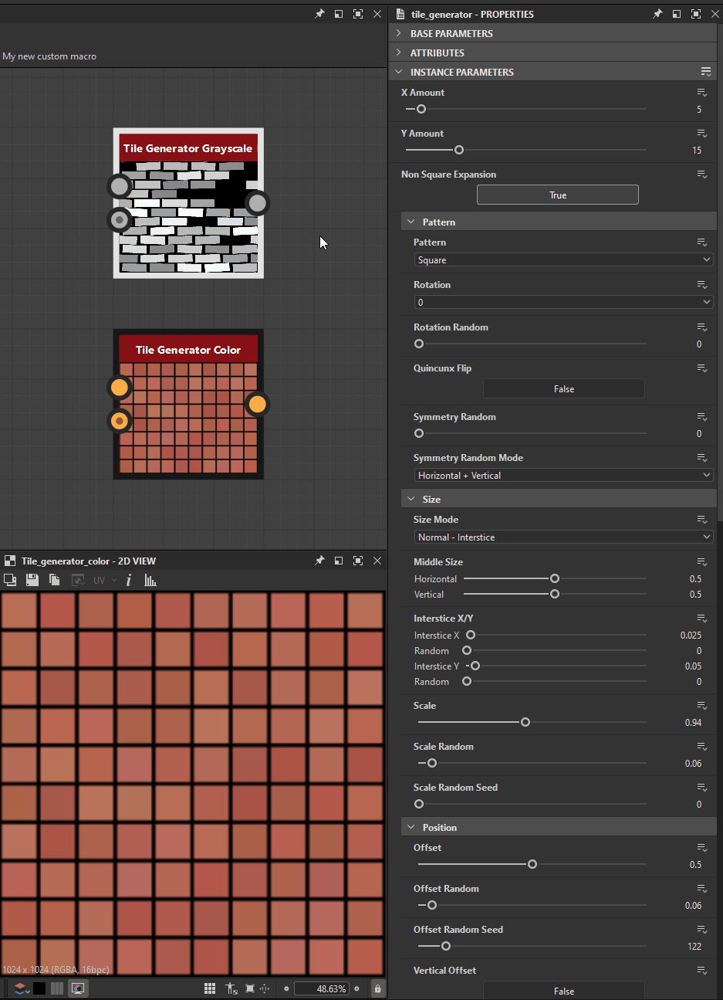

# Gestisci i parametri

Quando è necessario controllare i parametri in modo diverso dalla regolazione diretta, Designer offre diverse azioni utili per:

* [Copiare e incollare](#copy-paste-parameters) i valori di tutti i parametri di un nodo
* Salvare i valori o tutti i parametri di un nodo in un [file predefinito](../../compositing-graphs/manage-parameters/parameter-presets/parameter-presets.md), per riutilizzarli in seguito
* [Esporre i parametri](../../compositing-graphs/manage-parameters/exposing-a-parameter/exposing-a-parameter.md) dei nodi per renderli accessibili e collegarli
* [Nascondere o mostrare i parametri](../../compositing-graphs/visible-control-vis/visible-if-control-visibility-of-inputs-outputs-and-parameters.md) in base ai valori di altri parametri
* Utilizza un [grafico della funzione Substance](../../function-graphs/function-graphs.md) per calcolare il valore di un parametro

## Azioni parametro

Gli strumenti disponibili per la gestione dei parametri sono disponibili nei seguenti percorsi:

### Azioni globali

<table>
<tr style="border: 0;">
<td width="100.00%" style="border: 0;" valign="top">

Quando le proprietà di un nodo vengono visualizzate nel Dock proprietà, i parametri del nodo possono essere gestiti globalmente utilizzando il menu &#39;<b>Gestisci parametri</b>&#39; nell&#39;intestazione di sezione seguente:

* Per [nodi atomici](../../compositing-graphs/nodes-reference-for-com/atomic-nodes/atomic-nodes.md): parametri specifici
* Per [nodi di istanza](../../compositing-graphs/creating-compositing-gra/graph-instances-sub-gra/graph-instances-sub-graphs.md): parametri di istanza

</td>
<td width="33.33%" style="border: 0;" valign="top">

{zoomable="yes"}

</td>
</tr>
</table>

Le azioni di questo menu influiranno su *tutti* i parametri elencati in quella sezione:

* <b>Parametri di esposizione:</b> Apre la finestra di dialogo &#39;Parametri di esposizione batch&#39;. Per ogni parametro esposto, l’azione crea un nuovo input grafico e imposta automaticamente una funzione utilizzando tale input. Ulteriori informazioni sull&#39;esposizione dei parametri in [questa pagina dedicata](../../compositing-graphs/manage-parameters/exposing-a-parameter/exposing-a-parameter.md).
* <b>Copia parametri:</b> Vedere la sezione [Copia e incolla parametri](#copy-paste-parameters) riportata di seguito.
* <b>Incolla parametri:</b> Vedere la sezione [Copia e incolla parametri](../../compositing-graphs/manage-parameters/manage-parameters.md) seguente.
* <b>Salva i parametri come file di predefiniti:</b> Ulteriori informazioni sui predefiniti dei parametri in [questa pagina dedicata](../../compositing-graphs/manage-parameters/parameter-presets/parameter-presets.md).
* <b>Applicare i parametri da un file di predefiniti:</b> Ulteriori informazioni sui predefiniti dei parametri in [questa pagina dedicata](../../compositing-graphs/manage-parameters/parameter-presets/parameter-presets.md).
* <b>Reimposta tutto:</b> Reimposta tutti i parametri sui valori e gli intervalli predefiniti. Se una funzione è stata applicata a un parametro, viene ignorata.

>[!NOTE]
>
> Alcune azioni non sono disponibili per alcuni nodi atomici. Consulta [Limitazioni dei nodi atomici](#atomic-nodes-limitations) di seguito.

### Azioni con parametro singolo

<table>
<tr style="border: 0;">
<td width="100.00%" style="border: 0;" valign="top">

Per gestire un parametro *singolo*, utilizzare il menu &#39;<b>Gestisci funzione</b>&#39; di fronte all&#39;etichetta del parametro.

</td>
<td width="33.33%" style="border: 0;" valign="top">

{zoomable="yes"}

</td>
</tr>
</table>

È possibile applicare un [grafico della funzione Substance](../../function-graphs/the-function-graph/the-function-graph.md) a tale parametro in tre modi:

* <b>Esporre come nuovo input grafico:</b> Questo crea un nuovo input grafico e imposta automaticamente una funzione utilizzando tale input grafico. Ulteriori informazioni sull&#39;esposizione dei parametri in [questa pagina dedicata](../../compositing-graphs/manage-parameters/exposing-a-parameter/exposing-a-parameter.md).
* <b>Funzione vuota:</b> creare una funzione da zero.
* <b>Valore costante:</b> Modificare una funzione a partire da un [nodo di valore costante](../../function-graphs/nodes-reference-for-fun/atomic-function-nodes/constant-nodes/constant-nodes.md) impostato sul valore corrente del parametro.
* <b>Reimposta:</b> reimposta il parametro sul valore e sull&#39;intervallo predefiniti. Se una funzione è stata applicata al parametro, viene ignorata.

>[!NOTE]
>
> Le azioni copia/incolla e file predefinito sono globali per tutti i parametri e quindi non sono disponibili per singoli parametri.

### Menu contestuale nodo

<table>
<tr style="border: 0;">
<td width="100.00%" style="border: 0;" valign="top">

Alcune azioni dei parametri del menu *globale* sopra elencato sono disponibili nel menu contestuale del nodo. Fai clic su RMB su un nodo e seleziona &quot;Gestisci parametri&quot; per accedervi.

Le azioni di copia/incolla non sono disponibili in questo menu. È possibile trovarli nelle proprietà del nodo come spiegato in precedenza.

Le stesse limitazioni elencate di seguito per i nodi atomici si applicano a questo menu.

</td>
<td width="50.00%" style="border: 0;" valign="top">

{zoomable="yes"}

</td>
</tr>
</table>

<table>
<tr style="border: 0;">
<td style="border: 0;" valign="top">

## Copiare e incollare i parametri

È possibile copiare tutti i valori dei parametri per un nodo di origine e incollarli in un nodo di destinazione. I parametri dei nodi di origine e di destinazione sono <b>corrispondenti in base ai relativi identificatori e tipi</b>.

Ad esempio, un parametro &#39;Scale&#39; con identificatore &#39;scale&#39; e tipo &#39;Float&#39; può essere copiato e incollato in un altro parametro &#39;Shape Scale&#39; quando anche l&#39;identificatore è &#39;scale&#39; e il relativo tipo è &#39;Float&#39;.

Questa funzionalità funziona come l&#39;utilizzo di un [file di parametri predefiniti](../../compositing-graphs/manage-parameters/parameter-presets/parameter-presets.md). In effetti, i dati copiati negli Appunti sono gli stessi dei dati memorizzati nei file dei predefiniti SBSPRS e possono essere incollati in qualsiasi editor di testo per essere rivisti e modificati.

</td>
<td style="border: 0;" valign="top">

{zoomable="yes"}

</td>
</tr>
</table>

## Limitazioni dei nodi atomici

Alcune funzionalità non sono disponibili per alcuni [nodi atomici](../../compositing-graphs/nodes-reference-for-com/atomic-nodes/atomic-nodes.md), a causa della loro implementazione e dei controlli specifici.

Queste azioni...

* [Copia/Incolla parametri](#copy-paste-parameters)
* [Salva/Applica file predefinito](../../compositing-graphs/manage-parameters/parameter-presets/parameter-presets.md)

...non sono disponibili per questi nodi atomici:

<table>
<tr style="border: 0;">
<td style="border: 0;" valign="top">

[Bitmap](../../compositing-graphs/nodes-reference-for-com/atomic-nodes/bitmap/bitmap.md)

[Curva](../../compositing-graphs/nodes-reference-for-com/atomic-nodes/curve/curve.md)

[Distanza](../../compositing-graphs/nodes-reference-for-com/atomic-nodes/distance/distance.md)

[FX-Map](../../compositing-graphs/nodes-reference-for-com/atomic-nodes/fx-map/fx-map.md)

[Sfumatura (dinamica)](../../compositing-graphs/nodes-reference-for-com/atomic-nodes/gradient-dynamic/gradient-dynamic.md)

</td>
<td style="border: 0;" valign="top">

[Mappa sfumatura](../../compositing-graphs/nodes-reference-for-com/atomic-nodes/gradient-map/gradient-map.md)

[Colore di input](../../compositing-graphs/nodes-reference-for-com/atomic-nodes/input/input.md)

[Scala di grigi di input](../../compositing-graphs/nodes-reference-for-com/atomic-nodes/input/input.md)

[Valore di input](../../compositing-graphs/nodes-reference-for-com/atomic-nodes/input/input.md)

[Output](../../compositing-graphs/nodes-reference-for-com/atomic-nodes/output/output.md)

</td>
<td style="border: 0;" valign="top">

[Elaboratore pixel](../../compositing-graphs/nodes-reference-for-com/atomic-nodes/pixel-processor/pixel-processor.md)

[SVG](../../compositing-graphs/nodes-reference-for-com/atomic-nodes/svg/svg.md)

[Testo](../../compositing-graphs/nodes-reference-for-com/atomic-nodes/text/text.md)

[Colore uniforme](../../compositing-graphs/nodes-reference-for-com/atomic-nodes/uniform-color/uniform-color.md)

[Elaboratore valori](../../compositing-graphs/nodes-reference-for-com/atomic-nodes/value-processor/value-processor.md)

</td>
<td style="border: 0;" valign="top">

</td>
</tr>
</table>
