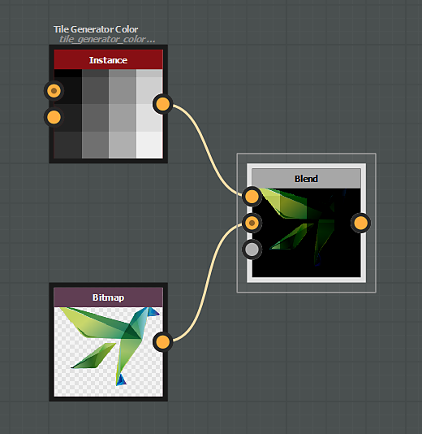

# Metodi fusione

Il nodo [Fusione](../../../../../compositing-graphs/nodes-reference-for-com/atomic-nodes/blend/blend.md) offre i seguenti metodi di fusione:

## Copia

Il metodo di fusione *Copia* posizionerà il primo piano sopra lo sfondo.

{zoomable="yes"}

Per le immagini a colori, il canale alfa viene considerato per impostazione predefinita nell’opacità.

Questo può essere modificato utilizzando il parametro &quot;Fusione Alpha&quot;.

"){zoomable="yes"}

## Aggiungi (Scherma lineare)

Il metodo di fusione *Aggiungi* aggiungerà il valore di input in primo piano a ciascun pixel corrispondente sullo sfondo.

"){zoomable="yes"}

## Sottrai

Il metodo di fusione *Substract* sottrarrà il valore dell’input in primo piano da ogni pixel corrispondente sullo sfondo.

Se il risultato della substrazione è inferiore a 0, il valore viene limitato a 0, ottenendo il nero puro.

{zoomable="yes"}

## Moltiplica

Il metodo di fusione *Moltiplica* moltiplicherà il valore di input dello sfondo per ogni pixel corrispondente in primo piano.

Poiché il valore di ciascun pixel è compreso tra 0 e 1, il risultato è sempre uguale o inferiore (più scuro) rispetto all’originale.

{zoomable="yes"}

## Aggiungi sub

Il metodo di fusione *Aggiungi sub* funziona come segue:

* I pixel in primo piano con un valore superiore a 0,5 vengono aggiunti ai rispettivi pixel di sfondo.
* I pixel in primo piano con un valore inferiore a 0,5 vengono sottratti dai rispettivi pixel di sfondo.

{zoomable="yes"}

## Max (Schiarisci)

Il metodo di fusione *Max* selezionerà il valore più alto tra lo sfondo e il primo piano.

"){zoomable="yes"}

## Min (Scurisci)

Il metodo di fusione *Min* selezionerà il valore più basso tra lo sfondo e il primo piano.

"){zoomable="yes"}

## Cambia

Il metodo di fusione *Switch* è simile al metodo di copia, con una differenza *cruciale*:

* &#39;Opacità&#39; impostata su 0: il flusso di nodi connessi all&#39;input &#39;In primo piano&#39; *non verrà calcolato*.
* &#39;Opacità&#39; impostata su 1: il flusso di nodi connessi all&#39;input &#39;Background&#39; *non verrà calcolato*.

Pertanto, questa modalità può essere utilizzata per migliorare le prestazioni del grafico.

I nodi [Switch](../../../../../compositing-graphs/nodes-reference-for-com/node-library/filters/blending/switch/switch.md) e [Switch scala di grigi](../../../../../compositing-graphs/nodes-reference-for-com/node-library/filters/blending/switch/switch.md) sono configurati per utilizzare i nodi di fusione in queste configurazioni specifiche.

{zoomable="yes"}

## Dividi

Il metodo di fusione *Dividi* dividerà il valore dei pixel di input dello sfondo per ogni pixel corrispondente in primo piano.

{zoomable="yes"}

## Sovrapposizione

Il metodo di fusione *Sovrapposizione* combina i metodi di fusione Moltiplica e Scherma:

* 
  * Se il valore del pixel del livello inferiore è inferiore a 0,5, viene applicata una fusione di tipo *Moltiplica*
  * Se il valore del pixel del livello inferiore è superiore a 0,5, viene applicata una fusione di tipo *Schermo*

{zoomable="yes"}

## Scolora

Con il metodo di fusione Schermo i valori dei pixel nei due input vengono invertiti, moltiplicati e quindi invertiti di nuovo.

Il risultato è l’effetto opposto a quello della moltiplicazione ed è sempre uguale o superiore (più chiaro) rispetto all’originale.

{zoomable="yes"}

## Luce soffusa

Il metodo di fusione Luce soffusa crea un risultato leggermente più chiaro o più scuro a seconda della luminosità del colore di primo piano.

La fusione di colori con luminosità superiore al 50% schiarirà i pixel di sfondo e i colori con luminosità inferiore al 50% scurirà i pixel di sfondo.

{zoomable="yes"}
