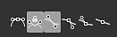
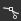
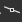
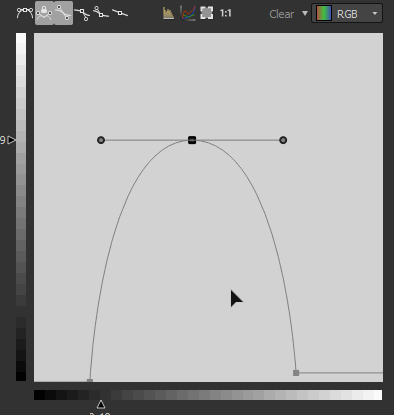
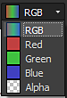

# Curva

<table>
<tr style="border: 0;">
<td width="33.33%" style="border: 0;" valign="top">

{width="200px"}

</td>
<td width="100.00%" style="border: 0;" valign="top">

Modifica i valori di un’immagine utilizzando una curva personalizzata.

Il nodo fornisce un&#39;interfaccia per la modifica della tonalità dell&#39;immagine, simile ad altre applicazioni di modifica delle immagini 2D. L&#39;utente può posizionare punti e regolare le curve di Bezier per rimappare l&#39;input, che può essere in scala di grigio o a colori.È particolarmente utile quando viene utilizzato con le transizioni di sfumatura per rimapparle a un profilo di height specifico, in quanto consente di modellare con estrema precisione i profili di smusso e simili.

</td>
</tr>
</table>

A differenza della maggior parte degli altri nodi, il nodo Curva non dispone di un&#39;interfaccia standard tipica con cursori e parametri, ma presenta invece un editor di curve completo. Vedere la sezione espandibile riportata di seguito su come utilizzarlo.

[Ciò significa tuttavia che nessuno dei parametri di un nodo Curva può essere esposto a un grafico secondario](../../../../compositing-graphs/manage-parameters/exposing-a-parameter/exposing-a-parameter.md). L&#39;unica opzione disponibile è quella di utilizzare un [switch multiplo](../../../../compositing-graphs/nodes-reference-for-com/node-library/filters/blending/multi-switch/multi-switch.md) per passare da un profilo di curva all&#39;altro.

<table>
<tr style="border: 0;">
<td width="100.00%" style="border: 0;" valign="top">

</td>
<td width="83.33%" style="border: 0;" valign="top">

</td>
<td width="100.00%" style="border: 0;" valign="top">

</td>
</tr>
</table>

<table>
<tr style="border: 0;">
<td style="border: 0;" valign="top">

## Parametri

### Editor curva

</td>
<td style="border: 0;" valign="top">

### Connettori di ingresso

### Connettori di uscita

</td>
<td style="border: 0;" valign="top">

### Esempi

</td>
</tr>
</table>

## Parametri

|  |  |
| --- | --- |
| <b>Applica/Esporta curva</b> *Booleano* | Consente di copiare la curva utente nell&#39;output invece di applicarla all&#39;immagine di input |
| <b>Indirizzamento della curva</b> *Booleano* | Questo parametro determina il modo in cui vengono gestiti i pixel HDR fuori dall’intervallo [0, 1] nell’input: bloccati o piegati fino a [0, 1]. |
| <b>Curva</b> *Matrice di chiavi di curva* | Curva personalizzata utilizzata per mappare i valori in scala di grigio di input.   Può essere modificato utilizzando l&#39;[editor curva](#curve-editor). |

## Editor curva

### Creare e spostare un punto

Per creare un punto, fate doppio clic in un punto qualsiasi della vista Curva:

### Controllo dell&#39;influenza di un punto

<table>
<tr style="border: 0;">
<td width="100.00%" style="border: 0;" valign="top">

Per ottenere risultati precisi, i nodi della curva offrono diverse modalità per ciascun punto:

</td>
<td width="33.33%" style="border: 0;" valign="top">

</td>
</tr>
</table>

 Reimpostare la modalità punto sul valore predefinito.

 Bloccare e sbloccare i due gestori Bezier in modo che l&#39;utente possa spostarli insieme o in modo indipendente.

 Entrambi i lati del punto sono controllati da un gestore di Bezier.

 Il lato destro del punto è controllato da un gestore di Bezier mentre il lato sinistro rimane piatto.

 Il lato sinistro del punto è controllato da un gestore di Bezier mentre il lato destro rimane piatto.

 I lati dei punti rimangono piatti

### Mostra istogramma di input

Puoi mostrare/nascondere l&#39;istogramma del tuo input semplicemente facendo clic su 

### Controllo individuale di ciascun canale (input colore)

<table>
<tr style="border: 0;">
<td width="100.00%" style="border: 0;" valign="top">

Quando immettete è un nodo di colore, potete regolare la curva per ciascun canale:

Seleziona la curva da regolare nell’elenco a discesa in alto a destra:

</td>
<td width="33.33%" style="border: 0;" valign="top">

</td>
</tr>
</table>

Nella modalità Curva RGB puoi nascondere/mostrare le singole curve dei canali premendo/depremendo :

### Allineamento, specchiatura e capovolgimento

<table>
<tr style="border: 0;">
<td width="100.00%" style="border: 0;" valign="top">

Se fate clic con il pulsante destro del mouse sulla vista curva, verranno visualizzate altre opzioni.

<b>Allinea in alto:</b> Allinea orizzontalmente i punti selezionati a quello più alto.

<b>Allinea al centro:</b> Allinea orizzontalmente i punti selezionati al height medio della selezione.

<b>Allinea in basso:</b> Allinea orizzontalmente i punti selezionati con quello più basso.

</td>
<td width="50.00%" style="border: 0;" valign="top">

</td>
</tr>
</table>

<b>Distribuisci orizzontalmente/verticalmente:</b> Distribuisci i punti sull&#39;asse selezionato

<b>Capovolgi in orizzontale/verticale:</b> capovolgi i punti selezionati in base all&#39;asse selezionato.

<b>Specchiatura orizzontale/verticale:</b> Specchiatura dell&#39;intera curva, in base all&#39;asse selezionato

### Scelte rapide da tastiera

<table>
<tr style="border: 0;">
<td style="border: 0;" valign="top">

<b>LMB + Trascina</b>

Disegnate una casella di selezione.

</td>
<td style="border: 0;" valign="top">

</td>
</tr>
</table>

<table>
<tr style="border: 0;">
<td style="border: 0;" valign="top">

<b>Maiusc + Trascina</b>

Vincola lo spostamento sull’asse X o Y.

</td>
<td style="border: 0;" valign="top">

</td>
</tr>
</table>

<table>
<tr style="border: 0;">
<td style="border: 0;" valign="top">

<b>Alt + LMB + Trascina</b>

Interrompi temporaneamente le maniglie per spostarle in modo indipendente.

</td>
<td style="border: 0;" valign="top">

</td>
</tr>
</table>

### Regolare l’inquadratura della curva

Durante l’ottimizzazione dei gestori, potreste trovarvi in un caso in cui un gestore si trova sopra la vista curva.

In tal caso, è possibile utilizzare il pulsante  per adattare le dimensioni al contenuto.

Il pulsante  ripristina il livello di zoom su 1

## Connettori di ingresso

|  |  |
| --- | --- |
| <b>Input</b> *Scala di grigi/Colore* PRIMARIO | Immagine da elaborare. |

## Connettori di uscita

|  |  |
| --- | --- |
| <b>Output</b> *Scala di grigi/Colore* |  |

## Esempi

*Disponibile a breve.*
