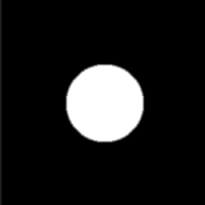

# Distanza

<table>
<tr style="border: 0;">
<td width="33.33%" style="border: 0;" valign="top">

{width="200px"}

</td>
<td width="100.00%" style="border: 0;" valign="top">

Trova la posizione del pixel bianco più vicino in una maschera e genera una sfumatura da quella posizione o il colore in quella posizione in un’immagine di origine.

Questo nodo crea una dissolvenza lineare (sfumatura) verso l’esterno da qualsiasi pixel nel valore massimo di input superiore a 0,5 della scala di grigi.

</td>
</tr>
</table>

La dissolvenza verso l&#39;esterno in espansione terminerà non appena incontrerà un&#39;altra cella: non si sovrapporrà mai. Internamente, questo è in realtà il calcolo e la visualizzazione della distanza al pixel più vicino > 0,5, con il nodo distanza impostato come un morsetto/massimo.

Una mappa sorgente opzionale consente di combinare le celle con la texture da una mappa di input secondaria.

Il nodo distanza non è un nodo facile da padroneggiare, ma i suoi principali casi d&#39;uso sono l&#39;espansione delle maschere esistenti in modo affidabile (rispetto alla sfocatura e alla regolazione del contrasto), la generazione di celle di disturbo di tipo Voronoi e lo smusso delle forme esistenti con un profilo nitido e lineare (che può essere rimappato in seguito.

Per ulteriori informazioni, consultate i seguenti [esempi](#examples).

<table>
<tr style="border: 0;">
<td width="100.00%" style="border: 0;" valign="top">

</td>
<td width="83.33%" style="border: 0;" valign="top">

</td>
<td width="100.00%" style="border: 0;" valign="top">

</td>
</tr>
</table>

<table>
<tr style="border: 0;">
<td style="border: 0;" valign="top">

## Connettori di uscita

</td>
<td style="border: 0;" valign="top">

### Esempi

</td>
</tr>
</table>

## Parametri

|  |  |
| --- | --- |
| <b>Metodo colore</b> *Booleano* | Alterna tra un’immagine in scala di grigio e un’immagine a colori in output. Modifica anche il tipo di input &quot;Input sorgente&quot;. |
| <b>Distanza massima</b> *Mobile* | Regola la distanza massima in pixel per il rilevamento del bordo più vicino nella maschera. |
| <b>Combina origine/distanza</b> *Booleano* | Determinare la modalità di combinazione del &quot;Input sorgente&quot; facoltativo con le celle finali.<ul data-preserve-html="true"> <li data-preserve-html="true"><i>Combina:</i> combina il valore &#39;Input sorgente&#39; con la maschera lineare di dissolvenza. Se l&#39;input &#39;Source input&#39; è collegato, il suo valore viene combinato con la distanza calcolata.</li> <li data-preserve-html="true"><i>Solo origine:</i> genera un colore in tinta unita solo dall&#39;input di origine.</li> </ul> |
| <b>Modalità distanza</b> *Numero intero* | Seleziona il metodo di calcolo della distanza dal bordo più vicino nella maschera estratta:<ul data-preserve-html="true"> <li data-preserve-html="true"><i>Euclideo:</i> somma delle differenze X/Y al quadrato.</li> <li data-preserve-html="true"><i>Manhattan:</i> somma dei valori assoluti delle differenze X/Y.</li> <li data-preserve-html="true"><i>Chebyshev:</i> massimo di valori assoluti di differenze X/Y.</li> </ul>  

 |

## Connettori di ingresso

|  |  |
| --- | --- |
| <b>Input maschera</b> *Scala di grigi* PRIMARIO | Maschera in scala di grigio, i cui bordi devono essere calcolati con un valore di distanza.   Una maschera binaria viene estratta dall’immagine con un valore di soglia pari a 0,5, in cui tutti i valori al di sopra di tale soglia sono bianchi e tutti i valori al di sotto sono neri. |
| <b>Input di origine</b> *Colore/Scala di grigi* | Immagine in scala di grigio facoltativa dalla quale deve essere copiato il valore del pixel sul bordo più vicino dell’input della maschera. |

## Connettori di uscita

|  |  |
| --- | --- |
| <b>Output</b> *Colore/Scala di grigi* |  |

## Esempi

<table>
<tr style="border: 0;">
<td style="border: 0;" valign="top">

{width="250px"}

</td>
<td style="border: 0;" valign="top">

{width="250px"}

</td>
<td style="border: 0;" valign="top">

{width="250px"}

</td>
</tr>
</table>
