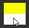
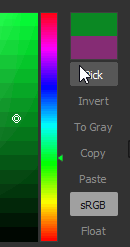

# Mappa sfumatura

<table>
<tr style="border: 0;">
<td width="33.33%" style="border: 0;" valign="top">

{width="200px"}

</td>
<td width="100.00%" style="border: 0;" valign="top">

Modifica i valori in scala di grigi di un’immagine utilizzando una sfumatura personalizzata.

Questo nodo ha un duplice scopo: può essere utilizzato semplicemente come <b> </b>nodo di conversione da scala di grigi a colore oppure per colorare la scala di grigi inserisco la mia mappatura a una scala di colori personalizzata.

</td>
</tr>
</table>

Il nodo offre un editor delle sfumature avanzato e ricco di funzionalità per mappare più colori con precisione: per ulteriori informazioni, vai alla sezione [Editor delle sfumature](#gradient-editor) di questa pagina.

<table>
<tr style="border: 0;">
<td width="100.00%" style="border: 0;" valign="top">

</td>
<td width="83.33%" style="border: 0;" valign="top">

</td>
<td width="100.00%" style="border: 0;" valign="top">

</td>
</tr>
</table>

## Esempi

## Parametri

|  |  |
| --- | --- |
| <b>Metodo colore</b> *Booleano* | Imposta la modalità di output su Colore o Scala di grigio. |
| <b>Indirizzamento sfumatura</b> *Booleano* | Imposta la sfumatura in modo che venga ripetuta (affiancata) o bloccata a valori che non rientrano nell’intervallo [0, 1]. |
| <b>Sfumatura</b> *Matrice di chiavi sfumatura* | Gradient ramp personalizzato utilizzato per mappare i valori di input della scala di grigi.   Può essere modificato in posizione o utilizzando l&#39;[editor sfumatura](#gradient-editor). |

## Editore sfumatura

Questa finestra offre controlli per modificare la sfumatura di riferimento utilizzata dal nodo Mappa sfumatura per mappare i valori della scala di grigio ai colori.

Può essere aperto dalle <b>Proprietà</b> del nodo Mappa sfumatura nei modi seguenti:

* Fai clic su LMB sul pulsante <b>Editore sfumatura</b>.
* Fate doppio clic su LMB su una puntina nella barra della sfumatura. La puntina su cui hai fatto clic verrà selezionata automaticamente in Editore sfumatura, così potrai modificarne direttamente i valori.

### Modifica delle puntine della sfumatura

I colori e la loro posizione lungo la sfumatura sono controllati dai perni posizionati lungo la barra della sfumatura.

Ogni puntina imposta un colore nella sua posizione lungo la sfumatura.

Le parti della sfumatura prima e dopo il primo e l’ultimo segnaposto vengono impostate rispettivamente sui colori di tali segnaposti.

Per modificare i segnaposti sono disponibili i seguenti controlli:

<table>
<tr style="border: 0;">
<td style="border: 0;" valign="top">

<b>Aggiungi segnaposto</b>

Fate clic su LMB sulla sfumatura o appena sotto per aggiungere un segnaposto nella posizione in cui avete fatto clic nella barra della sfumatura.

Il nuovo segnaposto verrà impostato sul colore della sfumatura in quella posizione.

</td>
<td style="border: 0;" valign="top">

</td>
</tr>
</table>

<table>
<tr style="border: 0;">
<td style="border: 0;" valign="top">

<b>Sposta segnaposto</b>

Tenete premuto LMB e trascinate i segnaposti selezionati lungo la barra della sfumatura per spostarli.

È inoltre possibile impostare la posizione di un segnaposto con un valore numerico selezionandolo e utilizzando il parametro <b>Posizione</b>. La posizione è un valore nell&#39;intervallo [0;1] in cui 0 rappresenta l&#39;inizio del gradiente e 1 la sua fine.

</td>
<td style="border: 0;" valign="top">

</td>
</tr>
</table>

Quando sono selezionati più segnaposti, è possibile spostarli tutti *contemporaneamente*. Quando uno o più segnaposti raggiungono e terminano la sfumatura mentre vengono spostati, sono disponibili due comportamenti a seconda del pulsante del mouse utilizzato per lo spostamento:

* <b>LMB:</b> Segnaposti rimanenti alla fine, ovvero verranno impilati in quella posizione mentre lo raggiungono e le loro posizioni relative verranno modificate;
* <b>MMB:</b> Segnaposti tornano all&#39;altra estremità della sfumatura, il che significa che le loro posizioni relative rimangono invariate.

<table>
<tr style="border: 0;">
<td style="border: 0;" valign="top">

<b>Elimina segnaposto</b>

Selezionate i segnaposti e premete Elimina, oppure trascinate i segnaposti fuori dalla barra della sfumatura per eliminarli.

</td>
<td style="border: 0;" valign="top">

</td>
</tr>
</table>

<table>
<tr style="border: 0;">
<td style="border: 0;" valign="top">

<b>Inverti posizioni</b>

Riflette le posizioni dei segnaposti selezionati sulla sfumatura.

</td>
<td style="border: 0;" valign="top">

</td>
</tr>
</table>

<table>
<tr style="border: 0;">
<td style="border: 0;" valign="top">

<b>Cancella tutto</b>

Rimuove tutti i segnaposti dalla barra della sfumatura.

</td>
<td style="border: 0;" valign="top">

</td>
</tr>
</table>

<b>Invertire i colori</b>

Questo pulsante consente di passare da un colore all&#39;altro dei perni selezionati.

<b>Togli saturazione</b>

Questo pulsante desatura i colori impostati sui perni selezionati.

### Modalità di interpolazione

Una volta impostati i perni, puoi controllare la transizione dei colori da un perno all’altro utilizzando le modalità di interpolazione disponibili:

+++Lineare
Modalità di interpolazione predefinita: applica una semplice interpolazione lineare tra ogni perno, in modo che la sfumatura avanzi in modo uniforme.

+++

+++Tangenti piatte
Quando si pensa alla transizione tra sfumature come curve di Bezier in cui i perni sono punti della curva, questa modalità imposta questi punti in modo che abbiano tangenti orizzontali.

In questo modo si ottiene una transizione che evoca l’interpolazione a gradino arrotondato.

Quando questa modalità è selezionata, il parametro <b>Punto intermedio</b> è attivato e consente di spostare la posizione orizzontale del punto centrale verticale della curva tra i punti. In questo modo, la scala viene spostata tra le tangenti &quot;out&quot; e &quot;in&quot;.

+++

+++Uniforme
Applica l’arrotondamento alla curva di interpolazione tra ogni punto.

Quando questa modalità è selezionata, il parametro <b>Smoothness</b> è abilitato e consente di regolare l&#39;intensità dell&#39;attenuazione in cui un valore pari a 0 è uguale alla modalità di interpolazione <b>lineare</b>.

+++

+++Nessuna interpolazione
Il colore cambia solo in corrispondenza della posizione dei perni e rimane costante fino al perno successivo lungo la barra della sfumatura.

Questo comporta passaggi difficili tra i colori e solo i colori impostati dai perni sono presenti sulla sfumatura.

+++

### selettore colore

Il Selettore colore consente di impostare un colore in diversi modi:

* <b>Sfumatura e barra della tonalità</b>

  <table>
  <tr style="border: 0;">
  <td style="border: 0;" valign="top">

  Modifica le posizioni del gizmo nella sfumatura e della tacca nella barra della tonalità per impostare un colore.

  </td>
  <td style="border: 0;" valign="top">

  

  </td>
  </tr>
  </table>

* <b>Cursori RGB, HSV e Alpha</b>

  <table>
  <tr style="border: 0;">
  <td width="100.00%" style="border: 0;" valign="top">

  I cursori RGB, HSV e Alpha consentono di impostare un colore con precisione, modificando i cursori o impostandone direttamente i valori numerici.

  In alternativa, utilizza un codice esadecimale nel campo di input dedicato sotto i cursori.

  </td>
  <td width="33.33%" style="border: 0;" valign="top">

  

  </td>
  </tr>
  </table>

* <b>Seleziona sullo schermo</b>

  <table>
  <tr style="border: 0;">
  <td style="border: 0;" valign="top">

  Usate il pulsante <b>Scegli</b> e fate clic su LMB in un punto qualsiasi dello schermo per campionare il colore in quella posizione.

  </td>
  <td style="border: 0;" valign="top">

  

  </td>
  </tr>
  </table>

<table>
<tr style="border: 0;">
<td width="100.00%" style="border: 0;" valign="top">

Il colore selezionato viene visualizzato in anteprima nella metà superiore della miniatura del colore.\
Nella metà inferiore viene visualizzato il colore utilizzato in precedenza. Fate doppio clic su LMB per ripristinare il colore modificato.

</td>
<td width="16.67%" style="border: 0;" valign="top">

</td>
</tr>
</table>

Quando sono selezionati più pin, i cursori RGB, HSV e Alpha si trasformano in cursori delta (Δ), ovvero vengono utilizzati per compensare il valore di ciascun pin della stessa quantità.

<table>
<tr style="border: 0;">
<td width="100.00%" style="border: 0;" valign="top">

Inoltre, sotto la miniatura a colori, sono disponibili come pulsanti le seguenti funzionalità:

<b>Inverti:</b> imposta il colore sul negativo;

<b>Al grigio:</b> desatura il colore;

<b>Copia </b>*:* Copia negli Appunti il colore attualmente selezionato;

<b>Incolla:</b> consente di passare al colore attualmente presente negli Appunti;

<b>sRGB</b>: usate lo spazio colore sRGB per visualizzare i colori. Se è disattivata, viene utilizzato lo spazio colore lineare;

<b>Float:</b> visualizzare i valori di RGB, HSV e cursore Alpha in virgola mobile.

</td>
<td width="25.00%" style="border: 0;" valign="top">

</td>
</tr>
</table>

### Contagocce sfumatura

Il contagocce Sfumatura è una delle funzioni più utili offerte da questo nodo, in quanto potete creare sfumature complesse disegnando una linea su un&#39;immagine di riferimento.

Il cursore <b>Precisione</b> ti aiuterà a regolare la sfumatura appena creata aumentando o diminuendo il numero di tasti: più bassi sono i valori, più precisa sarà la sfumatura a corrispondere ai valori selezionati.

## Connettori di ingresso

|  |  |
| --- | --- |
| <b>Input</b> *Scala di grigi* PRIMARIO | Immagine in scala di grigio da elaborare. |

## Connettori di uscita

|  |  |
| --- | --- |
| <b>Output</b> *Scala di grigi* |  |

## Esempi

*Disponibile a breve.*
