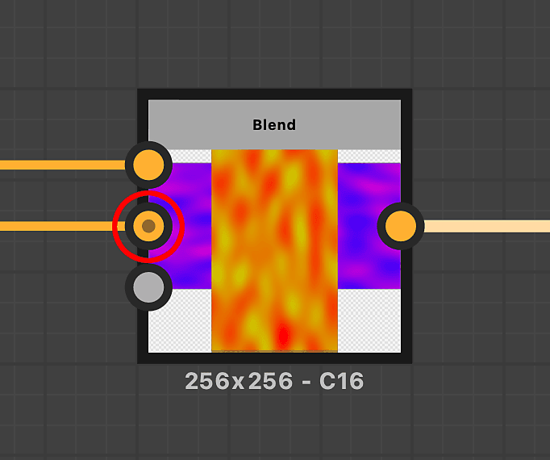

# Input

<table>
<tr style="border: 0;">
<td style="border: 0;" valign="top">

{width="200px"}

</td>
<td style="border: 0;" valign="top">

{width="200px"}

</td>
<td style="border: 0;" valign="top">

{width="200px"}

</td>
</tr>
</table>

I nodi di input sono un tipo speciale di nodo che crea uno slot dinamico nel grafico, consentendo di collegare qualsiasi input una volta che il grafico è utilizzato in un altro contesto.

A differenza dei [nodi di output](../../../../compositing-graphs/nodes-reference-for-com/atomic-nodes/output/output.md), dovete inserire esplicitamente un input di colore, scala di grigi o valore. Non è possibile creare input &quot;agnostici&quot; personalizzati che cambiano tipo a seconda del tipo di connessione.

I nodi di input non sono cruciali quanto [nodi di output](../../../../compositing-graphs/nodes-reference-for-com/atomic-nodes/output/output.md): puoi avere grafici avanzati perfettamente funzionanti che non richiedono input. Gli input vengono utilizzati solo quando si desidera basare il risultato dell&#39;istanza del grafico o del nodo su un input esterno, ad esempio durante la creazione di un [istanza](../../../../compositing-graphs/creating-compositing-gra/graph-instances-sub-gra/graph-instances-sub-graphs.md)o di un [filtro](https://experienceleague.adobe.com/it/docs/substance-3d-painter/using/effects/filter) per Substance 3D Painter.

<table>
<tr style="border: 0;">
<td width="100.00%" style="border: 0;" valign="top">

</td>
<td width="83.33%" style="border: 0;" valign="top">

</td>
<td width="100.00%" style="border: 0;" valign="top">

</td>
</tr>
</table>

<table>
<tr style="border: 0;">
<td style="border: 0;" valign="top">

## PARAMETRI

</td>
<td style="border: 0;" valign="top">

### ATTRIBUTI

</td>
<td style="border: 0;" valign="top">

### EREDITÀ

</td>
<td style="border: 0;" valign="top">

### ATTRIBUTI DI INTEGRAZIONE

</td>
</tr>
</table>

## Parametri

Per impostazione predefinita, un colore di input o una scala di grigi restituiscono il nero se non è collegato nulla. Potete impostare un valore predefinito diverso oppure trascinare una risorsa [bitmap](../../../../resources/importing-linking-and-new/importing-linking-and-new-resources.md) esistente da [Esplora risorse](../../../../interface/the-explorer-window/the-explorer-window.md) nel nodo di input del grafico per visualizzare in anteprima questi dati nello slot. Questa opzione funziona solo per gli ingressi a colori e in scala di grigi. Il valore predefinito è persistente se utilizzato in altri contesti, la bitmap di anteprima viene scartata ovunque.

Per visualizzarlo con gli output di un altro grafico, dovrete esportare il grafico in Bitmap per il metodo precedente oppure utilizzare la modifica &quot;In contesto&quot;.

|  |  |
| --- | --- |
| <b>Percorso risorsa PKG</b> *Stringa* | Punta a una risorsa bitmap personalizzata per la visualizzazione in anteprima. |
| <b>Valore predefinito</b> *Colore/Scala Di Grigi/Valore* | Consente di utilizzare un valore diverso dal nero come input predefinito, se allo slot non è collegato nulla. |

## Attributi

|  |  |
| --- | --- |
| <b>Identificatore</b> *Stringa* | L&#39;unico attributo univoco obbligatorio. Impossibile contenere spazi.   Questa opzione viene utilizzata per etichettare gli input se non è impostata alcuna etichetta e per distinguere tra output diversi. Non lasciatele solo su &quot;input\_1&quot;! |
| <b>Descrizione</b> *Stringa* | Descrizione facoltativa utilizzata nella libreria di Designer e nello scaffale di Painter. |
| <b>Etichetta</b> *Stringa* | Etichetta dell&#39;interfaccia utente utilizzata per un&#39;etichettatura ottimale nell&#39;interfaccia utente di Designer e Painter. Può contenere spazi.   Consigliato per impostare un nome simile a quello dell&#39;Identificatore, con le sole barre spaziatrici invece dei caratteri di sottolineatura. |
| <b>Dati utente</b> *Stringa* | Dati utente aggiuntivi e facoltativi che possono essere utilizzati per operazioni di filtro specifiche, in pratica un campo dati personalizzato con caratteri jolly. |
| <b>Gruppo</b> *Stringa* | Attributo gruppo utilizzato per raggruppare gli input per le [modalità di creazione dei collegamenti](../../../../interface/the-graph-view/link-creation-modes/link-creation-modes.md) di Designer.   Gli input con un attributo di gruppo identico (con distinzione tra maiuscole e minuscole) verranno presentati come una singola connessione in modalità Materiale compatto. |

## Ereditarietà

<table>
<tr style="border: 0;">
<td width="100.00%" style="border: 0;" valign="top">

Quando sono presenti più input, è necessario prestare attenzione al modo in cui il grafico [eredita i parametri di base](../../../../compositing-graphs/inheritance-compositing/inheritance-in-substance-compositing-graphs.md) da questi input.\
I parametri di base includono, tra gli altri, <b>Dimensioni output</b>, <b>Formato output</b> e <b>Modalità di porzioni</b>.

</td>
<td width="33.33%" style="border: 0;" valign="top">

</td>
</tr>
</table>

È possibile definire un input come [input primario](../../../../compositing-graphs/inheritance-compositing/inheritance-in-substance-compositing-graphs.md). Questo input determina quindi gli attributi di tutti gli input il cui metodo di ereditarietà è impostato su *Rispetto al padre*. Metodo di ereditarietà *impostato per impostazione predefinita* nei nodi di input.

È possibile impostare un nodo di input come input principale del grafico facendo clic su *RMB* sul nodo e selezionando l&#39;opzione <b>Imposta come input principale</b> nel menu di scelta rapida.\
L&#39;input principale di un nodo è contrassegnato con un *piccolo punto scuro nel connettore* (cerchiato in rosso nell&#39;esempio accanto a questa sezione).

In alternativa, qualsiasi set di input per il metodo di ereditarietà *Relativo all&#39;input* eredita gli attributi dal nodo a cui è connesso, *indipendentemente* dell&#39;input primario.

È infine possibile eseguire l&#39;override di qualsiasi valore per un determinato attributo impostando il relativo metodo di ereditarietà su *Assoluto*.

>[!TIP]
>
> Per ulteriori informazioni sull&#39;ereditarietà, consultare la pagina [Ereditarietà nei grafici delle Substance](../../../../compositing-graphs/inheritance-compositing/inheritance-in-substance-compositing-graphs.md) di questa documentazione.

>[!IMPORTANT]
>
> Il metodo di ereditarietà *relativo all&#39;input* per i nodi di input è *non supportato* in [risorse Substance 3D (SBSAR)](https://helpx.adobe.com/it/substance-3d-assets.html). Imposta tutti i metodi di ereditarietà dei nodi di input su *Rispetto all&#39;elemento padre* prima di pubblicare il pacchetto.

## Attributi integrazione

Gli input non vengono inviati direttamente alla vista 3D, ma i relativi attributi di utilizzo vengono utilizzati da [Substance 3D Painter](https://experienceleague.adobe.com/it/docs/substance-3d-painter/using/home) per riempire automaticamente gli slot con determinate mappe (utilizzati principalmente con [filtri](https://experienceleague.adobe.com/it/docs/substance-3d-painter/using/effects/filter)).

Inoltre, gli attributi di utilizzo vengono utilizzati anche con le [modalità di creazione del collegamento](../../../../interface/the-graph-view/link-creation-modes/link-creation-modes.md), in modo che corrispondano agli slot di input e output corretti.

<b>Utilizzo</b>

|  |  |
| --- | --- |
| <b>Componente</b> *Stringa* | Determina quali canali sono effettivamente presenti nell’input risultante.   Questa è un’impostazione legacy che non viene più utilizzata da integrazioni e grafici. |
| <b>Utilizzo</b> *Stringa* | Definire un tipo o un utilizzo per questo input. Indica la modalità di connessione degli altri nodi a questo input. |
| <b>Spazio colore</b> *Stringa* | Imposta lo spazio colore in cui deve essere interpretato questo input. |
