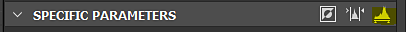

# Livelli

<table>
<tr style="border: 0;">
<td width="33.33%" style="border: 0;" valign="top">

{width="200px"}

</td>
<td width="100.00%" style="border: 0;" valign="top">

Regola la gamma tonale globale e il bilanciamento del colore di ombre, mezzitoni e luci di un’immagine.

Il nodo Livelli consente di rimappare i toni di un input impostando i fattori di modifica dell’input e dell’output, presentati in un’interfaccia istogramma familiare ad altri editor di immagini 2D.

</td>
</tr>
</table>

È uno dei nodi principali e più utili di Substance 3D Designer ed è molto spesso utilizzato per rielaborare e regolare i valori in un grafico, in quanto fornisce l’interfaccia più precisa e precisa per modificare i valori.

Sebbene si tratti di un nodo importante, in alcuni casi l&#39;interfaccia può essere un po&#39; scomoda, quindi assicuratevi di esaminare [Livelli automatici](../../../../compositing-graphs/nodes-reference-for-com/node-library/filters/adjustments/auto-levels/auto-levels.md), [Contrasto/Luminosità](../../../../compositing-graphs/nodes-reference-for-com/node-library/filters/adjustments/contrast-luminosity/contrast-luminosity.md) e [Scansione istogramma](../../../../compositing-graphs/nodes-reference-for-com/node-library/filters/adjustments/histogram-scan/histogram-scan.md) per trovare alternative.

<table>
<tr style="border: 0;">
<td width="100.00%" style="border: 0;" valign="top">

</td>
<td width="83.33%" style="border: 0;" valign="top">

</td>
<td width="100.00%" style="border: 0;" valign="top">

</td>
</tr>
</table>

## Esempi

## Parametri

Il nodo offre due interfacce per regolarne i valori: istogramma e cursori. Puoi passare da uno all’altro con il pulsante più a destra nella barra di intestazione &quot;Parametri specifici&quot;:

<table>
<tr style="border: 0;">
<td width="100.00%" style="border: 0;" valign="top">

Il pulsante giallo evidenziato alterna l’interfaccia tra i cursori dei valori dell’istogramma (in alto) (in basso)

</td>
<td width="66.67%" style="border: 0;" valign="top">

</td>
</tr>
</table>

|  |  |
| --- | --- |
| <b>Livello in basso</b> *Float/Float4* | Definisce i livelli di scarsa illuminazione dell&#39;immagine di input. Modifica i valori di input Bassi in modo che diventino nero intero. |
| <b>Livello in alto</b> *Float/Float4* | Definisce i livelli di luce dell&#39;immagine di input.  Modifica l’input con valori alti per rendere il bianco intero. |
| <b>Livello a metà</b> *Float/Float4* | Definisce i livelli dei mezzitoni dell’immagine di input.  Modifica i valori di input di Mid in modo che diventino grigio medio. |
| <b>Livella in basso</b> *Float/Float4* | Definisce i livelli di scarsa illuminazione dell&#39;immagine di output.  Blocca i valori di nero di output per impostare il limite. |
| <b>Livella in alto</b> *Float/Float4* | Definisce i livelli di luce dell’immagine di output.  Blocca i valori bianchi di output per impostare il limite. |
| <b>Morsetto intermedio</b> *Booleano* | Determina se il valore di input trasformato viene bloccato su [0, 1] prima di calcolare il livello di output. |

## Guida all’uso

Guardate questa panoramica video del nodo Livelli e del relativo editor di istogrammi:

### Azioni rapide

Nella barra di intestazione &quot;Parametri specifici&quot;, potete trovare dei pulsanti per accedere alle funzioni più comode dell’istogramma:

<b>1 - Inverti:</b> scambia i valori dei parametri &#39;Uscita livellata bassa&#39; e &#39;Uscita livellata alta&#39;.

<b>2 - Livello automatico:</b> regola automaticamente i valori dei parametri &#39;Livello in basso&#39; e &#39;Livello in alto&#39; rispettivamente sul valore più basso e più alto presente nell&#39;immagine.

<b>3 - Cambia interfacce:</b> Alterna l&#39;editor dell&#39;istogramma e quello del cursore.

### Istogramma

L’editor di istogrammi è destinato a regolazioni visive e rapide, in cui non sono realmente necessari valori accurati e l’esposizione dei parametri non è importante. In genere è il modo più rapido e facile di lavorare con i livelli.

A seconda del tipo di input (a colori o in scala di grigi), potete utilizzare il menu a discesa sopra l’istogramma per scegliere il canale da modificare.

### Cursori

L&#39;editor dei cursori elimina qualsiasi editor visivo e presenta solo cursori numerici, utili soprattutto se desideri bloccare o ridefinire valori molto esatti o se desideri [esporre uno di questi parametri](../../../../compositing-graphs/manage-parameters/exposing-a-parameter/exposing-a-parameter.md), poiché questo è possibile solo nell&#39;editor dei cursori.

I cursori variano a seconda dell’input di un colore o di una scala di grigi: gli input di colore creano 4 cursori separatamente per ciascun canale RGBA; la scala di grigi ha un solo cursore, rendendo più facile lavorare. Per una spiegazione su ogni cursore, consultate l’Elenco dei parametri sopra riportato.

## Connettori di ingresso

|  |  |
| --- | --- |
| <b>Input</b> *Scala di grigi/Colore* PRIMARIO | Immagine da elaborare. |

## Connettori di uscita

|  |  |
| --- | --- |
| <b>Output</b> *Scala di grigi/Colore* |  |

## Esempi

*Disponibile a breve.*
