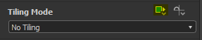

# Trasformazione 2D

<table>
<tr style="border: 0;">
<td width="33.33%" style="border: 0;" valign="top">

{width="200px"}

</td>
<td width="100.00%" style="border: 0;" valign="top">

Applica all’immagine una matrice di trasformazione 2D: traslazione, rotazione, ridimensionamento, simmetria e inclinazione.

È abbastanza simile alla Trasforma (Ctrl-T) in Photoshop o all&#39;utilizzo del manipolatore di mappatura 2D in Substance 3D Painter.

</td>
</tr>
</table>

Si tratta di un nodo estremamente utile e ampiamente applicato, che consente di aumentare l&#39;Affiancamento, rimuovere l&#39;Affiancamento, posizionare un&#39;immagine in una posizione specifica, allungamento o schiacciare un input, ecc.

Tuttavia, non può essere una corrispondenza perfetta per alcune applicazioni, quindi i seguenti nodi possono essere di interesse: [Trasforma sicura](../../../../compositing-graphs/nodes-reference-for-com/node-library/filters/transforms/safe-transform/safe-transform.md), [Trasforma non quadrata](../../../../compositing-graphs/nodes-reference-for-com/node-library/filters/transforms/non-square-transform/non-square-transform.md), [Trasforma quadrata](../../../../compositing-graphs/nodes-reference-for-com/node-library/filters/transforms/quad-transform/quad-transform.md) e [Trasforma trapezoidale](../../../../compositing-graphs/nodes-reference-for-com/node-library/filters/transforms/trapezoid-transform/trapezoid-transform.md).

<table>
<tr style="border: 0;">
<td width="100.00%" style="border: 0;" valign="top">

</td>
<td width="83.33%" style="border: 0;" valign="top">

</td>
<td width="100.00%" style="border: 0;" valign="top">

</td>
</tr>
</table>

>[!TIP]
>
> Disabilitazione dell&#39;Affiancamento
> 
> Impostare il [metodo di ereditarietà](../../../../glossary/glossary.md) del parametro &#39;Modalità Affiancamento&#39; [parametro base](../../../../glossary/glossary.md) su &#39;Assoluto&#39;, che consente quindi di impostare il valore del parametro su &#39;Nessun Affiancamento&#39;:
> 
> 

>[!NOTE]
>
> I valori di ridimensionamento e rotazione nelle proprietà del nodo sono *relativi alla trasformazione corrente* e non vengono applicati al vista 2D finché non si fa clic sul pulsante &#39;Applica&#39;.

<table>
<tr style="border: 0;">
<td style="border: 0;" valign="top">

## Connettori di uscita

</td>
<td style="border: 0;" valign="top">

### Esempi

</td>
</tr>
</table>

## Parametri

|  |  |
| --- | --- |
| <b>Matrice di trasformazione</b> *Virgola mobile 4* | Aprite la matrice di trasformazione sottostante per la modifica diretta. Consente di modificare la rotazione e il ridimensionamento. Può essere regolato anche attraverso il gizmo nel Vista 2D.   Avvertenza: non sono correlate direttamente alla vista e sono regolazioni relative che possono essere applicate in più passaggi. |
| <b>Scostamento</b> *Virgola mobile 2* | Definisce lo spostamento 2D dell’immagine. Consente di modificare la posizione o lo scostamento. Può essere regolato anche tramite il gizmo nel Vista 2D.   Si riferisce direttamente all&#39;output del Vista 2D. |
| <b>Modalità Mipmap</b> *Numero intero* | Consente di passare a un livello [mipmap](../../../../glossary/glossary.md) manuale, che riduce gli artefatti in un&#39;immagine utilizzando il filtro texture. |
| <b>Livello mipmap</b> *Numero intero* | Imposta il livello [mipmap](../../../../glossary/glossary.md) da utilizzare.     *Disponibile quando la modalità Mipmap è impostata su Manuale* |
| <b>Colore mascherino</b> *Virgola mobile 4* | Colore utilizzato come sfondo quando l’Affiancamento della trasformazione è disattivato. Cioè, imposta il colore usato quando l&#39;input Trasforma non copre un&#39;area dell&#39;output.   Può essere reso trasparente se si lavora con il colore RGBA. |
| <b>Filtraggio</b> *Numero intero* | Imposta il metodo di downsampling utilizzato. Non funziona particolarmente bene con la riduzione del Livello mipmap. |

## Connettori di ingresso

|  |  |
| --- | --- |
| <b>Input</b> *Scala di grigi/Colore* PRIMARIO | Immagine da Trasforma. |

## Connettori di uscita

|  |  |
| --- | --- |
| <b>Output</b> *Scala di grigi/Colore* |  |

## Esempi

*Disponibile a breve.*
