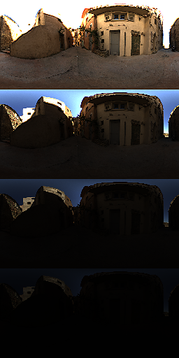

# Anteprima esposizione

<table>
<tr style="border: 0;">
<td width="33.33%" style="border: 0;" valign="top">

{width="200px"}

<b>Ingresso:</b> vista 3D > Strumenti HDRI

</td>
<td width="100.00%" style="border: 0;" valign="top">

## Descrizione

Nodo helper per visualizzare l&#39;anteprima dei passaggi di esposizione. Gli utenti impostano un valore minimo e un valore massimo, il nodo genera un&#39;immagine molto più grande con un numero diverso di versioni esposte dell&#39;input originale. Le diverse versioni sono sempre impilate orizzontalmente, la quantità dipende dalla risoluzione del nodo o del grafico.

</td>
</tr>
</table>

## Parametri

|  |  |
|:---|:---|
| <b>Esposizione massima (EV)</b> <i>-8.0 - 8.0</i> | Esposizione massima dell’immagine più luminosa in alto. |
| <b>Esposizione minima (EV)</b> <i>-8.0 - 8.0</i> | Esposizione minima dell’immagine più scura in basso. |

## Esempi

<table style="margin-top: 32px; margin-bottom: 32px">
    <tr style="border: 0">
        <td style="border: 0; background: transparent">
            
        </td>
    </tr>
</table>
