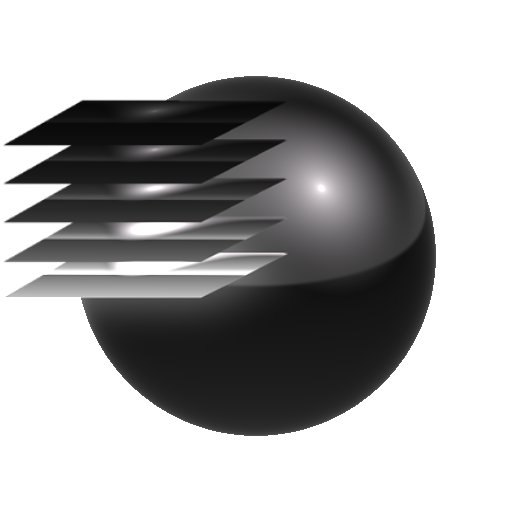

# Unione HDR

<table>
<tr style="border: 0;">
<td style="border: 0;" valign="top">

{width="200px"}

## Unione HDR

**Ingresso:** *Visualizzazione/Strumento HDRI 3D*

**Semplice**

</td>
<td style="border: 0;" valign="top">

## Descrizione

Unisci più esposizioni fotografiche per creare un&#39;immagine High dynamic range. Il primo input è l’immagine più sottoesposta.

## Input

* **Input 1-**&#x200B;**&#x200B; 16**: *Input colore*Immagini di input. La quantità disponibile dipende dal parametro.

## Parametri

* **Input**: *2 - 16*\
  Imposta la quantità di input disponibili.
* **Delta esposizione (EV)**: *0.0 - 4.0*\
  Imposta la differenza di esposizione per interpretare le immagini.
* **Punto bianco**: *0.0 - 13.0* Impostare il punto bianco per eseguire alcune regolazioni sul risultato finale.

</td>
</tr>
</table>
