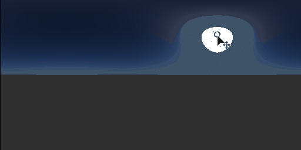

# Sole fisico/Cielo

<table>
<tr style="border: 0;">
<td width="33.33%" style="border: 0;" valign="top">

{width="200px"}

<b>Ingresso:</b> vista 3D > Strumenti HDRI

</td>
<td width="100.00%" style="border: 0;" valign="top">

## Descrizione

Implementazione fisica di Sole e Cielo basata sul modello Hosek-Wikie skylight. Fornisce una base eccellente per un HDRI artificiale.

</td>
</tr>
</table>

## Parametri

|  |  |
|:---|:---|
| <b>Posizione Sole</b> | intervallo = [0,1]x[0,1] (angoli longitudine-latitudine) |
| <b>Turbidità</b> <i>1.0 - 10.0</i> | La torbidità varia da 1 a 10 |
| <b>Albedo</b> <i>0.0 - 1.0</i> | L’Albedo varia da 0 a 1. |
| <b>Colore terreno</b> <i>(valore colore)</i> | Colore del piano terreno. |
| <b>Esposizione (EV)</b> <i>-1.0 - 4.0</i> | Valore di esposizione dell’output risultante. |
| <b>Dimensioni Sole</b> <i>0.0 - 4.0</i> | Scala del Sole, qualsiasi valore diverso da 1 non è fisicamente corretto. Il valore ha effetti sottili. |
| <b>Intensità Sole</b> <i>0.0 - 1.0</i> | Intensità del disco solare. Il disco Sun è piuttosto piccolo, quindi l&#39;effetto non è immediatamente visibile. |
| <b>Intensità cielo</b> <i>0.0 - 1.0</i> | Intensità del cielo. Influisce anche sulla luce del sole nel cielo, non sul disco stesso. |

## Esempi

<table style="margin-top: 32px; margin-bottom: 32px">
    <tr style="border: 0">
        <td style="border: 0; background: transparent">
            
        </td>
    </tr>
</table>
