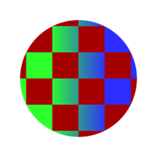

# Corrispondenza colori

<table>
<tr style="border: 0;">
<td width="33.33%" style="border: 0;" valign="top">

{width="128px"}

<b>Ingresso:</b> Filtri > Regolazioni

</td>
<td width="100.00%" style="border: 0;" valign="top">

## Descrizione

Tenta di trovare una corrispondenza tra l&#39;intervallo definito di *Colore di origine* e un intervallo di *Colore di destinazione*, con supporto per gli slot di input per definire Origine e Destinazione.

Per versioni più semplici, consulta [Sostituisci intervallo colore](../../../../../../compositing-graphs/nodes-reference-for-com/node-library/filters/adjustments/replace-color-range/replace-color-range.md) o [Sostituisci colore](../../../../../../compositing-graphs/nodes-reference-for-com/node-library/filters/adjustments/replace-color/replace-color.md).

</td>
</tr>
</table>

## Input

|  |  |
|:---|:---|
| <b>Input</b> <i>Input colore</i> | Input principale da modificare per il risultato. |
| <b>Colore di origine</b> <i>Input colore</i> | Slot di input per il colore di origine, utilizzato solo quando &quot;Metodo colore di origine&quot; è impostato su *Input*. |
| <b>Colore di destinazione</b> <i>Input colore</i> | Slot di input per il colore di destinazione, utilizzato solo quando &#39;Metodo colore di destinazione&#39; è impostato su *Input*. |

## Parametri

|  |  |
|:---|:---|
| <b>Metodo colore di origine</b> <i>Media, Parametro, Input</i> | Consente di impostare se il colore di origine è definito calcolando la media dell’immagine di input, impostando un parametro o utilizzando uno slot di input. |
| <b>Colore di origine</b> <i>(valore colore)</i> | Se Metodo colore di origine è impostato su *Parametro*, questo parametro determina il colore di origine. |
| <b>Metodo colore di destinazione</b> <i>Parametro, Input immagine</i> | Consente di impostare se il colore di origine è definito calcolando la media dell’immagine di input, impostando un parametro o utilizzando uno slot di input. |
| <b>Colore di destinazione</b> <i>(valore colore)</i> | Se Metodo colore di destinazione è impostato su *Parametro*, questo parametro determina il colore di destinazione. |
| <b>Variazione colore personalizzata</b> <i>Falso/Vero</i> | Abilita una variazione di colore aggiuntiva. |
| <b>Variazione colore</b> | Imposta le variazioni di tonalità, crominanza o luminanza sul risultato, se attivate. |
| <b>Usa maschera</b> <i>Falso/Vero</i> | Attiva/disattiva l’utilizzo di Input maschera o Output, a seconda della Modalità maschera riportata di seguito. |
| <b>Modalità maschera</b> <i>Parametro, Input</i> | In modalità Parametro viene generata una maschera che descrive in dettaglio la modifica del colore. La modalità di input consente a una maschera di controllare l’intensità dell’effetto Corrispondenza colore. |
| <b>Maschera</b> | Genera una maschera che mostra esattamente dove è stato applicato l’effetto Corrispondenza colore, con controlli aggiuntivi per smussare e sfocare la maschera risultante. |
