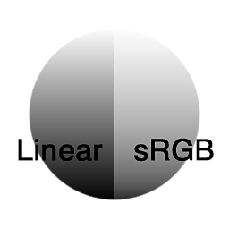

# Converti in sRGB

<table>
<tr style="border: 0;">
<td style="border: 0;" valign="top">

{width="128px"}

{width="128px"}

## Converti in sRGB (scala di grigi)

**Ingresso:** *Filtri/Regolazioni*

**Semplice**

</td>
<td style="border: 0;" valign="top">

## Descrizione

Converte un input lineare in uno spazio colore sRGB. Utile ad esempio quando lavorate e convertitevi con materiale di riferimento fotografico.

## Parametri

*Nessun parametro.*

## Immagini di esempio

|  |
| --- |
| Nessuna immagine allegata alla pagina. |

</td>
</tr>
</table>
