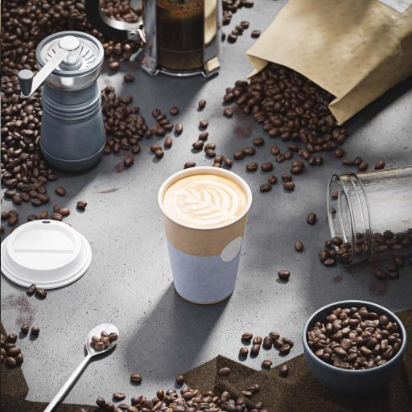

# Quantizza colore

<table>
<tr style="border: 0;">
<td width="33.33%" style="border: 0;" valign="top">

{width="200px"}

<b>Ingresso:</b> Filtri > Regolazioni

</td>
<td width="100.00%" style="border: 0;" valign="top">

## Descrizione

Riduce la quantità di colori in un’immagine a colori, appiattendo efficacemente le sfumature.

Oltre all&#39;immagine elaborata, il nodo estrae anche quanto segue:

* Una <b>tavolozza</b> dei colori rimanenti, che può essere utilizzata per colorare altre immagini
* Una <b>mappa ID</b> delle aree quantizzate, che può essere utilizzata per ricolorare l&#39;immagine elaborata utilizzando una tavolozza diversa
* <b>quantità</b> dei colori rimanenti come valore intero non elaborato

</td>
</tr>
</table>

Se il parametro &quot;Ignora alfa&quot; è impostato su &quot;False&quot;, il canale alfa dell’immagine originale viene utilizzato per selezionare le aree dell’immagine da cui estrarre i colori per il processo di quantizzazione, mentre i colori nelle aree trasparenti vengono ignorati.

In questo modo è possibile controllare i colori estratti.

Questo nodo può essere utilizzato in combinazione con i seguenti nodi: [Crea tavolozza colori](../../../../../../compositing-graphs/nodes-reference-for-com/node-library/filters/adjustments/create-color-palette-16/create-color-palette-16.md), [Applica tavolozza colori](../../../../../../compositing-graphs/nodes-reference-for-com/node-library/filters/adjustments/apply-color-palette/apply-color-palette.md), [Modifica tavolozza colori](../../../../../../compositing-graphs/nodes-reference-for-com/node-library/filters/adjustments/modify-color-palette/modify-color-palette.md), [Visualizza tavolozza colori](../../../../../../compositing-graphs/nodes-reference-for-com/node-library/filters/adjustments/view-color-palette/view-color-palette.md).

## Input

|  |  |
|:---|:---|
| <b>Input</b> <i>Colore</i> PRIMARIO | Immagine a colori da quantizzare. |

## Output

|  |  |
|:---|:---|
| <b>Output</b> <i>Colore</i> | Immagine a colori quantizzati. |
| <b>ID</b> <i>Scala di grigi</i> | Mappa in cui a ogni colore quantizzato viene assegnato un identificatore intero univoco.   Questo può essere utilizzato per:<ul data-preserve-html="true"> <li data-preserve-html="true"><b>Estrarre una maschera</b> da alcune aree quantizzate con il nodo [ID da mascherare](../../../../../../compositing-graphs/nodes-reference-for-com/node-library/filters/adjustments/id-to-mask/id-to-mask.md)</li> <li data-preserve-html="true"><b>Ricolorare</b> l&#39;immagine quantizzata con i nodi [Applica tavolozza colori](../../../../../../compositing-graphs/nodes-reference-for-com/node-library/filters/adjustments/apply-color-palette/apply-color-palette.md) o [Modifica tavolozza colori](../../../../../../compositing-graphs/nodes-reference-for-com/node-library/filters/adjustments/modify-color-palette/modify-color-palette.md)</li> </ul> |
| <b>Tavolozza</b> <i>Colore</i> | Tavolozza estratta dall&#39;immagine, con i colori rimanenti dopo la quantizzazione.   L’immagine è un elenco ordinato di colori RGB codificati come una riga di pixel e può contenere un massimo di 256 colori.   È possibile visualizzare la tavolozza con il nodo [Visualizza tavolozza colori](../../../../../../compositing-graphs/nodes-reference-for-com/node-library/filters/adjustments/view-color-palette/view-color-palette.md). |
| <b>Quantità colore tavolozza</b> <i>Numero intero</i> | Quantità di colori memorizzati nella tavolozza. |

## Parametri

|  |  |
|:---|:---|
| <b>Max. quantità colore</b> *Numero intero* | La quantità massima di colori da utilizzare nell&#39;immagine quantizzata.   Questa quantità è la stessa utilizzata nella tavolozza estratta dall&#39;immagine.   Per &quot;massimo&quot; si intende che questo importo può non essere raggiunto a causa della tecnica di quantizzazione utilizzata. Controllate l&#39;output &quot;Quantità colore tavolozza&quot; per la quantità effettiva di colori estratti. |
| <b>Uniformità contorno</b> *Mobile* | Controlla il raggio di un effetto di arrotondamento applicato all’immagine di input, utilizzato per semplificare l’immagine quantizzata in forme più solide e coerenti.   Nota: questo arrotondamento richiede calcoli intensivi, pertanto l&#39;aumento di questo valore aumenta notevolmente il tempo di calcolo del nodo. |
| <b>Dithering</b> *Virgola mobile* | Applica un pattern di dithering per ricreare le sfumature e le fusioni di colore nell’immagine originale, continuando a utilizzare solo i colori rimanenti dopo la quantizzazione.   Per ottenere l’effetto di dithering atteso, assicuratevi di utilizzare un valore di &quot;Attenuazione contorno&quot; pari a 0. |
| <b>Criterio dithering</b> *Numero intero* | Pattern di dithering utilizzato per ricreare le sfumature e le fusioni di colore nell’immagine originale:<ul data-preserve-html="true"> <li data-preserve-html="true">Disturbo blu</li> <li data-preserve-html="true">Bayer</li> </ul> |
| <b>Ignora alfa</b> *Booleano* | Per impostazione predefinita, il canale alfa dell’immagine originale viene utilizzato per selezionare le aree dell’immagine da cui estrarre i colori per la quantizzazione, mentre i colori nelle aree trasparenti vengono ignorati. In questo modo è possibile controllare i colori estratti.   In effetti, potete usare solo i colori delle parti visibili dell’immagine per il processo di quantizzazione.   Questo interruttore consente di disabilitare questa mascheratura e di utilizzare l&#39;immagine *completa* indipendentemente dalla trasparenza. |
| <b>Spazio colore distanza</b> *Numero intero* | I colori sono disposti in un *cubo* in cui larghezza, height e profondità sono una sfumatura in cui ogni componente di un colore aumenta da 0 a 1 (ad esempio rosso, verde e blu in RGB).   Il processo di quantizzazione prevede la selezione dei *colori di definizione* in un&#39;immagine, quindi la ricerca dei colori più vicini nel cubo e la loro sostituzione con il colore di definizione.   Questo parametro consente di selezionare lo spazio cromatico utilizzato per distribuire i colori nel cubo, che modifica il risultato della quantizzazione modificando i criteri per il rilevamento di un colore di definizione e la ridisposizione dei colori adiacenti.   Puoi selezionare lo spazio cromatico che si adatta al tuo caso d&#39;uso:<ul data-preserve-html="true"> <li data-preserve-html="true"><b>Lab (Colore):</b> uno spazio colore percettivo standardizzato, che distribuisce i colori in modo tale che quelli più vicini siano effettivamente vicini nel cubo. Questa opzione è indicata per immagini che possono essere visualizzate su schermi</li> <li data-preserve-html="true"><b>RGB (dati):</b> il colore viene suddiviso in rosso, verde e blu e distribuito direttamente lungo tali assi, ignorando la percezione umana. Questa opzione è indicata per le immagini contenenti dati non elaborati, ad esempio mappe normali</li> </ul> |
| <b>Modalità ordinamento ID</b> *Numero intero* | I colori sono disposti in un *cubo* in cui larghezza, height e profondità sono una sfumatura in cui ogni componente di un colore aumenta da 0 a 1 (ad esempio rosso, verde e blu in RGB).   Questo parametro seleziona il metodo utilizzato per ordinare l&#39;elenco dei colori nella tavolozza estratta e gli indici nelle aree della mappa ID estratta:<ul data-preserve-html="true"> <li data-preserve-html="true"><b>Curva Z:</b> colori sono ordinati in base al successivo trovato nel cubo dei colori utilizzando una curva Z, dal bianco al nero</li> <li data-preserve-html="true"><b>Tonalità:</b> colori sono ordinati in base alla tonalità più vicina</li> <li data-preserve-html="true"><b>Rappresentatività:</b> colori sono ordinati dalla maggior parte alla meno utilizzata nell&#39;immagine quantizzata</li> </ul> |
| <b>Filtro di downscale</b> *Numero intero* | Il processo di quantizzazione del colore comporta il calcolo di un istogramma di un’immagine di dimensioni ridotte (cioè ridimensionata), al fine di ordinare i colori in base all’importanza. Questo parametro controlla il metodo di filtraggio dell’immagine ridimensionata prima di calcolarne l’istogramma:<ul data-preserve-html="true"> <li data-preserve-html="true"><b>Bilineare:</b> applica un filtro bilineare all&#39;immagine, risultando in un istogramma con colori interpolati che potrebbero non far parte dell&#39;immagine originale, diluendo alcuni dei colori originali. Questo è utile per le immagini che usano molti colori.</li> <li data-preserve-html="true"><b>Più vicino:</b> campiona il colore del pixel più vicino senza filtri, creando un istogramma che utilizza esclusivamente i colori dell&#39;immagine originale. Questa opzione è indicata per le immagini che usano pochi colori.</li> </ul> |

## Esempi

<table>
  <tr>
    <td>
      
       <i>Prima</i>
    </td>
    <td>
      
       <i>Dopo</i>
    </td>
  </tr>
</table>

<table>
  <tr>
    <td>
      
       <i>Prima</i>
    </td>
    <td>
      
       <i>Dopo</i>
    </td>
  </tr>
</table>

<table>
  <tr>
    <td>
      
       <i>Prima</i>
    </td>
    <td>
      
       <i>Dopo</i>
    </td>
  </tr>
</table>

<table>
  <tr>
    <td>
      
       <i>Prima</i>
    </td>
    <td>
      
       <i>Dopo</i>
    </td>
  </tr>
</table>

<table>
  <tr>
    <td>
      
       <i>Prima</i>
    </td>
    <td>
      
       <i>Dopo</i>
    </td>
  </tr>
</table>
