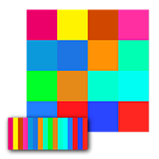
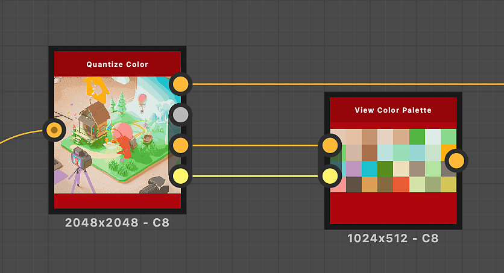

# Visualizza tavolozza colori

<table>
<tr style="border: 0;">
<td width="33.33%" style="border: 0;" valign="top">

{width="200px"}

<b>Ingresso:</b> Filtri > Regolazioni

</td>
<td width="100.00%" style="border: 0;" valign="top">

## Descrizione

Inserisce una tavolozza di colori in un quadrato o in un rettangolo per visualizzarla più facilmente nella vista Grafico o 2D.\
L&#39;impacchettamento mira a lasciare il minor numero possibile di slot vuoti.

</td>
</tr>
</table>

L&#39;ordine dei colori nella tavolozza viene mantenuto, con i colori che scorrono da sinistra a destra e dall&#39;alto verso il basso in modo simile alla disposizione del testo.

Questo nodo può essere utilizzato per visualizzare le tavolozze prodotte dai seguenti nodi: [Quantizza colore](../../../../../../compositing-graphs/nodes-reference-for-com/node-library/filters/adjustments/quantize-color/quantize-color.md), [Crea tavolozza colori](../../../../../../compositing-graphs/nodes-reference-for-com/node-library/filters/adjustments/create-color-palette-16/create-color-palette-16.md), [Modifica tavolozza colori](../../../../../../compositing-graphs/nodes-reference-for-com/node-library/filters/adjustments/modify-color-palette/modify-color-palette.md).

<table>
<tr style="border: 0;">
<td style="border: 0;" valign="top">

</td>
<td style="border: 0;" valign="top">

### Connettori di uscita

</td>
<td style="border: 0;" valign="top">

</td>
</tr>
</table>

## Connettori di ingresso

|  |  |
| --- | --- |
| <b>Tavolozza</b> *Colore* PRIMARIO | Un elenco ordinato di colori RGB codificati come una riga di pixel. La tavolozza può contenere un massimo di 256 colori.   Questa è la tavolozza che il nodo prepara ed esegue il rendering. |
| <b>Quantità colore tavolozza</b> *Numero intero* | Quantità di colori memorizzati nella tavolozza.   Se tale numero non corrisponde alla quantità effettiva di colori nell&#39;input dell&#39;immagine &quot;Palette&quot;, la visualizzazione potrebbe essere incompleta o disporre di più spazi vuoti del necessario. |

## Connettori di uscita

|  |  |
| --- | --- |
| <b>Output</b> *Colore* | Visualizzazione della tavolozza compressa. |

## Esempi

<table>
<tr style="border: 0;">
<td style="border: 0;" valign="top">

{zoomable="yes"}

</td>
<td style="border: 0;" valign="top">

{zoomable="yes"}

</td>
</tr>
</table>

<table>
<tr style="border: 0;">
<td style="border: 0;" valign="top">

{zoomable="yes"}

</td>
<td style="border: 0;" valign="top">

{zoomable="yes"}

</td>
</tr>
</table>
