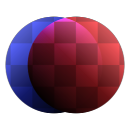

# Colore scherma

<table>
<tr style="border: 0;">
<td width="33.33%" style="border: 0;" valign="top">

{width="128px"}

<b>Ingresso:</b> Filtri > Fusione

</td>
<td width="100.00%" style="border: 0;" valign="top">

## Descrizione

Esegue una fusione Scherma colore. Matematicamente la formula è Sfondo / (1-Primo piano).

</td>
</tr>
</table>

## Input

|  |  |
|:---|:---|
| <b>Primo piano</b> <i>Input colore</i> |  |
| <b>Sfondo</b> <i>Input colore</i> |  |
| <b>Maschera</b> <i>Input scala di grigi</i> | Slot maschera utilizzato per mascherare gli effetti del nodo. |

## Parametri

|  |  |
|:---|:---|
| <b>Opacità</b> <i>0.0 - 1.0</i> | Fusione dell’opacità tra primo piano e sfondo. |
| <b>Fusione alfa</b> <i>Falso/Vero</i> | Attiva/disattiva la fusione dei canali alfa di primo piano e di sfondo. Se è impostato su False, il canale alfa del primo piano viene ignorato. |
