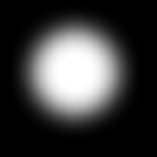

# Sfocatura anisotropa

<table>
<tr style="border: 0;">
<td width="33.33%" style="border: 0;" valign="top">

{width="128px"}

{width="128px"}

<b>Ingresso:</b> Filtri > Sfocature

</td>
<td width="100.00%" style="border: 0;" valign="top">

## Descrizione

Esegue una [sfocatura direzionale](../../../../../../compositing-graphs/nodes-reference-for-com/atomic-nodes/directional-blur/directional-blur.md) di alta qualità, con alcune impostazioni per personalizzare l&#39;aspetto. Detto anche &quot;effetto movimento&quot;.

Importante: assicurati di utilizzare la versione appropriata per il tuo input. Usate &quot;Sfocatura anisotropa&quot; per gli input di colore o &quot;Scala di grigi Sfocatura anisotropa&quot; per gli input di scala di grigi.

</td>
</tr>
</table>

## Parametri

|  |  |
|:---|:---|
| <b>Intensità</b> <i>0.0 - 16.0</i> | Intensità (raggio) della sfocatura. Più alto è questo valore, maggiore sarà la sfocatura. |
| <b>Anisotropia</b> <i>0.0 - 1.0</i> | Direzione della sfocatura. Impostare questo valore su 0,0 equivale a eseguire una sfocatura normale. |
| <b>Angolo</b> <i>0.0 - 1.0</i> | Imposta l’angolo per la direzione di sfocatura. |
| <b>Qualità</b> <i>0 - 1</i> | Consente di passare internamente da una sfocatura a [box](../../../../../../compositing-graphs/nodes-reference-for-com/atomic-nodes/blur/blur.md) a una sfocatura HQ. Scambia in velocità per qualità. |

## Esempi

<table style="margin-top: 32px; margin-bottom: 32px">
    <tr style="border: 0">
        <td style="border: 0; background: transparent">
            
        </td>
    </tr>
</table>
