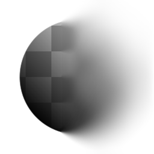

# Sfocatura non uniforme

<table>
<tr style="border: 0;">
<td width="33.33%" style="border: 0;" valign="top">

{width="128px"}

{width="128px"}

<b>Ingresso:</b> Filtri > Sfocature

</td>
<td width="100.00%" style="border: 0;" valign="top">

## Descrizione

Esegue una Sfocatura di alta qualità, in cui l’intensità è determinata da una maschera di input. Le opzioni consentono l&#39;aggiunta di Anisotropia e assimetria.

</td>
</tr>
</table>

## Input

|  |  |
|:---|:---|
| <b>Mappa sfocatura</b> <i>Input scala di grigi</i> | Mappa maschera per potenziare l’effetto. |

## Parametri

|  |  |
|:---|:---|
| <b>Intensità</b> <i>0.0 - 50.0</i> | Intensità massima per applicare la sfocatura. Con la maschera della Mappa sfocatura, questa impostazione non avrà alcun effetto sulle aree nere della mappa. |
| <b>Anisotropia</b> <i>0.0 - 1.0</i> | Facoltativamente, aggiunge direzionalità all’effetto di sfocatura. Guidata dal parametro Angle. |
| <b>Asimmetria</b> <i>0.0 - 1.0</i> | Facoltativamente, aggiunge una distorsione al campionamento. Guidata dal parametro Angle. |
| <b>Angolo</b> <i>0.0 - 1.0</i> | Angolo per impostare la direzionalità e la distorsione di campionamento. |
| <b>Esempi</b> <i>1 - 16</i> | Quantità di campioni, determina la qualità. Moltiplicato per la quantità di blade. |
| <b>Blade</b> <i>1 - 9</i> | Quantità di settori di campionamento, determina la qualità. Moltiplicato per la quantità di campioni. |

## Esempi

<table style="margin-top: 32px; margin-bottom: 32px">
    <tr style="border: 0">
        <td style="border: 0; background: transparent">
             <i>Nell'esempio seguente viene utilizzata una sfumatura a 90 gradi nello slot Mappa sfocatura.</i>
        </td>
    </tr>
</table>
