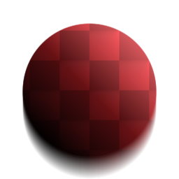

# Pendenza sfocatura

<table>
<tr style="border: 0;">
<td width="33.33%" style="border: 0;" valign="top">

{width="128px"}

{width="128px"}

<b>Ingresso:</b> Filtri > Sfocature

</td>
<td width="100.00%" style="border: 0;" valign="top">

## Descrizione

Effettua una sfocatura avanzata di alta qualità quando l’Anisotropia/direzione è guidata da una &quot;Mappa Pendenza&quot; in scala di grigi. Immaginalo come Effetto di sfocatura di Pendenza che segue le pendenze della tua Mappa Pendenza come se fosse una Mappa di altezza, simile a [Alterazione direzionale](../../../../../../compositing-graphs/nodes-reference-for-com/atomic-nodes/directional-warp/directional-warp.md) (su cui si basa internamente).

Questa è una delle sfocature più interessanti e potenti di Designer. Può essere utilizzato per ottenere alcuni effetti molto interessanti e inaspettati, come scheggiatura e bordi di tempo o spalmatura e perdita di dirt o ruggine.

Importante: assicurati di utilizzare la versione appropriata per il tuo input. Usate &quot;Pendenza sfocatura&quot; per gli input di colore o &quot;Pendenza sfocatura scala di grigi&quot; per gli input di scala di grigi.

</td>
</tr>
</table>

## Input

|  |  |
|:---|:---|
| <b>Pendenza</b> <i>Input scala di grigi</i> | Pendenza mappa per l&#39;angolo di guida dell&#39;anisotropia. Dovrebbero idealmente contenere sfumature inclinate; transizioni dure e nitide non funzioneranno bene! |

## Parametri

|  |  |
|:---|:---|
| <b>Esempi</b> <i>0 - 32</i> | Quantità di campioni, influisce sulla qualità a scapito della velocità. |
| <b>Intensità</b> <i>0.0 - 16.0</i> | Entità o intensità della sfocatura. |
| <b>Modalità</b> <i>Sfocatura, Min, Max</i> | Metodo di fusione per le passate di sfocatura successive. &quot;Sfocatura&quot; si comporta in modo più simile a una [Sfocatura anisotropa](../../../../../../compositing-graphs/nodes-reference-for-com/node-library/filters/blurs/anisotropic-blur/anisotropic-blur.md) standard, mentre Min &quot;mangia via&quot; le aree esistenti e Max &quot;macchia&quot; le aree bianche. |

## Esempi

<table style="margin-top: 32px; margin-bottom: 32px">
    <tr style="border: 0">
        <td style="border: 0; background: transparent">
            
        </td>
        <td style="border: 0; background: transparent">
            
        </td>
    </tr>
</table>
