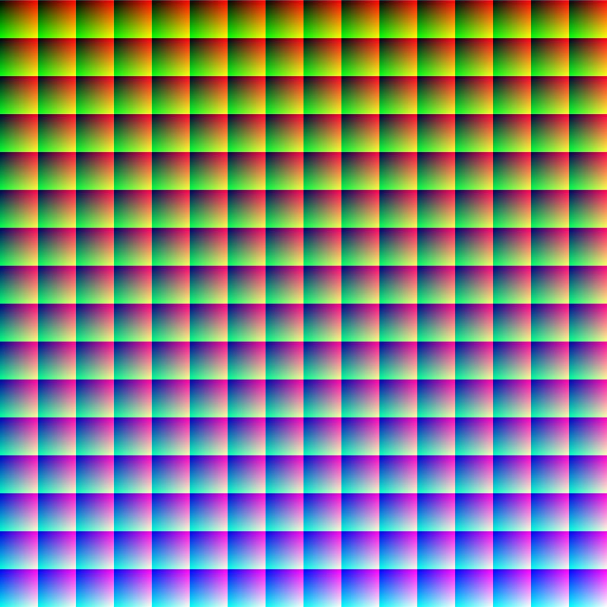

# Posizione Texture 3D

<table>
<tr style="border: 0;">
<td width="33.33%" style="border: 0;" valign="top">

{width="256px"}

<b>Ingresso:</b> Filtro > Effetto

</td>
<td width="100.00%" style="border: 0;" valign="top">

## Descrizione

Il nodo **Posizione Texture 3D** genera le *sezioni di posizione* di un cubo di unità.

Può essere utilizzato per eseguire i baking rumori o funzioni 3D come *atlas della texture 3D*.

</td>
</tr>
</table>

## Esempi

<table style="margin-top: 32px; margin-bottom: 32px">
    <tr style="border: 0">
        <td style="border: 0; background: transparent">
            
        </td>
        <td style="border: 0; background: transparent">
            
        </td>
    </tr>
</table>
