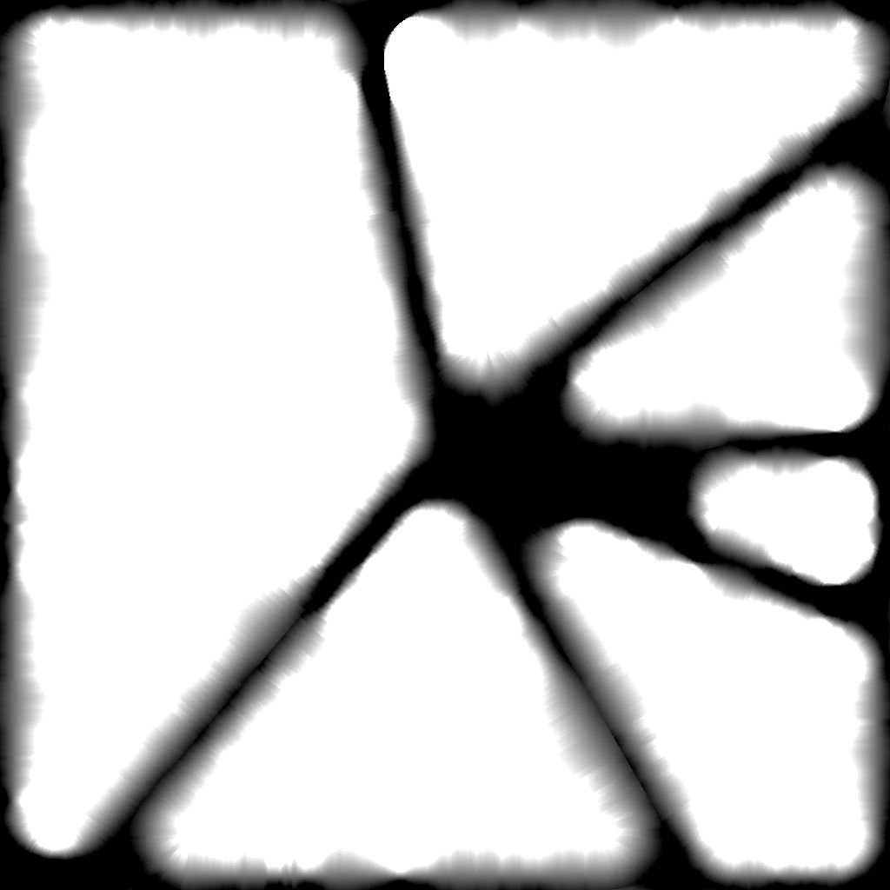
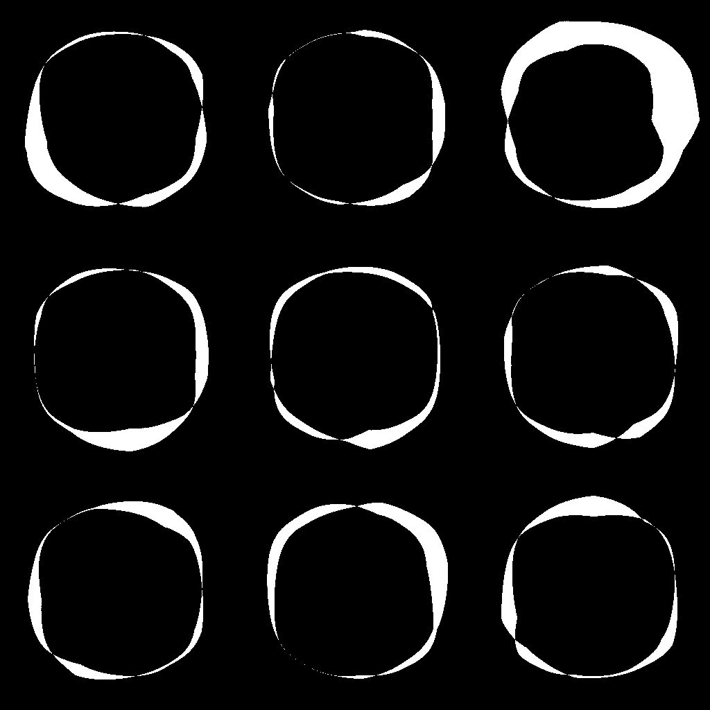

# Smusso uniforme

<table>
<tr style="border: 0;">
<td width="33.33%" style="border: 0;" valign="top">

{width="200px"}

<b>Ingresso:</b> Filtri > Effetti

</td>
<td width="100.00%" style="border: 0;" valign="top">

## Descrizione

Traccia una sfumatura o un colore piatto dai bordi di una maschera verso l’esterno, l’interno o entrambi.

Le sfumature sovrapposte vengono ordinate in base alla distanza normalizzata invertita, in modo da tracciare la distanza dal bordo più vicino.

La distanza della sfumatura può essere regolata dinamicamente lungo il bordo utilizzando una mappa di distanza.

</td>
</tr>
</table>

>[!TIP]
>
> Il nodo [Distanza direzionale](../../../../../../compositing-graphs/nodes-reference-for-com/node-library/filters/effects/directional-distance/directional-distance.md) offre funzionalità simili, in cui la dilatazione viene eseguita in una direzione specifica.

<table>
<tr style="border: 0;">
<td style="border: 0;" valign="top">

</td>
<td style="border: 0;" valign="top">

### Connettori di uscita

</td>
<td style="border: 0;" valign="top">

### Parametri

</td>
</tr>
</table>

## Connettori di ingresso

|  |  |
| --- | --- |
| <b>Input maschera</b> *Scala di grigi* PRIMARIO | Immagine da cui estrarre la maschera.   Tutti i valori al di sopra del valore &quot;Soglia maschera&quot; sono bianchi nella maschera. |
| <b>Input di origine</b> *Scala di grigi* | Un input opzionale utilizzato solo quando il parametro &#39;Modalità output&#39; è impostato su &#39;Dilation&#39;.   In tal caso, l’immagine viene sovrapposta sulle aree bianche della maschera e i valori in scala di grigio ai bordi vengono dilatati. |
| <b>Mappa di distanza</b> *Scala di grigi* | Input facoltativo utilizzato quando il valore del parametro &#39;Moltiplicatore Mappa di distanza&#39; è maggiore di 0.   Viene utilizzato per regolare la distanza di smussatura/dilatazione lungo i bordi della maschera, dove un valore più scuro determina una distanza più breve. |

## Connettori di uscita

|  |  |
| --- | --- |
| <b>Output</b> *Scala di grigi* | L&#39;immagine risultante, in base al &quot;Metodo di output&quot; selezionato. |
| <b>UV</b> *Colore* | Una mappa UV in cui gli UV sono dilatati lungo i bordi della maschera.   Questo può essere collegato a un nodo [UV Mapper](../../../../../../compositing-graphs/nodes-reference-for-com/node-library/spline-paths-tools/spline-tools/uv-mapper-color/uv-mapper-color.md) per mappare qualsiasi altra immagine utilizzando questi UV dilatati. |

## Parametri

|  |  |
| --- | --- |
| <b>Modalità output</b> *Numero intero* | Metodo di dilatazione dei bordi della maschera:<ul data-preserve-html="true"> <li data-preserve-html="true"><b>Smusso:</b> tracciate una sfumatura da 1 a 0 dove 0 viene raggiunto alla &#39;Distanza&#39; massima</li> <li data-preserve-html="true"><b>Dilatazione:</b> disegnate una tinta unita fino alla &#39;Distanza massima&#39;. Questo colore è bianco oppure, se collegato, il colore dell’immagine &quot;Input sorgente&quot; sul bordo della maschera</li> <li data-preserve-html="true"><b>Distanza:</b> la distanza raw dal bordo della maschera più vicino, in uno spazio immagine normalizzato in cui 1 è la lunghezza del lato più corto dell&#39;immagine</li> </ul> |
| <b>Direzione</b> *Intero* *Disponibile quando &#39;Modalità output&#39; è impostato su &#39;Smussato&#39; o &#39;Dilatazione&#39;* | Lato del bordo della maschera da dilatare:<ul data-preserve-html="true"> <li data-preserve-html="true"><b>Entrata:</b> disegnate verso l&#39;interno della maschera</li> <li data-preserve-html="true"><b>Uscita:</b> disegnate verso l&#39;esterno della maschera</li> <li data-preserve-html="true"><b>Attacco/Stacco:</b> disegnare verso l&#39;interno e l&#39;esterno della maschera</li> </ul> |
| <b>Distanza massima</b> *Mobile* | La distanza di dilatazione, nello spazio normalizzato dell&#39;immagine dove 1 è la lunghezza del lato più corto dell&#39;immagine di input. |
| <b>smoothness maschera</b> *Mobile* | Intensità dell’attenuazione applicata alla maschera.   Il valore corrisponde al raggio della sfocatura e 1 unità corrisponde a 1/256 dell’immagine. |
| <b>Scostamento maschera</b> *Mobile* | Sposta i bordi della maschera verso l’interno o l’esterno. |
| <b>Soglia maschera</b> *Mobile* | Valore utilizzato per rilevare i bordi della maschera nell’immagine di &quot;Input maschera&quot;.   I valori al di sopra di questa soglia sono *interni* delle forme maschera, mentre i valori al di sotto sono *esterni*. |
| <b>Scala</b> *Float2* | Regola la distanza orizzontale (X) e verticale (Y) della dilatazione.   Questi valori sono moltiplicatori per il valore del parametro &#39;Distanza massima&#39;. |
| <b>Moltiplicatore Mappa di distanza</b> *Numero intero* | Regola l’impatto della &quot;Mappa di distanza&quot; sulla &quot;Distanza massima&quot;. |

## Esempi

<table>
<tr style="border: 0;">
<td style="border: 0;" valign="top">

{width="1024px" zoomable="yes"}

</td>
<td style="border: 0;" valign="top">

{width="1024px" zoomable="yes"}

</td>
</tr>
</table>

<table>
<tr style="border: 0;">
<td style="border: 0;" valign="top">

<table>
  <tr>
    <td>
      
       <i>Prima</i>
    </td>
    <td>
      
       <i>Dopo</i>
    </td>
  </tr>
</table>

</td>
<td style="border: 0;" valign="top">

<table>
  <tr>
    <td>
      
       <i>Prima</i>
    </td>
    <td>
      
       <i>Dopo</i>
    </td>
  </tr>
</table>

</td>
</tr>
</table>

<table>
<tr style="border: 0;">
<td style="border: 0;" valign="top">

<table>
  <tr>
    <td>
      
       <i>Prima</i>
    </td>
    <td>
      
       <i>Dopo</i>
    </td>
  </tr>
</table>

</td>
<td style="border: 0;" valign="top">

<table>
  <tr>
    <td>
      
       <i>Prima</i>
    </td>
    <td>
      
       <i>Dopo</i>
    </td>
  </tr>
</table>

</td>
</tr>
</table>

<table>
  <tr>
    <td>
      
       <i>Prima</i>
    </td>
    <td>
      
       <i>Dopo</i>
    </td>
  </tr>
</table>
