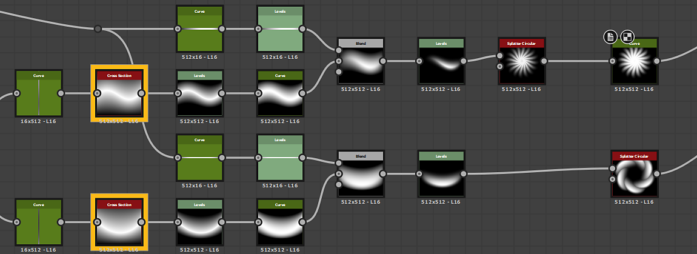

# Sezione trasversale

<table>
<tr style="border: 0;">
<td width="33.33%" style="border: 0;" valign="top">

{width="200px"}

<b>Ingresso:</b> Filtri > Effetti

</td>
<td width="100.00%" style="border: 0;" valign="top">

## Descrizione

Disegna un profilo di sezione trasversale di un input. Può essere regolata in verticale o orizzontale e dispone di controlli per lo stile del disegno e lo scostamento del grafico e il ridimensionamento.

</td>
</tr>
</table>

Questo nodo è particolarmente utile per il debug e l&#39;analisi delle mappe di altezza. che offre una vista del profilo con perfezionamento pixel, senza la necessità di nodi complessi o di una configurazione lunga e meno precisa nella vista 3D.

In alternativa, può essere utilizzato per creare forme e silhouette 2D difficili da ottenere altrimenti. In combinazione con un [nodo curva](../../../../../../compositing-graphs/nodes-reference-for-com/atomic-nodes/curve/curve.md)può visualizzare direttamente il profilo della curva applicato a una sfumatura lineare.

## Parametri

<b>Coordinata sezione trasversale</b> *Mobile*\
Impostate le coordinate di campionamento della sezione. Può essere una coordinata X o Y a seconda dell&#39;asse di sezione.

<b>Asse di sezione</b> *Numero intero*\
Impostate questa opzione se la sezione è verticale o orizzontale.

<b>Mostra helper</b> *Booleano*\
Attiva una sovrapposizione che mostra la posizione della sezione sull’immagine di input.

Impostazioni helper

<b>Scala helper</b> *Mobile*\
La dimensione della sovrapposizione espressa come multiplo, dove 1,0 è l’intera immagine.

<b> posizione helper</b> *Float2*\
Posizione (X, Y) della sovrapposizione nell’immagine di output, dove (0,0, 0,0) è in alto a sinistra e (1,0, 1,0) è in basso a destra.

<b>Scala Height</b> *Mobile*

Riduce l&#39;intero grafico. Utile per la visualizzazione HDR.

<b>Offset Height</b> *Mobile*\
Sposta l’intero grafico in alto o in basso. Utile per la visualizzazione HDR.

<b>Stile disegno</b> *Numero intero*\
Consente di passare dal riempimento pieno al disegno con linea.

<b>Inverti sfumatura</b> *Booleano* Se lo stile del disegno è impostato su *Sfumatura* o *Sfumatura speculare*, consente di invertire la sfumatura senza modificare lo sfondo.\
*Nota:* disponibile solo quando &#39;Stile disegno&#39; è impostato su &#39;Sfumatura&#39; o &#39;Sfumatura speculare&#39;.

<b>Uniforme/Poligonale</b> *Booleano*\
Alterna la forma tra un profilo liscio perfetto o un profilo poligonale scalettato.\
*Nota:* disponibile solo quando &#39;Stile disegno&#39; è impostato su &#39;Tinta unita&#39;, &#39;Sfumatura&#39; o &#39;Sfumatura speculare&#39;.

<b>Importo segmento</b>: *Numero intero*\
Imposta la quantità di segmenti da disegnare in Stile poligonale o in Stile linea.\
*Nota:* disponibile solo quando &#39;Uniforme/Poligonale&#39; è impostato su &#39;Poligonale&#39; o quando &#39;Stile disegno&#39; è impostato su &#39;Linea&#39;.

<b>thickness di righe</b> *Mobile*\
Imposta il thickness della linea.\
*Nota:* disponibile solo quando &#39;Stile disegno&#39; è impostato su &#39;Linea.

<b>Stile linea</b> *Numero intero*\
Consente di scegliere la colorazione e la dissolvenza della linea.\
*Nota:* disponibile solo quando &#39;Stile disegno&#39; è impostato su &#39;Linea.

<b>smoothness riga</b> *Mobile*\
Imposta il decadimento della sfumatura della linea.\
*Nota:* disponibile solo quando &#39;Stile disegno&#39; è impostato su &#39;Linea.

<b>Colore</b> *Mobile*\
Colore in scala di grigio della linea o della forma.\
*Nota:* disponibile solo quando &#39;Stile disegno&#39; è impostato su &#39;Uniforme&#39; oppure &#39;Linea&#39; e &#39;Stile linea&#39; è impostato su &#39;Uniforme&#39; o &#39;Uniforme&#39;.

<b>Colore di sfondo</b> *Colore fluttuante* in scala di grigi dello sfondo.\
*Nota:* non disponibile quando &#39;Stile disegno&#39; è impostato su &#39;Linea&#39; e &#39;Stile linea&#39; è impostato su &#39;ID segmento&#39; o &#39;Sfumatura lungo la linea&#39;.

## Esempi

