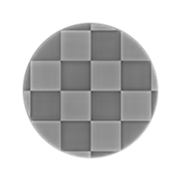

# Curvatura uniforme

<table>
<tr style="border: 0;">
<td width="33.33%" style="border: 0;" valign="top">

{width="200px"}

<b>Ingresso:</b> Filtri > Effetti

</td>
<td width="100.00%" style="border: 0;" valign="top">

## Descrizione

Calcola la curvatura di una superficie descritta da una mappa normale.

Una mappa di curvatura rappresenta le aree concave e convesse di una superficie.\
Le aree piatte sono grigie al 50%. Le aree convesse sono più luminose, mentre quelle concave più scure.

</td>
</tr>
</table>

Anche le aree concave e convesse vengono suddivise nelle rispettive uscite, per una più semplice selezione o mascheratura delle aree in base a tali caratteristiche.

>[!TIP]
>
> Per una versione più nitida, osserva [Curvatura](../../../../../../compositing-graphs/nodes-reference-for-com/node-library/filters/effects/curvature-filter-node/curvature-filter-node.md) oppure [Sobel curvatura](../../../../../../compositing-graphs/nodes-reference-for-com/node-library/filters/effects/curvature-sobel/curvature-sobel.md) se hai bisogno di più opzioni.

<table>
<tr style="border: 0;">
<td style="border: 0;" valign="top">

</td>
<td style="border: 0;" valign="top">

### Connettori di uscita

</td>
<td style="border: 0;" valign="top">

### Parametri

</td>
</tr>
</table>

## Connettori di ingresso

|  |  |
| --- | --- |
| <b>Normale</b> *Colore* <b>PRIMARIO</b> | La mappa normale che descrive la superficie da calcolare per la curvatura. |

## Connettori di uscita

|  |  |
| --- | --- |
| <b>Curvatura</b> *Scala di grigi* | Mappa di curvatura calcolata a partire dalla mappa normale di input.   Le aree piatte sono grigie al 50%. Le aree convesse sono più luminose, mentre quelle concave più scure. |
| <b>Convessità</b> *Scala di grigi* | La mappa di convessità calcolata a partire dalla mappa normale di input.   Più convessa è un&#39;area, più luminosa è nella mappa.  Le aree piatte o concave sono nere. |
| <b>Concavità</b> *Scala di grigi* | Mappa di concavità calcolata a partire dalla mappa normale di input.   Più concava è un&#39;area, più luminosa è nella mappa.  Le aree piatte o convesse sono nere. |

## Parametri

|  |  |
| --- | --- |
| <b>Formato normale</b> *Numero intero* | Formato della mappa normale di input. Inverte efficacemente il canale del verde.<ul data-preserve-html="true"> <li data-preserve-html="true"><b>DirectX:</b> l&#39;asse Y punta in alto</li> <li data-preserve-html="true"><b style="">OpenGL:</b> l&#39;asse Y punta in basso</li> </ul> |

## Esempi

<table>
  <tr>
    <td>
      
       <i>Prima</i>
    </td>
    <td>
      
       <i>Dopo</i>
    </td>
  </tr>
</table>

<table>
<tr style="border: 0;">
<td style="border: 0;" valign="top">

{zoomable="yes"}

</td>
<td style="border: 0;" valign="top">

{zoomable="yes"}

</td>
</tr>
</table>

<table>
  <tr>
    <td>
      
       <i>Prima</i>
    </td>
    <td>
      
       <i>Dopo</i>
    </td>
  </tr>
</table>

<table>
<tr style="border: 0;">
<td style="border: 0;" valign="top">

{zoomable="yes"}

</td>
<td style="border: 0;" valign="top">

{zoomable="yes"}

</td>
</tr>
</table>
