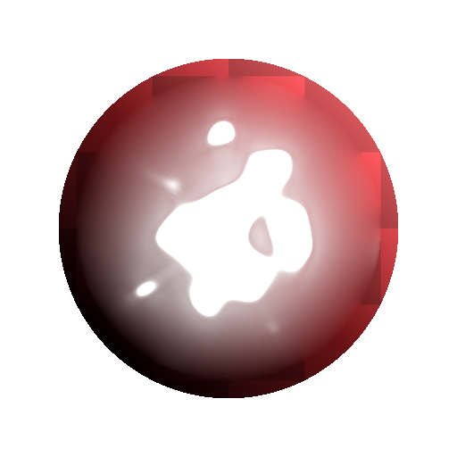

# Colore diffusione

<table>
<tr style="border: 0;">
<td width="33.33%" style="border: 0;" valign="top">

{width="200px"}

<b>Ingresso:</b> Filtri > Effetti

</td>
<td width="100.00%" style="border: 0;" valign="top">

## Descrizione

Applicate un processo di diffusione ai colori nell&#39;input dell&#39;immagine **Sorgente** in base all&#39;input dell&#39;immagine **Maschera** fornito, creando sfumature uniformi tra i colori quando si utilizza [Substance 3D Designer](https://www.adobe.com/it/products/substance3d-designer.html).

Vengono diffusi solo i colori dei pixel corrispondenti alla maschera; gli altri pixel non partecipano al risultato.

</td>
</tr>
</table>

## Input

|  |  |
|:---|:---|
| <b>Origine</b> <i>Colore</i> | Immagine da diffondere. |
| <b>Maschera</b> <i>Scala di grigi</i> | Maschera di diffusione: i pixel bianchi vengono campionati in <i>Sorgente</i> e diffusi in pixel neri. L’immagine deve essere in bianco e nero. Se la maschera include sfumature, il valore di taglio è 0,5. |
| <b>Intensità</b> <i>Scala di grigi</i> | Definisce localmente la forza con cui viene applicato il processo di diffusione. Questa mappa dovrebbe essere <i>in contrasto</i> per ottenere un effetto evidente. |

## Parametri

|  |  |
|:---|:---|
| <b>Iterazioni</b> <i>0.0 - 64.0</i> | Numero di iterazioni di diffusione da eseguire (maggiore è migliore ma più lento). I valori utili sono compresi nell’intervallo [8, 48]. Si noti che se non si cerca la correttezza matematica, i valori bassi sono corretti o addirittura migliori. |
| <b>Distanza</b> <i>0.0 - 1.0</i> | Regola la distanza massima della diffusione. |
| <b>Abilita dithering</b> <i>Vero/Falso</i> | Controlla il metodo di campionamento di ogni passata. Il dithering consente la convergenza in meno passaggi, ma introduce disturbi. In caso contrario, ogni passaggio è più veloce, ma sono necessarie più passaggi per ottenere un risultato uniforme senza artefatti di striatura. |
| <b>Mappa normale</b> <i>Vero/Falso</i> | Aggiunge una normalizzazione sui valori in ogni fase. |
| <b>Usa Alpha come maschera</b> <i>Vero/Falso</i> | Utilizzate il canale alfa dell&#39;input <i>Source</i> come maschera di diffusione, invece dell&#39;input <i>Mask</i>. |

## Esempi

<table style="margin-top: 32px; margin-bottom: 32px">
    <tr style="border: 0">
        <td style="border: 0; background: transparent">
            
        </td>
        <td style="border: 0; background: transparent">
            
        </td>
        <td style="border: 0; background: transparent">
            
        </td>
    </tr>
    <tr style="border: 0">
        <td style="border: 0; background: transparent">
            
        </td>
        <td style="border: 0; background: transparent">
            
        </td>
        <td style="border: 0; background: transparent">
            
        </td>
    </tr>
    <tr style="border: 0">
        <td style="border: 0; background: transparent">
            
        </td>
        <td style="border: 0; background: transparent">
            
        </td>
    </tr>
</table>
