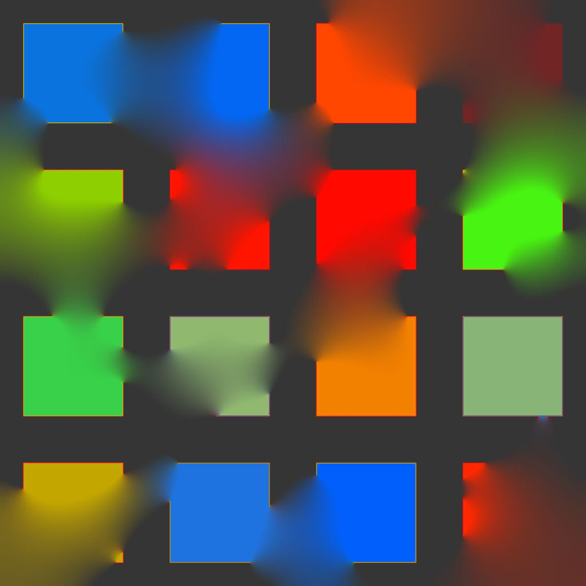

# Colore diffusione

<table>
<tr style="border: 0;">
<td width="41.60%" style="border: 0;" valign="top">

{width="200px"}

**Ingresso:** *Filtri/Effetti*

**Intermedio**

</td>
<td width="58.30%" style="border: 0;" valign="top">

## Descrizione

Applicate un processo di diffusione ai colori nell&#39;input dell&#39;immagine **Sorgente** in base all&#39;input dell&#39;immagine **Maschera** fornito, creando sfumature uniformi tra i colori quando si utilizza [Substance 3D Designer](https://www.adobe.com/products/substance3d-designer.html).

Vengono diffusi solo i colori dei pixel corrispondenti alla maschera; gli altri pixel non partecipano al risultato.

</td>
</tr>
</table>

## Parametri

* **Iterazioni**: *0.0 - 64.0* Numero di iterazioni di diffusione da eseguire (maggiore è il numero migliore, ma più lento). I valori utili sono compresi nell’intervallo [8, 48].\
  Si prega di notare che se non si cerca la correttezza matematica, i valori bassi sono buoni o anche meglio.\
  **Distanza**: **0.0 - 1.0** Regola la distanza massima della diffusione.
* **Attiva dithering**: *True/False* Controlla il metodo di campionamento di ogni passaggio. Il dithering consente la convergenza in meno passaggi, ma introduce disturbi.\
  Senza questa opzione, ogni passata è più veloce ma sono necessarie più passate per ottenere un risultato uniforme senza creare artefatti di banda.
* **Mappa normale**: *Vero/Falso* Aggiunge una normalizzazione ai valori in ogni passaggio.
* **Usa Alpha come maschera**: *Vero/Falso* Usa il canale alfa dell&#39;input *Sorgente* come maschera di diffusione, invece dell&#39;input *Maschera*.

## Input

* **Origine** *Colore*\
  Immagine da diffondere.
* **Maschera** *Scala di grigi*\
  Maschera di diffusione: i pixel bianchi vengono campionati in *Sorgente* e diffusi in pixel neri. L’immagine deve essere in bianco e nero. Se la maschera include sfumature, il valore di taglio è 0,5.
* **Intensità** *Scala Di Grigi*\
  Definisce localmente la forza con cui viene applicato il processo di diffusione. Questa mappa dovrebbe essere *in contrasto* per ottenere un effetto evidente.

## Immagini di esempio

<table>
<tr style="border: 0;">
<td style="border: 0;" valign="top">

{width="256px"}

</td>
<td style="border: 0;" valign="top">

{width="256px"}

</td>
<td style="border: 0;" valign="top">

{width="256px"}

</td>
</tr>
</table>

<table>
<tr style="border: 0;">
<td style="border: 0;" valign="top">

{width="256px"}

</td>
<td style="border: 0;" valign="top">

{width="256px"}

</td>
<td style="border: 0;" valign="top">

{width="256px"}

</td>
</tr>
</table>

<table>
<tr style="border: 0;">
<td style="border: 0;" valign="top">

{width="256px"}

</td>
<td style="border: 0;" valign="top">

{width="512px"}

</td>
</tr>
</table>
