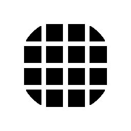

# Rilevamento bordo

<table>
<tr style="border: 0;">
<td width="33.33%" style="border: 0;" valign="top">

{width="128px"}

<b>Ingresso:</b> Filtri > Effetti

</td>
<td width="100.00%" style="border: 0;" valign="top">

## Descrizione

Rileva il contrasto nelle immagini in bianco e nero, quindi crea una maschera in bianco e nero che evidenzia il contrasto.

Utile in molti casi in cui è necessaria una maschera per i bordi. Tieni presente che funziona meglio con input ad alto contrasto; se necessario, regola il contrasto prima di passare qualcosa in questo nodo.

</td>
</tr>
</table>

## Parametri

|  |  |
|:---|:---|
| <b>Larghezza bordo</b> <i>1.0 - 16.0</i> | Larghezza delle aree rilevate attorno ai bordi. |
| <b>Rotondità bordo</b> <i>0.0 - 16.0</i> | Arrotonda, sfoca e smussa insieme la maschera generata. |
| <b>Inverti</b> <i>Falso/Vero</i> | Inverte il risultato. |
| <b>Tolleranza</b> <i>0.0 - 1.0</i> | Fattore soglia tolleranza per la posizione in cui devono apparire i bordi. |

## Esempi

<table style="margin-top: 32px; margin-bottom: 32px">
    <tr style="border: 0">
        <td style="border: 0; background: transparent">
            
        </td>
    </tr>
</table>
