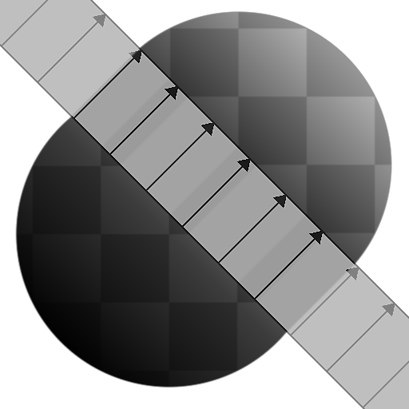
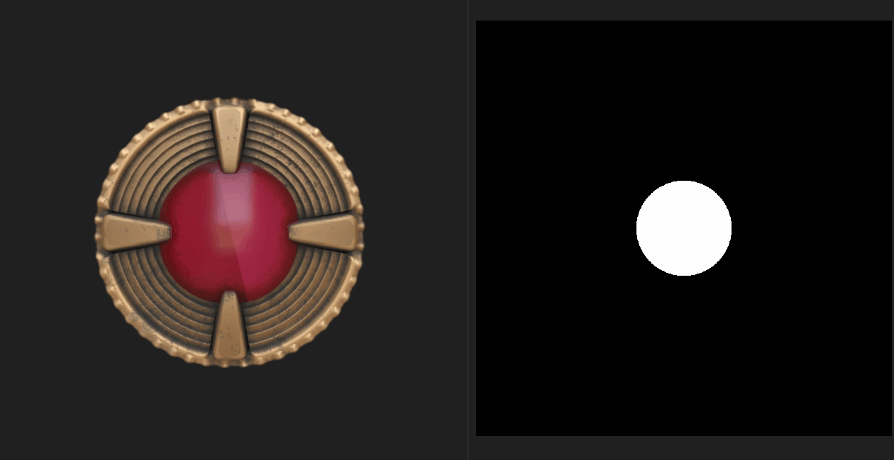

# Extend Shape

<table>
<tr style="border: 0;">
<td width="33.33%" style="border: 0;" valign="top">

<table>
<tr style="border: 0;">
<td style="border: 0;" valign="top">

{width="200px"}

</td>
<td style="border: 0;" valign="top">

{width="200px"}

</td>
</tr>
</table>

<b>Ingresso:</b> Filtri > Effetti

</td>
<td width="100.00%" style="border: 0;" valign="top">

## Descrizione

Il nodo <b>Extend Shape</b> estende una <i>sezione</i> dell&#39;<b>Input</b> su una direzione e una distanza impostate.

Il parametro <b>Mostra helper</b> consente di visualizzare la direzione della sezione estesa e dell&#39;estensione.

</td>
</tr>
</table>

## Parametri

|  |  |
|:---|:---|
| <b>Modalità</b> <i>Numero intero</i> | Definisce i <i>parametri</i> utilizzati per applicare l&#39;estensione:  - <i>Bidirezionale</i>: la sezione dell&#39;<b>Input</b> specificata dalla <b>Posizione estensione</b> e dall&#39;<b>Angolo estensione</b> viene estesa oltre la <b>Distanza estensione</b> in <i>direzioni opposte</i> - <i>Unidirezionale</i>: la sezione dell&#39;<b>Input</b> specificata dalla <b>Posizione estensione</b> e dall&#39;<b>Estensione L&#39;angolo</b> viene esteso oltre la <b>distanza di estensione</b> in una <i>direzione singola</i> - <i>posizione iniziale/finale</i>: un&#39;estensione <i>vettore</i> è definita da <b>posizione iniziale</b> e <b>posizione finale</b>. La sezione <i>perpendicolare</i> dell&#39;<b>Input</b> nella <b>Posizione iniziale</b> è estesa <i>su questo vettore</i> fino alla <b>Posizione finale</b> |
| <b>Distanza di estensione</b> <i>Virgola mobile</i> | La distanza oltre la quale deve essere estesa la sezione specificata dalla <b>Posizione estensione</b> e dall&#39;<b>Angolo estensione</b>. La distanza viene espressa come <i>proporzione</i> dell&#39;estensione dell&#39;immagine. |
| <b>Posizione estensione</b> <i>Virgola mobile</i> | La posizione nell&#39;immagine della sezione che deve essere estesa. Il valore viene espresso come <i>offset dal centro</i>. |
| <b>Angolo di estensione</b> <i>Virgola mobile</i> | L&#39;angolo della sezione che deve essere estesa, considerando il punto di partenza, è una <i>sezione verticale</i>. |
| <b>Posizione iniziale</b> <i>Virgola mobile 2</i> | Posizione iniziale del <i>vettore di estensione</i>. |
| <b>Posizione finale</b> <i>Virgola mobile 2</i> | Posizione finale del <i>vettore di estensione</i>. |
| <b>Avvia scostamento luminanza</b> <i>Virgola mobile</i> | Applica uno scostamento di luminanza all&#39;area dell&#39;immagine <i>che precede</i> la sezione estesa. Questo scostamento di luminanza è <i>interpolato lungo la sezione</i> alla luminanza dell&#39;area dell&#39;immagine che segue la sezione.  <i>Nota</i>: questo parametro è disponibile solo nella versione <b>Scala di grigi</b> del nodo. |
| <b>Fine scostamento luminanza</b> <i>Virgola mobile</i> | Applica uno scostamento di luminanza all&#39;area dell&#39;immagine <i>che segue</i> la sezione estesa. Questo scostamento di luminanza è <i>interpolato lungo la sezione</i> alla luminanza dell&#39;area dell&#39;immagine che precede la sezione.  <i>Nota</i>: questo parametro è disponibile solo nella versione <b>Scala di grigi</b> del nodo. |
| <b>Lum. Offset Ignora I Pixel Neri</b> <i>Booleano</i> | Se impostato su <i>True</i>, gli scostamenti di luminanza specificati in <i>both</i> <b>Lo scostamento di luminanza iniziale</b> e <b>lo scostamento di luminanza finale</b> vengono applicati solo a <i>pixel non neri</i>, ovvero pixel il cui valore è superiore a 0.  <i>Nota</i>: questo parametro è disponibile solo nella versione <b>Scala di grigi</b> del nodo. |
| <b>Modalità di filtro</b> <i>Numero intero</i> | Definisce come trattare i risultati campionati quando <i>si interpola</i> tra i pixel:  - <i>Più vicini</i>: verrà campionato esattamente lo <i>stesso</i> valore (più veloce) - <i>Bilineare</i>: verrà applicato un filtro bilineare al risultato per un aspetto <i>più uniforme</i> |
| <b>Mostra helper</b> <i>Booleano</i> | Visualizza la <i>sezione estesa</i> come una sovrapposizione con frecce che mostrano la <i>direzione</i> dell&#39;estensione. |

## Esempi

<table style="margin-top: 32px; margin-bottom: 32px">
    <tr style="border: 0">
        <td style="border: 0; background: transparent">
            
        </td>
        <td style="border: 0; background: transparent">
            
        </td>
        <td style="border: 0; background: transparent">
            
        </td>
        <td style="border: 0; background: transparent">
            
        </td>
    </tr>
</table>
