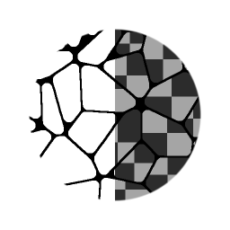

# Mappatura Flood Fill

<table>
<tr style="border: 0;">
<td width="33.33%" style="border: 0;" valign="top">

<b>Ingresso:</b> Filtri > Effetti

</td>
<td width="100.00%" style="border: 0;" valign="top">

## Descrizione

Mappatura Flood Fill consente di rimappare un motivo o una texture esistente su ogni singola cella da un [Flood Fill](../../../../../../compositing-graphs/nodes-reference-for-com/node-library/filters/effects/flood-fill/flood-fill.md). A differenza di altre conversioni di Flood Fill, ad esempio [Scala di grigi casuale](../../../../../../compositing-graphs/nodes-reference-for-com/node-library/filters/effects/flood-fill-random-gra/flood-fill-to-random-grayscale.md) o [Sfumatura](../../../../../../compositing-graphs/nodes-reference-for-com/node-library/filters/effects/flood-fill-to-gradient/flood-fill-to-gradient.md), non genera colori o valori in tinta unita, ma consente di utilizzare mappe di input personalizzate. Può essere visto come una sorta di combinazione di [Flood Fill](../../../../../../compositing-graphs/nodes-reference-for-com/node-library/filters/effects/flood-fill/flood-fill.md) e [Affianca Sampler](../../../../../../compositing-graphs/nodes-reference-for-com/node-library/texture-generators/patterns/tile-sampler/tile-sampler.md) o [Mappatura forme](../../../../../../compositing-graphs/nodes-reference-for-com/node-library/texture-generators/patterns/shape-mapper/shape-mapper.md), in quanto fornisce alcuni controlli e interfacce simili.

La versione a colori dispone di controlli aggiuntivi per l&#39;utilizzo delle mappe normali, in cui può [compensare le rotazioni delle mappe di norma nello spazio tangente](../../../../../../compositing-graphs/nodes-reference-for-com/node-library/filters/normal-map/normal-vector-rotation/normal-vector-rotation.md).

</td>
</tr>
</table>

## Input

|  |  |
|:---|:---|
| <b>Casella Di Testo Flood Fill</b> <i>Input colore</i> | Ingresso Flood Fill standard, obbligatorio. |
| <b>Input pattern 1-8</b> <i>Input colore/scala di grigi</i> | Inserimento di immagini con pattern personalizzato. |
| <b>Mappa distribuzione pattern</b> <i>Input scala di grigi</i> | ID Map per determinare il motivo a cui indirizzare la cella. Può derivare da un&#39;altra mappa del Flood Fill, ad esempio da Flood Fill a indice. |
| <b>Mappa scala</b> <i>Input scala di grigi</i> | Mapping per determinare la scala per cella. |
| <b>Mappa di rotazione</b> <i>Input scala di grigi</i> | Mapping per determinare la rotazione per cella. |
| <b>Mappa scostamento luminanza</b> <i>Input scala di grigi</i> | Mappa per impostare la luminanza per cella |

## Parametri

|  |  |
|:---|:---|
| <b>Modalità Porzione</b> <i>Nessun Affiancamento, H+V</i> | Impostare se utilizzare o meno l&#39;Affiancamento. Visibile solo se Dimensione o Scala sono impostate su un valore inferiore a 1. |
| <b>Pattern</b> |  |
| <b>Numero di input del modello</b> <i>1 - 8</i> | Impostate la quantità di input pattern personalizzati da utilizzare. |
| <b>Modalità distribuzione pattern</b> <i>Input casuale, dimensioni forma, mappa di distribuzione</i> | Impostare il metodo per determinare quale motivo viene visualizzato in una cella. |
| <b>Variazione distribuzione pattern</b> <i>0.0 - 1.0</i> | Consente una leggera variazione o scostamento nella distribuzione Pattern senza modificare tutto attraverso il valore di Numero casuale. |
| <b>Dimensioni</b> |  |
| <b>Modalità dimensioni</b> <i>Rispetto alla Texture, rispetto alla sfera della forma, rispetto alla forma più grande, rispetto alla forma più piccola, rispetto alla casella di testo Adatta forma</i> | Imposta la modalità di determinazione della dimensione del pattern in ogni cella. |
| <b>Dimensioni</b> <i>0.0 - 1.0</i> | Consente il ridimensionamento non uniforme del pattern. |
| <b>Scala</b> <i>0.0 - 1.0</i> | Impostate la scala globale (uniforme) per l’effetto. |
| <b>Moltiplicatore mappa scala</b> <i>0.0 - 1.0</i> | Impostate l&#39;influenza della Mappa scala opzionale. |
| <b>Scala casuale</b> <i>-1.0 - 1.0</i> | Impostate la quantità di variazione casuale all&#39;interno della scala del pattern. |
| <b>Rotazione</b> |  |
| <b>Rotazione</b> <i>0.0 - 1.0</i> | Imposta la rotazione globale e uniforme per ogni cella. |
| <b>Mappa di rotazione moltiplicatore</b> <i>0.0 - 1.0</i> | Impostate l&#39;influenza della Mappa di rotazione opzionale. |
| <b>Rotazione casuale</b> <i>0.0 - 1.0</i> | Imposta la quantità di rotazione casuale per ogni cella. |
| <b>Scala automatica rotazione</b> <i>Falso/Vero</i> | Consente di impostare se un pattern deve regolare la scala per adattarsi a una cella quando viene ruotato. |
| <b>Posizione</b> |  |
| <b>Scostamento posizione</b> <i>0.0 - 1.0</i> | Imposta lo scostamento posizione globale per ogni cella. |
| <b>Allineamento scostamento posizione</b> <i>Texture, Pattern</i> | Impostate questa opzione per allineare lo scostamento di 0 punti alla cella Pattern o alla texture. |
| <b>Scostamento posizione casuale</b> <i>0.0 - 1.0</i> | Imposta la quantità di randomizzazione dello scostamento posizione per cella. |
| <b>Colore (solo per la versione in scala di grigio)</b> |  |
| <b>Intervallo luminanza</b> <i>0.0 - 1.0</i> | Imposta il contrasto globale sulla texture, dove 0 diventa grigio medio. |
| <b>Intervallo luminanza casuale</b> <i>0.0 - 1.0</i> | Imposta il fattore di randomizzazione per l’Intervallo luminanza. |
| <b>Scostamento luminanza</b> <i>-1.0 - 1.0</i> | Imposta lo scostamento per Luminanza, che funge da controllo della luminosità. |
| <b>Scostamento luminanza casuale</b> <i>0.0 - 1.0</i> | Imposta il fattore di casualità per l’offset luminanza. |
| <b>Moltiplicatore mappa scostamento luminanza</b> <i>0.0 - 1.0</i> | Consente di impostare l’influenza della mappa opzionale Scostamento luminanza. |
| <b>Colore di sfondo</b> <i>(valore scala di grigi)</i> | Imposta il colore di sfondo su cui viene eseguita la fusione delle texture. |
| <b>Colore (solo per la versione a colori)</b> |  |
| <b>Mappa normale</b> <i>Falso/Vero</i> | Imposta questa opzione per interpretare l&#39;input del pattern come Mappa normale. Compenserà e correggerà la rotazione normale dello spazio tangente. |
| <b>Formato Normale</b> <i>DirectX, OpenGL</i> | Consente di passare da un Formato mappa normale all’altro (inverte il canale verde). Attivo solo quando Is Normal Map è True. |
| <b>Regolazione HSL</b> <i>-1.0 - 1.0</i> | Regolare l’HSL a livello globale. |
| <b>HSL casuale</b> <i>-1.0 - 1.0</i> | Impostare la randomizzazione HSL per cellula. |
| <b>Regolazione Alpha</b> <i>-1.0 - 1.0</i> | Impostate la regolazione dell&#39;Alpha globale e riducete il contrasto Alpha. |
| <b>Alpha casuale</b> <i>-1.0 - 1.0</i> | Impostare la randomizzazione della regolazione dell’Alpha per cella. |
| <b>Colore di sfondo</b> <i>(valore colore)</i> | Imposta il colore di sfondo su cui viene eseguita la fusione delle texture. |

## Esempi

<table style="margin-top: 32px; margin-bottom: 32px">
    <tr style="border: 0">
        <td style="border: 0; background: transparent">
            
        </td>
        <td style="border: 0; background: transparent">
            
        </td>
    </tr>
</table>
