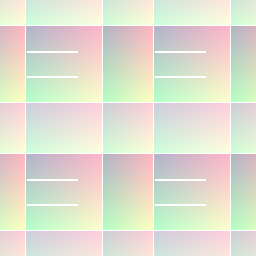

# Flood Fill

<table>
<tr style="border: 0;">
<td style="border: 0;" valign="top">

{width="128px"}

## Flood Fill

**Ingresso:** *Filtri/Effetti*

**Semplice**

</td>
<td style="border: 0;" valign="top">

## Descrizione

Flood Fill fa parte di un set avanzato di effetti che consente di aggiungere molta più variazione a una texture di base di porzioni binarie. Non è pensato per essere usato da solo: è piuttosto un punto di partenza per altri effetti di Flood Fill. La separazione dei dati consente un flusso di lavoro più dinamico, ottimizzato e meno distruttivo.

Gli altri effetti Flood Fill sono [da Flood Fill a sfumatura](../../../../../../compositing-graphs/nodes-reference-for-com/node-library/filters/effects/flood-fill-to-gradient/flood-fill-to-gradient.md), [da Flood Fill a colore/scala di grigi](../../../../../../compositing-graphs/nodes-reference-for-com/node-library/filters/effects/flood-fill-grayscale-col/flood-fill-to-grayscale-color.md), [da Flood Fill a scala di grigi casuale](../../../../../../compositing-graphs/nodes-reference-for-com/node-library/filters/effects/flood-fill-random-gra/flood-fill-to-random-grayscale.md), [da Flood Fill a colore casuale](../../../../../../compositing-graphs/nodes-reference-for-com/node-library/filters/effects/flood-fill-random-color/flood-fill-to-random-color.md), [da Flood Fill a dimensione casella BB](../../../../../../compositing-graphs/nodes-reference-for-com/node-library/filters/effects/flood-fill-to-bbox-size/flood-fill-to-bbox-size.md), [da Flood Fill a posizione](../../../../../../compositing-graphs/nodes-reference-for-com/node-library/filters/effects/flood-fill-to-position/flood-fill-to-position.md), [Mappatura Flood Fill](../../../../../../compositing-graphs/nodes-reference-for-com/node-library/filters/effects/flood-fill-mapper/flood-fill-mapper.md) e [da Flood Fill a indice](../../../../../../compositing-graphs/nodes-reference-for-com/node-library/filters/effects/flood-fill-to-index/flood-fill-to-index.md)

>[!WARNING]
>
> La mappa di input deve essere adatta al Flood Fill per funzionare. Idealmente si tratta di una mappa binaria (solo bianco/nero, senza scala di grigi) in cui ogni porzione è separata dalle altre da un bordo nero (0,0,0) per ogni pixel. Un esempio di candidato perfetto per questo è il [Tile Generator](../../../../../../compositing-graphs/nodes-reference-for-com/node-library/texture-generators/patterns/tile-generator/tile-generator.md).
> 
> I problemi si verificano se le porzioni non sono separate da pixel neri interi, in genere quando si utilizzano valori in scala di grigi e inclinati. È possibile identificare questo fenomeno in base a una mancanza complessiva di valori rossi nel risultato e a possibili strane linee di artefatti. In questi casi, regolate il contrasto sulla mappa di input o disattivate la mappa di input. Modificare l&#39;impostazione di compensazione Sicurezza/Velocità per verificare eventuali miglioramenti.

## Parametri

* **Compensazione tra sicurezza e velocità**: *Forme semplici o piccole, forme complesse o grandi, nessuna modalità di errore.*Imposta la modalità di calcolo che meglio si adatta alle forme di input. Consente risultati molto più precisi se si sceglie la modalità corretta.
* **Opzioni avanzate**: *Visualizza parametri avanzati e Output/Nascondi parametri avanzati e output*
* **Sostituzione del compromesso sicurezza/velocità**: *-1 - 100* Visibile solo con le opzioni avanzate attivate. Consente di sostituire le feature interne. Molto avanzato, serve per creare effetti o debug propri.

## Immagini di esempio

| 

 | 

 |
| --- | --- |
|  |  |

Buoni e cattivi esempi di risultati dal Flood Fill.

</td>
</tr>
</table>
