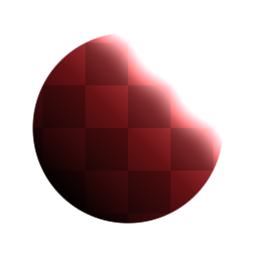

# Bagliore

<table>
<tr style="border: 0;">
<td style="border: 0;" valign="top">

{width="128px"}

{width="128px"}

## Bagliore

**Ingresso:** *Filtri/Effetti*

**Semplice**

</td>
<td style="border: 0;" valign="top">

## Descrizione

Esegue un effetto del tipo &quot;Bagliore esterno&quot;, tipico di altri software di editing di immagini molto diffusi. In sostanza, aggiunge un contorno sfumato di dissolvenza attorno all’input.

Tenete presente che non è destinato a funzionare per immagini con canali Alpha, come potreste aspettarvi. Anche la versione a colori si aspetta solo maschere binarie, in bianco e nero come input; consente solo di utilizzare un bagliore colorato. Se state seguendo una versione che funziona su immagini con trasparenza, consultate [Bagliore forma](../../../../../../compositing-graphs/nodes-reference-for-com/node-library/filters/effects/shape-glow/shape-glow.md).

Importante: assicurati di utilizzare la versione appropriata per il tuo input. Usate &quot;Glow&quot; per gli input di colore o &quot;Glow Greyscale&quot; per gli input di scala di grigio.

## Parametri

* **Quantità bagliore**: *0,0 - 1,0* Opacità globale per l&#39;effetto bagliore.
* **Cancella quantità**: *0,0 - 1,0* Soglia di soglia per l&#39;interruzione dell&#39;effetto bagliore. Utile per aree semitrasparenti.
* **Dimensione bagliore**: *0.0 - 20.0* Controlla la distanza raggiunta dall&#39;effetto bagliore.
* **Colore bagliore**: *(Valore colore) (Solo versione colore)*Imposta il colore dell&#39;effetto bagliore.

## Immagini di esempio

| 

 |
| --- |
|  |

</td>
</tr>
</table>
