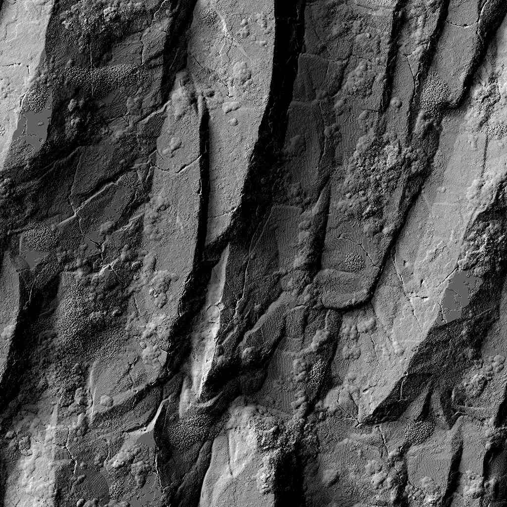

# Ombre RT

<table>
<tr style="border: 0;">
<td width="41.60%" style="border: 0;" valign="top">

<b>Ingresso:</b> *Filtri/Effetti*

</td>
<td width="58.30%" style="border: 0;" valign="top">

## Descrizione

Genera le ombre ray tracing da un input mappa height.

Questo nodo non deve essere utilizzato in combinazione con il motore CPU (SSE) a causa del tempo di calcolo.

</td>
</tr>
</table>

## Parametri

<b>Esempi</b> *Numero intero*\
Numero di raggi utilizzati per calcolare le ombre.\
Un valore più elevato fornisce un risultato più uniforme e preciso, a costo di prestazioni.

<b>Modalità</b> *Numero intero*\
Metodo di disegno delle ombre sulla superficie.

<b>Scala Height</b> *Mobile*\
Un moltiplicatore per l’intensità della mappa del height di input.

<b>Posizione Chiara </b>*Float2*\
Posizione della sorgente luminosa su una sfera che racchiude la superficie:
* <b>X</b>: posizione orizzontale, in numero di giri;
* <b>Y</b>: posizione verticale, dove 0,5 è lo zenit e 0/1 è l&#39;orizzonte.

<b>Intensità luce</b> *Mobile*\
Intensità della sorgente luminosa.

<b>Dimensioni Chiare</b> *Float2* (disponibile quando <b>Mode</b> è impostato su *Shaded*)\
Dimensioni della sorgente luminosa come rettangolo.

<b>Scala luminosa (ombre morbide)</b> *Mobile*\
Moltiplicatore per il contributo della <b>dimensione della luce</b> alla direzione dei raggi.\
Con un valore più alto le ombre risultano più uniformi.

<b>Luce sopra l&#39;orizzonte</b> *Booleano*\
Se <b>Posizione luce</b> è impostato in modo da posizionare la luce sotto l&#39;orizzonte, questo parametro impedisce alla luce di superare tale soglia, il che significa che i valori Y sono bloccati nell&#39;intervallo [0;1].

<b>Opacità ombra</b> *Mobile*\
Moltiplicatore per l’opacità delle ombre disegnate sulla superficie.

<b>Attenuazione ombra</b> *Mobile*\
Un moltiplicatore per l&#39;attenuazione delle ombre più lontane sono dalla loro cassa.\
Un valore pari a 0 determina ombre uniformi (vengono comunque applicate ombre morbide).

<b>Lunghezza massima ombre</b> *Mobile*\
Distanza massima che un&#39;ombra può essere tracciata dalla sua base.\
Un valore pari a 0 non produce ombre visibili.

## Immagini di esempio

<table>
<tr style="border: 0;">
<td style="border: 0;" valign="top">

</td>
<td style="border: 0;" valign="top">

</td>
<td style="border: 0;" valign="top">

</td>
</tr>
</table>
