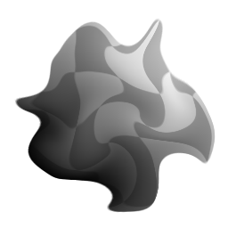
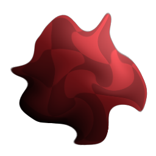

# Morphing vettoriale

<table>
<tr style="border: 0;">
<td width="33.33%" style="border: 0;" valign="top">

<b>Ingresso:</b> Filtri > Effetti

</td>
<td width="100.00%" style="border: 0;" valign="top">

## Descrizione

Distorce un’immagine di input mediante una mappa vettoriale. L’effetto è simile alla distorsione UV con una mappa normale o con una mappa di flusso nei dispositivi di ombreggiatura dei videogiochi. I pixel di input vengono spostati dai vettori definiti nei valori Rosso e Verde della mappa vettoriale.

Questo nodo di per sé non è il più difficile da utilizzare, ma la creazione di una mappa vettoriale appropriata richiede attenzione. Si consiglia di lavorare con le profondità di bit più alte per garantire precisione durante il morphing.

La morphing vettoriale è molto simile a [Alterazione vettoriale](../../../../../../compositing-graphs/nodes-reference-for-com/node-library/filters/effects/vector-warp/vector-warp.md): la differenza principale è che questo nodo morphing non &quot;ripete&quot; o &quot;affianca&quot; il risultato quando viene spinto al di fuori dei limiti dell&#39;area di lavoro. Al contrario, blocca e ripete i bordi.

</td>
</tr>
</table>

## Input

|  |  |
|:---|:---|
| <b>Input</b> <i>Ingresso colore/scala di grigi</i> | L&#39;input di origine che deve essere la destinazione per l&#39;alterazione. |
| <b>Campo Vettoriale</b> <i>Input colore</i> | La mappa vettoriale utilizzata per guidare l&#39;alterazione. |

## Parametri

|  |  |
|:---|:---|
| <b>Importo</b> <i>0.0 - 1.0</i> | Imposta l’intensità dell’effetto di alterazione e funziona come moltiplicatore per la Mappa vettoriale. |
