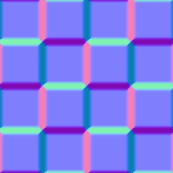

# Fusione normale

<table>
<tr style="border: 0;">
<td style="border: 0;" valign="top">

{width="128px"}

## Fusione normale

**Ingresso:** *Filtri/Mappa Normale*

**Intermedio**

</td>
<td style="border: 0;" valign="top">

## Descrizione

Fusione normale consente di fondere due mappe normali con una maschera opzionale, assicurandosi che tutti i valori rimangano normalizzati. Non differisce molto da un [nodo di fusione atomica](../../../../../../compositing-graphs/nodes-reference-for-com/atomic-nodes/blend/blend.md), ma ha aggiunto calcoli interni per Normalmaps.

Fusione normale non consente di combinare (sovrapporre) le mappe normali, in cui la mappa superiore aggiunge dettagli alla mappa inferiore. A tale scopo, utilizzare [Combinazione normale](../../../../../../compositing-graphs/nodes-reference-for-com/node-library/filters/normal-map/normal-combine/normal-combine.md).

## Parametri

### Input

* **NormalFG**: *Input colore*\
  Mappa Normale Primo Piano/Superiore.
* **NormalBG**: *Input colore*\
  Normalmap sfondo/inferiore.
* **Maschera**: *Input scala di grigi*\
  Slot maschera utilizzato per mascherare gli effetti del nodo. Può essere attivata/disattivata con il parametro &quot;Usa maschera&quot;.

### Parametri

* **Opacità**: *0,0 - 1,0*\
  Fusione dell’opacità tra primo piano e sfondo
* **Usa maschera**: *False/True*\
  Attiva o disattiva l’uso della mappa maschera.

## Immagini di esempio

*(.gif introduce il dithering, ad esempio, i risultati nell&#39;applicazione sono uniformi)*

</td>
</tr>
</table>
