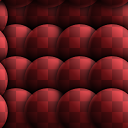
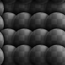

# Imposta come patch porzione

<table>
<tr style="border: 0;">
<td style="border: 0;" valign="top">

## Creare Un Cerotto In Piastrelle (Scala Di Grigi)

**Entrata:** *Filtri/Divisione in porzioni*

**Complesso**

</td>
<td style="border: 0;" valign="top">

## Descrizione

Questo nodo è un tiler semi-casuale basato su griglia. Prende una patch di input e la timbra, tentando di trasformarla in un&#39;immagine in porzioni senza troppe ripetizioni, in base alle tue impostazioni.

Utile per quando avete una piccola porzione di texture e desiderate creare una texture in porzioni più grande da essa.

Tieni presente che questo è diverso da [Make-It-Tile Photo](../../../../../../compositing-graphs/nodes-reference-for-com/node-library/filters/tiling/make-it-tile-photo/make-it-tile-photo.md), che corregge principalmente i bordi.

Per eseguire questa operazione con un intero materiale, vedere [Affianca automatica avanzata](../../../../../../compositing-graphs/nodes-reference-for-com/node-library/material-filters/scan-processing/smart-auto-tile/smart-auto-tile.md).

## Parametri

* **Dimensioni maschera**: *0,0 - 1,0* Dimensioni della maschera rotonda utilizzata per timbrare la patch.
* **Precisione maschera**: *0.0 - 1.0* Precisione di decadimento/smoothness della maschera.
* **Alterazione maschera**: *-100.0 - 100.0* Introduce alterazioni ai bordi della maschera. Ideale per evitare transizioni omogenee e indefinite tra le patch.
* **Larghezza motivo**: *0.0 - 1000.0* Modifica la larghezza della patch in modo non uniforme.
* **height dimensioni pattern**: *0.0 - 1000.0* Modifica il height della patch in modo non uniforme.
* **Disturbo**: *0,0 - 1,0*\
  Introduce la casualità di traduzione, spostando leggermente le patch.
* **Variazione dimensioni**: *0.0 - 100.0* Introduce una variazione delle dimensioni per la maschera.
* **Ottava**: *0 - 6* Questo è il controllo principale che determina la dimensione complessiva.
* **Rotazione**: *-360.0 - 360.0* Pre-ruota la patch.
* **Variazione rotazione**: *0.0 - 360.0* Introduce una rotazione casuale per ogni timbro patch.
* **Colore di sfondo**: *(Valore colore)*Imposta il colore di sfondo per le aree in cui non viene visualizzata alcuna patch.
* **Variazione colore**: *0.0 - 1.0 (solo versione a colori)*Introduce la variazione di colore per patch.
* **Variazione luminosità** *(solo versione in scala di grigio)*Introduce la variazione di luminosità per patch.

## Immagini di esempio

</td>
</tr>
</table>
