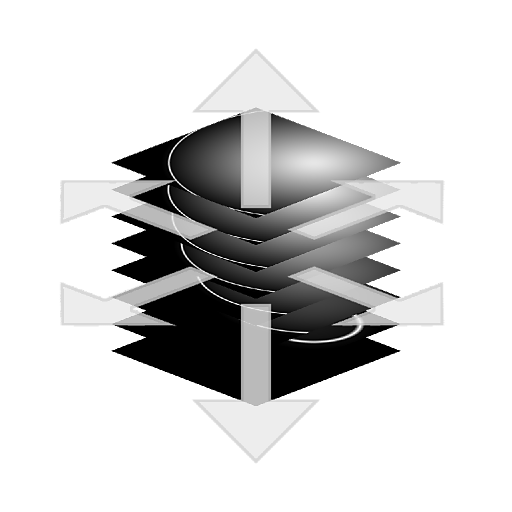

# Scostamento Texture 3D

<table>
<tr style="border: 0;">
<td width="33.33%" style="border: 0;" valign="top">

<table>
<tr style="border: 0;">
<td style="border: 0;" valign="top">

{width="200px"}

</td>
<td style="border: 0;" valign="top">

{width="200px"}

</td>
</tr>
</table>

<b>Entrata:</b> Filtro > Trasformazione

</td>
<td width="100.00%" style="border: 0;" valign="top">

## Descrizione

Il nodo **Scostamento Texture 3D** applica una *trasformazione offset* negli assi **X**, **Y** e **Z** su un oggetto descritto dalla *texture 3D* connessa all&#39;**Input**.

</td>
</tr>
</table>

## Input

|  |  |
|:---|:---|
| <b>Input</b> <i>Scala di grigi/Colore</i> | <i>texture 3D</i> che descrive un oggetto 3D. L&#39;oggetto è comunemente descritto in un <i>cubo di unità</i>. |

## Parametri

|  |  |
|:---|:---|
| <b>Scostamento</b> <i>Virgola mobile 3</i> | Quantità di offset nello <i>spazio mondo</i> applicata all&#39;oggetto descritto dalla <i>texture 3D</i> connessa all&#39;<b>Input</b>. |

## Esempi

<table style="margin-top: 32px; margin-bottom: 32px">
    <tr style="border: 0">
        <td style="border: 0; background: transparent">
            
        </td>
        <td style="border: 0; background: transparent">
            
        </td>
    </tr>
</table>
