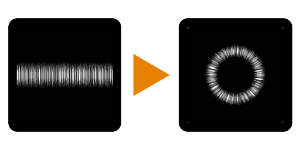

# Da Cartesiano A Polare

<table>
<tr style="border: 0;">
<td style="border: 0;" valign="top">

{width="128px"}

{width="128px"}

## Da Cartesiano A Polare (Scala Di Grigi)

**Entrata:** *Filtri/Trasformazioni*

**Semplice**

</td>
<td style="border: 0;" valign="top">

## Descrizione

Converte un input con coordinate cartesiane (X&amp;Y) in coordinate polari (angolo e raggio). L&#39;inverso è possibile con [Da polare a cartesiano](../../../../../../compositing-graphs/nodes-reference-for-com/node-library/filters/transforms/polar-to-cartesian/polar-to-cartesian.md).

## Parametri

*Nessun parametro.*

## Immagini di esempio

| 

 |
| --- |
|  |

</td>
</tr>
</table>
