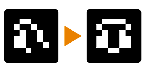

# Speculare (nodo filtro)

<table>
<tr style="border: 0;">
<td width="33.33%" style="border: 0;" valign="top">

{width="128px"}

{width="128px"}

<b>Ingresso:</b> Filtri > Trasforma

</td>
<td width="100.00%" style="border: 0;" valign="top">

## Descrizione

L&#39;immagine di input viene riflessa da un lato scelto su un asse selezionato. Molto utile, un modo rapido per ottenere effetti simmetrici.

</td>
</tr>
</table>

## Parametri

|  |  |
|:---|:---|
| <b>Modalità</b> <i>Asse mirror X, Asse mirror Y, Angolo Speculare</i> | Scegliete se specchiare a sinistra-destra, in alto-basso o entrambe le opzioni. |
| <b>Offset asse X</b> <i>0.0 - 1.0</i> | Utilizzato solo quando è selezionato l&#39;asse X, definire un offset. |
| <b>Scostamento asse Y</b> <i>0.0 - 1.0</i> | Utilizzato solo quando è selezionato l&#39;asse Y, definire un offset. |
| <b>Inverti asse X</b> <i>Falso/Vero</i> | Usato solo quando è selezionato l’asse X, Inverti direzione. |
| <b>Inverti asse Y</b> <i>Falso/Vero</i> | Usato solo quando è selezionato l’asse Y, capovolgi direzione. |
| <b>Tipo angolo</b> <i>In alto a sinistra, In alto a destra, In basso a sinistra e In basso a destra</i> | Utilizzato solo quando è selezionato il tipo Angolo, definisci l’angolo da specchiare. |

## Esempi

<table style="margin-top: 32px; margin-bottom: 32px">
    <tr style="border: 0">
        <td style="border: 0; background: transparent">
            
        </td>
    </tr>
</table>
