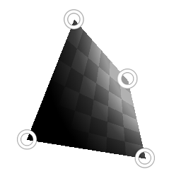

# Trasformazione quadrupla

<table>
<tr style="border: 0;">
<td width="33.33%" style="border: 0;" valign="top">

{width="128px"}

{width="128px"}

<b>Ingresso:</b> Filtri > Trasforma

</td>
<td width="100.00%" style="border: 0;" valign="top">

## Descrizione

Nodo di trasformazione speciale che consente la trasformazione di una forma quadrupla attraverso l&#39;interazione con i relativi punti d&#39;angolo. Consente trasformazioni molto specifiche in modo pratico.

</td>
</tr>
</table>

## Parametri

|  |  |
|:---|:---|
| <b>p00</b> | Punto in alto a sinistra. |
| <b>p01</b> | Punto in basso a sinistra |
| <b>p10</b> | Punto in alto a destra. |
| <b>p11</b> | In basso a destra. |
| <b>Annullamento</b> <i>Solo anteriore, Solo posteriore, Fronte e Fronte</i> | Impostate l’effetto di taglio/nascondere la forma quando i punti si incrociano. |
| <b>Abilita Affiancamento</b> <i>Falso/Vero</i> |  |
| <b>Colore di sfondo</b> <i>(valore scala di grigi)</i> | Colore di sfondo in tinta unita se Affiancamento è disattivato. |
| <b>Campionamento</b> <i>Bilineare, Più Vicino</i> | Impostate la qualità di campionamento. |

## Esempi

<table style="margin-top: 32px; margin-bottom: 32px">
    <tr style="border: 0">
        <td style="border: 0; background: transparent">
            
        </td>
    </tr>
</table>
