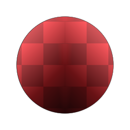

# Simmetria

<table>
<tr style="border: 0;">
<td width="33.33%" style="border: 0;" valign="top">

{width="128px"}

<b>Ingresso:</b> Filtri > Trasforma

</td>
<td width="100.00%" style="border: 0;" valign="top">

## Descrizione

Esegue una serie di operazioni di simmetria su un&#39;immagine di input. Può essere utilizzato per rendere simmetriche le forme geometriche.

Questo nodo è molto simile a [Mirror](../../../../../../compositing-graphs/nodes-reference-for-com/node-library/filters/transforms/mirror-filter-node/mirror-filter-node.md), ma dispone di controlli aggiuntivi per i metodi di fusione.

</td>
</tr>
</table>

## Parametri

|  |  |
|:---|:---|
| <b>Modalità Simmetria</b> <i>Specchio Y, Specchio X, Diagonale Sinistra, Diagonale Destra, Specchio X/Y, Specchio X / Specchio Y, Diagonale Sinistra/Diagonale Destra, Diagonale Destra/Diagonale Sinistra, 8</i> | Consente di scegliere la modalità simmetria geometrica. |
| <b>Modalità di trasferimento</b> <i>0 - 6</i> | Scegli il metodo di fusione simmetria: Copia, Aggiungi, Sottrai, Moltiplica, Aggiungi secondario, Max, Min. |

## Esempi

<table style="margin-top: 32px; margin-bottom: 32px">
    <tr style="border: 0">
        <td style="border: 0; background: transparent">
            
        </td>
    </tr>
</table>
