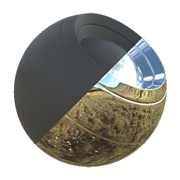

# Interruttore materiale

<table>
<tr style="border: 0;">
<td style="border: 0;" valign="top">

{width="128px"}

## Interruttore materiale

**Ingresso:** *Filtri materiale/Fusione*

**Semplice**

</td>
<td style="border: 0;" valign="top">

## Descrizione

Questo nodo è la versione completa del materiale multicanale di [Switch](../../../../../../compositing-graphs/nodes-reference-for-com/node-library/filters/blending/switch/switch.md). Vengono utilizzati due materiali come input e ne viene restituito solo uno in base al parametro switch.

## Parametri

### Parametri

* **Canali**\
  Attivate e disattivate i canali del materiale in questo gruppo, ad esempio quando utilizzate mappe Specular/lucidità invece di Metallico/Rugosità.
* **Switch**: *False/True* Switch per restituire il materiale 1 o 2.

## Immagini di esempio

|  |
| --- |
| Nessuna immagine allegata alla pagina. |

</td>
</tr>
</table>
