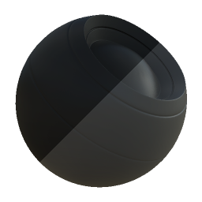

# Colore sicuro Albedo PBR

<table>
<tr style="border: 0;">
<td style="border: 0;" valign="top">

{width="128px"}

## Colore sicuro Albedo PBR

**Ingresso:** *Filtri materiale/Utility PBR*

**Semplice**

</td>
<td style="border: 0;" valign="top">

## Descrizione

Si tratta di un nodo di utilità che corregge se i valori Basecolor o Diffuse non rientrano in un intervallo accettabile e corretto per PBR. Quando è impostato su Metallico, il nodo tenta inoltre di correggere i valori di Colore di base in base all&#39;intensità del metallizzato.

Consultate anche [PBR BaseColor / Metallic Validate](../../../../../../compositing-graphs/nodes-reference-for-com/node-library/material-filters/pbr-utilities/pbr-basecolor-metallic/pbr-basecolor-metallic-validate.md) per il feedback visivo sulle aree che potrebbero essere errate.

Ciò è utile come strumento di correzione rapida, specialmente quando si sta ancora imparando la PBR, ma non inteso come una misura assoluta che si suppone sempre corretta.

## Parametri

* **Flusso di lavoro PBR**: *Colore di base - Metallico, Diffuso - Specular* Consente di passare da un flusso di lavoro PBR a un altro.
* **Tolleranza**: *0,0 - 1,0* Quantità di tolleranza per valori non compresi nell&#39;intervallo consentito.

## Immagini di esempio

|  |
| --- |
| Nessuna immagine allegata alla pagina. |

</td>
</tr>
</table>
