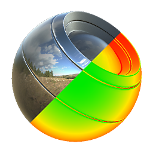

# PBR BaseColor/Metallic Validate

<table>
<tr style="border: 0;">
<td style="border: 0;" valign="top">

{width="128px"}

## PBR BaseColor/Metallic Validate

**Ingresso:** *Filtri materiale/Utility PBR*

**Semplice**

</td>
<td style="border: 0;" valign="top">

## Descrizione

Nodo di utilità che genera una &quot;Heatmap&quot; buona-cattiva in cui i valori sono corretti o errati in base agli standard PBR.

È molto utile come strumento di apprendimento per PBR, poiché fornisce un feedback visivo molto chiaro su quali sono gli errori e dove possono essere trovati.

Non utilizzare questo strumento come strumento finale, ma assicurati comunque di avere sempre una chiara comprensione del motivo per cui stai infrangendo le regole che questo strumento potrebbe evidenziare.

## Parametri

* **Modalità di convalida**: *Albedo , Metal, Combined* Imposta se controllare solo l&#39;Albedo, Metal o entrambe combinate come modalità panoramica.
* **Albedo soglia intervallo scuro**: *50 sRGB, 30 sRGB* Imposta il limite inferiore di Albedo su 50 o 30 sRGB. Può diminuire o aumentare la tolleranza per le aree rosse.
* **Intervallo di riflettanza metallo**: *70-100% riflettente, 60-100% riflettente* Modifica l&#39;intervallo metallico in modo che venga considerato corretto. Può diminuire o aumentare la tolleranza per le aree rosse.
* **Sovrapposizione mappa**: *False/True* La modalità di debug rapido per sovrapporre le mappe di input consente di individuare più rapidamente le aree problematiche.

## Immagini di esempio

|  |
| --- |
| Nessuna immagine allegata alla pagina. |

</td>
</tr>
</table>
