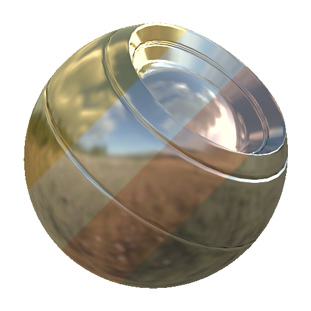

# Riflettenza metallica PBR

<table>
<tr style="border: 0;">
<td style="border: 0;" valign="top">

{width="128px"}

## Riflettenza metallica PBR

**Ingresso:** *Filtri materiale/Utility PBR*

**Semplice**

</td>
<td style="border: 0;" valign="top">

## Descrizione

Questo è un rapido nodo Helper predefiniti per restituire i colori di riflessione corretti per alcuni metalli **puri** predefiniti. Può essere utilizzato nel colore di base per il modello metallico o nel canale di Specular per il modello Specular/lucido.

Questo nodo è utile quando si desidera un punto di partenza per un metallo puro e consente di evitare la selezione dei colori da un grafico.

## Parametri

* **Colore metallo**: *Oro, Argento, Alluminio, Ferro, Rame, Titanio, Nichel, Cobalto, Platino* Sceglie un valore di metallo predefinito.

## Immagini di esempio

|  |
| --- |
| Nessuna immagine allegata alla pagina. |

</td>
</tr>
</table>
